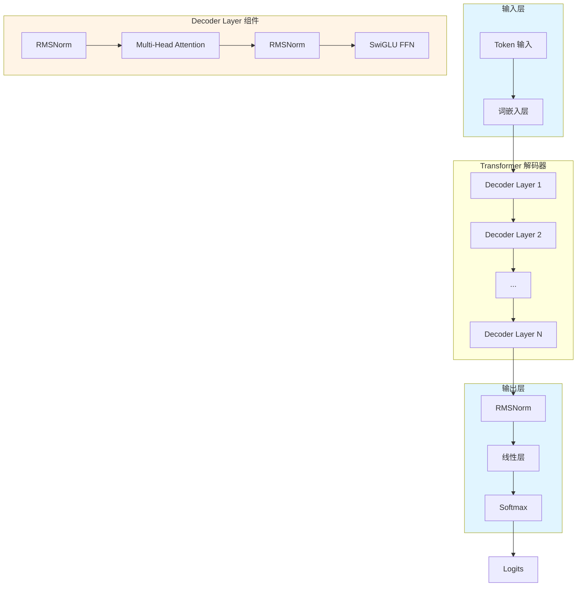
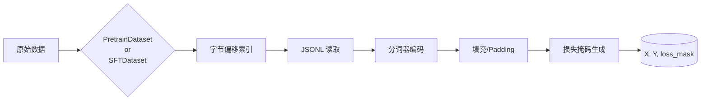
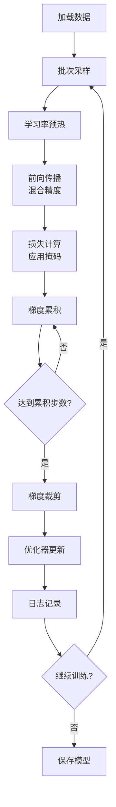
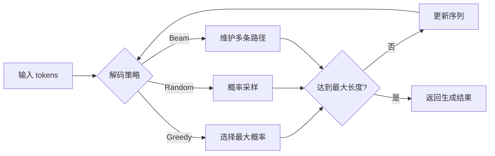

Tiny-K 是一个轻量级的语言模型训练框架，完整实现了从模型架构设计、预训练、微调到推理部署的全流程。本项目采用模块化设计，核心代码基于 PyTorch 实现，支持 Flash Attention、分组查询注意力（GQA）、旋转位置编码（RoPE）等前沿技术。通过本框架，开发者可以快速构建和训练参数规模在百万级到十亿级的语言模型。

## 核心架构设计

Tiny-K 的模型架构遵循标准的 Transformer 解码器设计，但在组件层面引入了多项优化，以在有限的计算资源下获得更好的性能表现。



### 模型配置参数

Tiny-K 的模型配置通过 `ModelConfig` 类统一管理，支持以下核心参数调整：

| 参数 | 默认值 | 说明 |
|------|--------|------|
| `dim` | 768 | 模型隐藏层维度 |
| `n_layers` | 12 | Transformer 层数 |
| `n_heads` | 16 | 注意力头数量 |
| `n_kv_heads` | 8 | 键值头的数量（用于 GQA） |
| `vocab_size` | 6144 | 词表大小 |
| `max_seq_len` | 512 | 最大序列长度 |
| `hidden_dim` | None | FFN 隐藏层维度 |
| `multiple_of` | 64 | 维度对齐参数 |

Sources: [k_model.py](k_model.py#L14-L44)

### 核心技术组件

#### 旋转位置编码（RoPE）

Tiny-K 采用旋转位置编码来引入位置信息，相比传统的绝对位置编码，RoPE 具有更好的外推能力。在实现中，首先通过 `precompute_freqs_cis` 函数预计算旋转角度：

```python
freqs = 1.0 / (theta ** (torch.arange(0, dim, 2)[: (dim // 2)].float() / dim))
freqs = torch.outer(t, freqs).float()
freqs_cos = torch.cos(freqs)
freqs_sin = torch.sin(freqs)
```

然后通过 `apply_rotary_emb` 函数将旋转矩阵应用到 Query 和 Key 向量上。这种设计使得模型能够自然地处理任意长度的位置信息。

Sources: [k_model.py](k_model.py#L68-L82), [k_model.py](k_model.py#L97-L122)

#### 分组查询注意力（GQA）

为了降低注意力计算的复杂度，Tiny-K 实现了分组查询注意力机制。GQA 的核心思想是让多个 Query 头共享同一个 Key/Value 头组：

```python
self.n_kv_heads = args.n_heads if args.n_kv_heads is None else args.n_kv_heads
self.n_rep = self.n_local_heads // self.n_local_kv_heads

# Key/Value 扩展
xk = repeat_kv(xk, self.n_rep)
xv = repeat_kv(xv, self.n_rep)
```

这种设计将 KV 缓存的内存需求从 O(n_heads) 降低到 O(n_kv_heads)，同时保持模型表达能力。

Sources: [k_model.py](k_model.py#L139-L156), [k_model.py](k_model.py#L124-L137)

#### RMSNorm 与 SwiGLU

归一化层采用 RMSNorm，相比 LayerNorm 去掉了均值计算，效率更高：

```python
def _norm(self, x):
    return x * torch.rsqrt(x.pow(2).mean(-1, keepdim=True) + self.eps)
```

前馈网络采用 SwiGLU 激活函数，由三个线性层构成：

```python
return self.dropout(self.w2(F.silu(self.w1(x)) * self.w3(x)))
```

Sources: [k_model.py](k_model.py#L46-L66), [k_model.py](k_model.py#L250-L273)

### Transformer 主结构

`Transformer` 类继承自 `PreTrainedModel`，完整实现了模型的前向传播和推理生成逻辑。词嵌入层和输出层共享权重，这是语言模型中常见的权重共享策略，可以有效减少参数量：

```python
self.tok_embeddings = nn.Embedding(args.vocab_size, args.dim)
self.output = nn.Linear(args.dim, args.vocab_size, bias=False)
self.tok_embeddings.weight = self.output.weight
```

Sources: [k_model.py](k_model.py#L309-L353)

## 数据处理流程

数据处理模块负责将原始文本转换为模型可处理的 token 序列，支持预训练和监督微调两种模式。



### 预训练数据处理

`PretrainDataset` 类实现了高效的预训练数据加载器。核心设计是使用字节偏移索引避免重复读取整个文件：

```python
with open(data_path, 'rb') as f:
    self._offsets.append(0)
    while f.readline():
        self._offsets.append(f.tell())
```

每个样本的损失掩码将填充区域标记为不计算损失：

```python
loss_mask = [1] * text_len + [0] * padding_len
```

Sources: [dataset.py](dataset.py#L10-L46)

### 监督微调数据处理

`SFTDataset` 类的核心功能是根据对话模板生成损失掩码。关键是根据 `<|im_start|>assistant` 标记识别助手回复的范围：

```python
a_sequence = self.tokenizer("<|im_start|>assistant\n")['input_ids']
# 标记从 assistant 开始到 EOS token 的位置为计算损失
for pos in range(start, end + 1):
    if pos < len(mask):
        mask[pos] = 1
```

这种方式实现了只对助手回复计算损失的训练策略。

Sources: [dataset.py](dataset.py#L48-L119)

### 自定义分词器训练

Tiny-K 支持从零训练自定义分词器，采用 BPE（Byte Pair Encoding）算法：

```python
tokenizer = Tokenizer(models.BPE(unk_token="<unk>"))
tokenizer.normalizer = NFKC()
tokenizer.pre_tokenizer = pre_tokenizers.ByteLevel(add_prefix_space=False)

trainer = trainers.BpeTrainer(
    vocab_size=6144,
    special_tokens=["<unk>", "<s>", "</s>", "<|im_start|>", "<|im_end|>"]
)
tokenizer.train_from_iterator(texts, trainer=trainer)
```

预训练模式下使用 `bos_token` 包裹文本，而 SFT 模式则使用 chat template 处理多轮对话。

Sources: [train_tokenizer.py](train_tokenizer.py#L77-L108)

## 训练流程详解

Tiny-K 实现了完整的训练流程，包括预训练和监督微调两个阶段。训练脚本采用混合精度、梯度累积、学习率调度等优化技术。



### 学习率调度

学习率采用 Warmup + Cosine Annealing 的调度策略：

```python
def get_lr(it, all):
    warmup_iters = args.warmup_iters
    min_lr = args.learning_rate / 10
    
    if it < warmup_iters:
        return args.learning_rate * it / warmup_iters  # 线性预热
    
    decay_ratio = (it - warmup_iters) / (all - warmup_iters)
    coeff = 0.5 * (1.0 + math.cos(math.pi * decay_ratio))
    return min_lr + coeff * (args.learning_rate - min_lr)  # 余弦退火
```

在预热阶段，学习率从 0 线性增长到目标学习率；之后按余弦曲线衰减至最小学习率。

Sources: [ddp_pretrain.py](ddp_pretrain.py#L34-L66)

### 混合精度训练

框架使用 PyTorch 的自动混合精度（AMP）技术，在 BF16 精度下进行前向和反向传播，既保证了训练稳定性，又提升了计算效率：

```python
scaler = torch.cuda.amp.GradScaler()
with ctx:  # autocast context
    out = model(X, Y)
    loss = out.last_loss / args.accumulation_steps
```

Sources: [ddp_pretrain.py](ddp_pretrain.py#L98-L103)

### 梯度累积

当单个批次无法容纳完整模型时，通过梯度累积模拟大批次训练：

```python
loss = out.last_loss / args.accumulation_steps
# 累积 accumulation_steps 个批次后执行一次优化器更新
if (step + 1) % args.accumulation_steps == 0:
    scaler.step(optimizer)
    scaler.update()
```

Sources: [ddp_pretrain.py](ddp_pretrain.py#L102-L125)

### 多 GPU 分布式支持

通过 `torch.nn.DataParallel` 实现多卡并行训练：

```python
num_gpus = torch.cuda.device_count()
if num_gpus > 1:
    model = torch.nn.DataParallel(model)
model = model.to(args.device)
```

Sources: [ddp_pretrain.py](ddp_pretrain.py#L200-L210)

### 实验跟踪集成

训练过程中集成了 SwanLab 实验跟踪工具，可以记录 loss、learning rate 等指标：

```python
if args.use_swanlab:
    swanlab.log({
        "loss": loss.item() * args.accumulation_steps,
        "lr": optimizer.param_groups[-1]['lr']
    })
```

Sources: [ddp_pretrain.py](ddp_pretrain.py#L142-L146)

## 推理与生成

Tiny-K 的 `Transformer` 类内置了多种文本生成策略，支持贪婪解码、随机采样和束搜索三种模式。



### 贪婪解码

当 temperature 设置为 0 时，模型选择概率最高的 token：

```python
def _greedy_decode(self, logits: torch.Tensor) -> torch.Tensor:
    _, idx_next = torch.topk(logits, k=1, dim=-1)
    return idx_next
```

Sources: [k_model.py](k_model.py#L527-L538)

### 随机采样

通过 temperature 和 top_k 控制生成的多样性：

```python
def _random_sample(self, logits, temperature=1.0, top_k=None):
    logits = logits / temperature
    if top_k is not None:
        v, _ = torch.topk(logits, min(top_k, logits.size(-1)))
        logits[logits < v[:, [-1]]] = -float('Inf')
    probs = F.softmax(logits, dim=-1)
    return torch.multinomial(probs, num_samples=1)
```

Sources: [k_model.py](k_model.py#L540-L564)

### 束搜索

束搜索维护多个候选序列，选择累积概率最高的路径：

```python
beams = [idx.clone() for _ in range(num_beams)]
for step in range(max_new_tokens):
    for beam_idx, beam in enumerate(beams):
        logits = self(beam).logits[:, -1, :]
        top_log_probs, top_indices = torch.topk(F.log_softmax(logits, dim=-1), k=num_beams)
        for k in range(num_beams):
            new_beam = torch.cat([beam, top_indices[:, k:k+1]], dim=1)
            new_score = beam_scores[beam_idx] + top_log_probs[:, k]
            # ... 排序并选择 top beams
```

Sources: [k_model.py](k_model.py#L566-L674)

### 文本生成示例

使用 `model_sample.py` 可以快速体验模型能力：

```python
generator = TextGenerator(
    checkpoint='./base_model_215M/pretrain_1024_18_6144.pth',
    tokenizer_model_path='./tokenizer_k/'
)

# SFT 模式（使用 chat template）
samples = generator.sft_sample(
    start="你好呀",
    num_samples=1,
    max_new_tokens=128,
    temperature=0.6
)
```

预训练模式直接使用 `pretrain_sample` 方法，适用于补全任务。

Sources: [model_sample.py](model_sample.py#L69-L96)

## 模型导出与部署

Tiny-K 支持将训练好的模型导出为 HuggingFace 格式，便于后续部署和推理：

```python
def export_model(tokenizer_path, model_config, model_ckpt_path, save_directory):
    ModelConfig.register_for_auto_class()
    Transformer.register_for_auto_class("AutoModelForCausalLM")
    
    model = Transformer(model_config)
    state_dict = torch.load(model_ckpt_path, map_location=device)
    model.load_state_dict(state_dict, strict=False)
    
    model.save_pretrained(save_directory, safe_serialization=False)
    tokenizer.save_pretrained(save_directory)
```

导出后的模型可以直接使用 HuggingFace 的 `AutoModelForCausalLM` 加载：

```python
from transformers import AutoModelForCausalLM, AutoTokenizer
model = AutoModelForCausalLM.from_pretrained("k-model-215M")
tokenizer = AutoTokenizer.from_pretrained("k-model-215M")
```

Sources: [export_model.py](export_model.py#L13-L46)

## 依赖与环境

Tiny-K 的核心依赖包括：

| 依赖包 | 说明 |
|--------|------|
| `torch>=2.4.0` | 深度学习框架 |
| `transformers>=4.44.0` | 模型和分词器支持 |
| `datasets>=2.16.1` | 数据集处理 |
| `swanlab` | 实验跟踪 |

其他辅助依赖包括 `pandas`、`numpy`、`jsonlines` 等数据处理工具。

Sources: [requirements.txt](requirements.txt#L1-L24)

## 项目文件结构

```
code/
├── k_model.py              # 核心模型架构实现
├── dataset.py              # 数据加载与处理
├── ddp_pretrain.py         # 预训练脚本
├── ddp_sft_full.py         # 监督微调脚本
├── model_sample.py         # 文本生成示例
├── export_model.py        # 模型导出工具
├── train_tokenizer.py     # 分词器训练脚本
├── deal_dataset.py        # 数据集处理脚本
├── download_dataset.sh     # 数据集下载脚本
├── requirements.txt       # 依赖清单
└── tokenizer_k/            # 预训练分词器
    ├── tokenizer.json
    ├── tokenizer_config.json
    └── special_tokens_map.json
```

## 下一步学习建议

完成本项目概述后，建议按以下顺序深入学习：

1. **[快速启动：一键运行预训练与微调](2-kuai-su-qi-dong-jian-yun-xing-yu-xun-lian-yu-wei-diao)** — 了解如何快速运行训练脚本
2. **[Transformer 架构详解：核心组件与设计原理](4-transformer-jia-gou-xiang-jie-he-xin-zu-jian-yu-she-ji-yuan-li)** — 深入理解模型架构的每个组件
3. **[旋转位置编码（RoPE）：原理与实现](5-xuan-zhuan-wei-zhi-bian-ma-rope-yuan-li-yu-shi-xian)** — 深入理解 RoPE 的数学原理和代码实现
4. **[预训练流程：数据加载与模型训练](8-yu-xun-lian-liu-cheng-shu-ju-jia-zai-yu-mo-xing-xun-lian)** — 学习预训练的完整流程
5. **[模型推理与文本生成](15-mo-xing-tui-li-yu-wen-ben-sheng-cheng)** — 掌握模型推理和多种解码策略