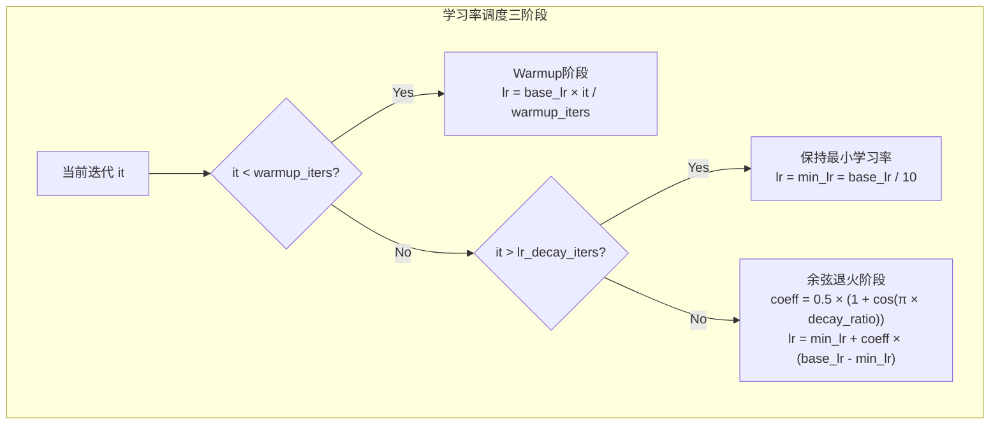

在大型语言模型训练过程中，**学习率调度（Learning Rate Scheduling）** 是影响模型收敛速度和最终性能的关键因素。本框架实现了经典的 Warmup + Cosine Annealing 学习率调度策略，通过预热阶段稳定梯度方向，利用余弦函数平滑衰减学习率，实现更稳定的训练过程和更好的模型收敛。

## 核心实现：get_lr 函数

学习率调度的核心逻辑封装在 `get_lr(it, all)` 函数中，该函数根据当前迭代次数和总迭代次数计算对应的学习率值。在 Tiny-K 框架中，预训练和监督微调（SFT）均采用统一的调度策略。



### 数学公式

整个调度过程可以用数学语言精确描述：

**阶段一：线性预热（Warmup）**
$$\text{lr}(t) = \text{base\_lr} \times \frac{t}{\text{warmup\_iters}}, \quad 0 \leq t < \text{warmup\_iters}$$

**阶段二：余弦退火（Cosine Annealing）**
$$\text{lr}(t) = \text{min\_lr} + \frac{1}{2}\left(1 + \cos\left(\pi \times \frac{t - \text{warmup\_iters}}{\text{lr\_decay\_iters} - \text{warmup\_iters}}\right)\right) \times (\text{base\_lr} - \text{min\_lr})$$

其中 `min_lr = base_lr / 10`。

Sources: [ddp_pretrain.py](ddp_pretrain.py#L34-L66), [ddp_sft_full.py](ddp_sft_full.py#L28-L49)

## 学习率调度曲线示意

以下示意图展示了完整的学习率变化曲线：

```mermaid
quadrantChart
    title 学习率调度曲线
    x-axis 训练进度 (0% → 100%)
    y-axis 学习率
    "Warmup阶段": [0, 0.8]
    "余弦衰减阶段": [0.2, 0.6]
    "最小学习率维持": [0.8, 0.2]
    "峰值学习率": [0.2, 0.95]
```

## 训练循环中的集成

学习率调度在每次参数更新前被调用，通过遍历优化器的所有参数组并更新其学习率值。这种手动更新方式比使用 PyTorch 的 `LRScheduler` 更加灵活，允许在梯度累积场景下精确控制学习率。

```python
# 获取当前步骤的学习率
lr = get_lr(epoch * iter_per_epoch + step, args.epochs * iter_per_epoch)

# 更新优化器中所有参数组的学习率
for param_group in optimizer.param_groups:
    param_group['lr'] = lr
```

Sources: [ddp_pretrain.py](ddp_pretrain.py#L92-L96)

## 关键配置参数

框架提供了两个与学习率调度直接相关的命令行参数：

| 参数 | 默认值 | 说明 |
|------|--------|------|
| `--learning_rate` | `2e-4` | 峰值学习率，即 Warmup 阶段结束后的最大学习率 |
| `--warmup_iters` | `0` | 预热阶段的迭代次数，设为 0 表示跳过 Warmup 直接进入余弦退火 |

### 参数配置建议

针对不同训练场景，参数配置策略如下：

| 训练场景 | learning_rate | warmup_iters | 说明 |
|----------|---------------|--------------|------|
| 预训练（从头开始） | 1e-4 ~ 3e-4 | 总步数的 1%~5% | 大模型建议使用较小学习率 |
| SFT（有预训练权重） | 1e-5 ~ 5e-5 | 建议开启 | 利用预训练知识，无需长时间 Warmup |
| 微调（小数据集） | 5e-6 ~ 2e-5 | 建议开启 | 避免破坏预训练特征 |

Sources: [ddp_pretrain.py](ddp_pretrain.py#L228-L240), [ddp_sft_full.py](ddp_sft_full.py#L161-L169)

## 日志记录与可视化

框架在训练过程中记录每个迭代步骤的学习率值，便于后续分析学习率调度效果：

```python
if step % args.log_interval == 0:
    Logger('Epoch:[{}/{}]({}/{}) loss:{:.3f} lr:{:.7f} epoch_Time:{}min;'.format(
        epoch + 1,
        args.epochs,
        step,
        iter_per_epoch,
        loss.item() * args.accumulation_steps,
        optimizer.param_groups[-1]['lr'],  # 记录当前学习率
        spend_time / (step + 1) * iter_per_epoch // 60 - spend_time // 60))

# SwanLab 实验跟踪
if args.use_swanlab:
    swanlab.log({
        "loss": loss.item() * args.accumulation_steps,
        "lr": optimizer.param_groups[-1]['lr']  # 学习率曲线可视化
    })
```

Sources: [ddp_pretrain.py](ddp_pretrain.py#L128-L146)

## 调度策略优势分析

本框架采用的学习率调度策略具有以下优势：

**稳定性提升**：Warmup 阶段允许模型在低学习率下先学习粗粒度特征，避免训练初期因参数剧烈更新导致的数值不稳定。

**收敛质量改善**：余弦退火函数在训练后期将学习率降至峰值的十分之一（`min_lr = base_lr / 10`），使模型能够在接近最优解时进行更精细的参数调整。

**实现简洁高效**：手动实现的学习率计算逻辑无需额外的调度器对象，在梯度累积场景下能够精确控制每个有效更新步骤的学习率。

## 完整训练示例

以下命令展示如何配置学习率调度参数进行训练：

```bash
# 预训练：使用 Warmup + Cosine Annealing
python ddp_pretrain.py \
    --out_dir base_model_215M \
    --epochs 1 \
    --batch_size 64 \
    --learning_rate 2e-4 \
    --warmup_iters 1000 \
    --use_swanlab

# SFT：使用较小的学习率和适中的 Warmup
python ddp_sft_full.py \
    --out_dir sft_model_215M \
    --epochs 1 \
    --batch_size 64 \
    --learning_rate 2e-5 \
    --warmup_iters 500 \
    --use_swanlab
```

## 进阶：学习率预热的重要性

对于从头开始预训练的大型语言模型，学习率预热（Warmup）是不可或缺的步骤。在训练初期，模型参数随机初始化，梯度方向可能极不稳定。直接使用较大学习率会导致参数更新幅度过大，使模型陷入局部最优或数值爆炸。Warmup 阶段通过渐进式提升学习率，帮助模型：

1. **稳定梯度流**：小学习率确保参数更新幅度可控
2. **学习基础模式**：优先捕获低频、普遍的特征表示
3. **自适应学习率缩放**：为后续余弦衰减阶段奠定基础

当使用预训练权重进行 SFT 时，Warmup 的重要性相对降低，但仍建议设置较小的预热步数（如 200-500 步）以平滑过渡到训练阶段。

---

## 相关资源

- 深入理解训练流程，请阅读：[预训练流程：数据加载与模型训练](8-yu-xun-lian-liu-cheng-shu-ju-jia-zai-yu-mo-xing-xun-lian)
- 了解混合精度训练如何与学习率调度协同工作：[混合精度训练与梯度累积](11-hun-he-jing-du-xun-lian-yu-ti-du-lei-ji)
- 完整的 SFT 训练配置：[监督微调（SFT）：对话能力训练](9-jian-du-wei-diao-sft-dui-hua-neng-li-xun-lian)