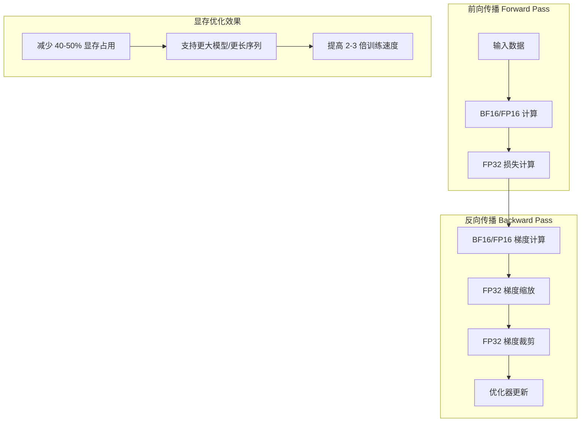
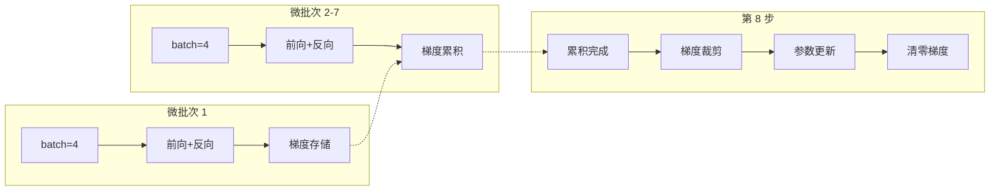

本文档深入探讨 Tiny-K 语言模型训练框架中的两项核心技术——**混合精度训练**（Mixed Precision Training）与**梯度累积**（Gradient Accumulation）。这两项技术是现代大语言模型训练的基石，通过降低显存占用与突破物理批量大小限制，使 215M 参数级别的模型能够在消费级 GPU 上高效训练。

## 技术概述与协同原理

混合精度训练与梯度累积并非孤立的技术手段，而是相互配合、共同优化训练效率与效果的核心机制。前者解决**显存容量与计算效率**的问题，后者解决**有效批量大小受限**的问题。

### 混合精度训练的核心价值

在 PyTorch 框架中，混合精度训练通过 `torch.cuda.amp`（Automatic Mixed Precision）模块实现。其核心思想是：在训练过程中根据操作类型动态选择最优精度——对数值精度要求高的操作（如梯度累积、损失计算）使用 FP32，对数值范围充足的操作（如前向传播中的矩阵乘法）使用 FP16/BF16。

BF16（BFloat16）相比 FP16 具有更宽的动态范围，数值稳定性更好，因此成为 LLM 训练的首选。本框架默认采用 `bfloat16` 作为混合精度的低精度数据类型。



### 梯度累积的数学原理

梯度累积的核心思想是将多个小批次的梯度**累加**起来，仅在累积到目标有效批量大小时执行一次参数更新。从数学角度看，梯度累积与单批次训练的梯度等效性可由链式法则证明：

设累积步数为 $N$，则累积梯度为：
$$\nabla_{\theta}^{accumulated} = \sum_{i=1}^{N} \nabla_{\theta}^{i}$$

使用累积梯度更新参数：
$$\theta_{new} = \theta_{old} - \eta \cdot \nabla_{\theta}^{accumulated}$$

这与使用有效批量大小 $N \times batch\_size$ 进行单批次训练在数学上完全等价。



## 框架实现深度解析

### 上下文管理器与精度配置

混合精度训练的第一步是设置合适的上下文管理器。框架根据目标设备类型选择不同的上下文策略——GPU 训练使用 `autocast`，CPU 训练使用 `nullcontext` 以确保代码兼容性。

Sources: [ddp_pretrain.py](ddp_pretrain.py#L288-L292)

```python
# 确定设备类型（用于选择合适的上下文管理器）
device_type = "cuda" if "cuda" in args.device else "cpu"

# 设置混合精度训练的上下文管理器
# CPU训练时使用nullcontext，GPU训练时使用autocast
ctx = nullcontext() if device_type == "cpu" else torch.cuda.amp.autocast()
```

参数配置通过命令行定义，其中 `--dtype` 参数控制数据类型选择，`--accumulation_steps` 参数控制梯度累积步数：

Sources: [ddp_pretrain.py](ddp_pretrain.py#L230-L239)

```python
# 基础训练参数
parser.add_argument("--dtype", type=str, default="bfloat16", help="数据类型")

# 训练优化参数
parser.add_argument("--accumulation_steps", type=int, default=8, help="梯度累积步数")
parser.add_argument("--grad_clip", type=float, default=1.0, help="梯度裁剪阈值")
```

### GradScaler 梯度缩放器

`GradScaler` 是 PyTorch AMP 训练的核心组件，负责动态调整损失函数的缩放因子以避免梯度下溢（underflow）。当检测到前一次迭代发生 inf/nan 梯度时，scaler 会自动缩小缩放因子，跳过该次更新，等待梯度恢复正常。

Sources: [ddp_pretrain.py](ddp_pretrain.py#L312-L314)

```python
# 初始化混合精度训练的梯度缩放器
# 只有在使用float16或bfloat16时才启用
scaler = torch.cuda.amp.GradScaler(enabled=(args.dtype in ['float16', 'bfloat16']))
```

### 训练循环核心实现

训练循环是混合精度与梯度累积技术协同工作的核心场所。整个流程分为三个阶段：**前向传播与损失计算**、**梯度累积与反向传播**、**条件更新与梯度清零**。

Sources: [ddp_pretrain.py](ddp_pretrain.py#L85-L126)

```python
for step, (X, Y, loss_mask) in enumerate(train_loader):
    # 将数据转移到指定设备
    X = X.to(args.device)
    Y = Y.to(args.device)
    loss_mask = loss_mask.to(args.device)

    # 计算当前步骤的学习率
    lr = get_lr(epoch * iter_per_epoch + step, args.epochs * iter_per_epoch)
    for param_group in optimizer.param_groups:
        param_group['lr'] = lr

    # 使用混合精度训练上下文
    with ctx:
        # 前向传播
        out = model(X, Y)
        # 计算损失并除以累积步数（用于梯度累积）
        loss = out.last_loss / args.accumulation_steps
        # 将loss_mask展平为一维
        loss_mask = loss_mask.view(-1)
        # 应用掩码计算有效损失
        loss = torch.sum(loss * loss_mask) / loss_mask.sum()

    # 使用scaler进行混合精度的反向传播
    scaler.scale(loss).backward()

    # 每accumulation_steps步执行一次优化器更新
    if (step + 1) % args.accumulation_steps == 0:
        # 取消梯度缩放，准备梯度裁剪
        scaler.unscale_(optimizer)
        # 梯度裁剪，防止梯度爆炸
        torch.nn.utils.clip_grad_norm_(model.parameters(), args.grad_clip)

        # 执行优化器步骤
        scaler.step(optimizer)
        # 更新scaler的缩放因子
        scaler.update()

        # 清零梯度，set_to_none=True可以节省内存
        optimizer.zero_grad(set_to_none=True)
```

**关键设计要点解析：**

1. **损失缩放**（第 103 行）：`loss = out.last_loss / args.accumulation_steps` 将损失除以累积步数，确保累积后的总损失与单批次训练一致

2. **延迟反向传播**（第 110 行）：`scaler.scale(loss).backward()` 在混合精度上下文中执行反向传播，梯度自动以 BF16 精度存储

3. **条件更新**（第 113-125 行）：仅在累积步数满足时执行优化器更新，这是梯度累积的核心控制逻辑

4. **内存优化**（第 125 行）：`optimizer.zero_grad(set_to_none=True)` 使用 `set_to_none=True` 参数将梯度张量设为 None 而非零张量，可节省约 30% 的显存用于存储梯度

### SFT 训练中的相同模式

监督微调（SFT）训练使用完全相同的混合精度与梯度累积模式，确保预训练阶段习得的能力能够有效迁移到下游任务：

Sources: [ddp_sft_full.py](ddp_sft_full.py#L64-L82)

```python
# 前向传播
with ctx:
    out = model(X, Y)
    loss = out.last_loss / args.accumulation_steps
    loss_mask = loss_mask.view(-1)
    loss = torch.sum(loss * loss_mask) / loss_mask.sum()

# 反向传播
scaler.scale(loss).backward()

# 更新权重
if (step + 1) % args.accumulation_steps == 0:
    scaler.unscale_(optimizer)
    torch.nn.utils.clip_grad_norm_(model.parameters(), args.grad_clip)
    scaler.step(optimizer)
    scaler.update()
    optimizer.zero_grad(set_to_none=True)
```

## 显存占用对比分析

理解混合精度训练对显存占用的影响，需要分析模型各组件的显存需求。下表展示了不同精度下各组件的显存占用对比（以 215M 参数模型为例）：

| 组件类型 | FP32 占用 | BF16/FP16 占用 | 节省比例 |
|---------|----------|---------------|----------|
| 模型参数 | ~860 MB | ~430 MB | 50% |
| 梯度 | ~860 MB | ~430 MB | 50% |
| 优化器状态（Adam） | ~3440 MB | ~3440 MB | 0% |
| 激活值 | ~500-2000 MB | ~250-1000 MB | 50% |
| **总计（不含激活值）** | **~5160 MB** | **~4300 MB** | **~17%** |

> **注意**：使用混合精度训练时，梯度必须存储为 FP32 以保证数值稳定性，这是 Adam 优化器状态的显存占用无法减少的原因。

## 参数配置指南

### 关键参数说明

| 参数名 | 默认值 | 说明 | 调优建议 |
|-------|-------|------|---------|
| `--dtype` | `bfloat16` | 混合精度数据类型 | BF16 稳定性优于 FP16，建议优先使用 |
| `--accumulation_steps` | `8` | 梯度累积步数 | 增大可提高有效批量大小，适合长序列训练 |
| `--grad_clip` | `1.0` | 梯度裁剪阈值 | 过大无法抑制梯度爆炸，过小会减慢收敛 |
| `--batch_size` | `64` | 单卡微批次大小 | 受 GPU 显存限制，需与累积步数配合 |

### 显存估算公式

在混合精度 + 梯度累积配置下，单卡所需显存可通过以下公式估算：

```
显存 ≈ 模型参数 × 2 + 梯度 × 2 + 优化器状态 × 4 + 激活值 × batch_size × 序列长度 × 隐藏维度 × 4
```

对于 215M 模型，使用 `--batch_size=64 --accumulation_steps=8 --dtype=bfloat16`，典型显存占用约为 8-12 GB。

### 配置示例

```bash
# 单卡训练：有效批量大小 = 64 × 8 = 512
python ddp_pretrain.py \
    --batch_size 64 \
    --accumulation_steps 8 \
    --dtype bfloat16 \
    --grad_clip 1.0 \
    --learning_rate 2e-4

# 多卡训练：有效批量大小 = 64 × 8 × 4 = 2048
python ddp_pretrain.py \
    --batch_size 64 \
    --accumulation_steps 8 \
    --gpus 0,1,2,3 \
    --dtype bfloat16
```

## 故障排查与最佳实践

### 常见问题与解决方案

| 问题现象 | 可能原因 | 解决方案 |
|---------|---------|---------|
| 训练 loss 出现 NaN | 梯度下溢或梯度爆炸 | 增大 `--grad_clip`，或切换到 bfloat16 |
| 显存不足 OOM | 批量大小过大 | 减小 `--batch_size`，增大 `--accumulation_steps` |
| 训练速度过慢 | CPU 数据加载瓶颈 | 增加 `--num_workers`，启用 `pin_memory=True` |
| 收敛不稳定 | 学习率过高 | 使用 [学习率调度：Warmup 与余弦退火策略](10-xue-xi-lu-diao-du-warmup-yu-yu-xian-tui-huo-ce-lue) 中的调度策略 |

### 性能优化建议

1. **启用 Flash Attention**：框架默认支持 Flash Attention，可显著加速注意力计算并降低显存占用
   Sources: [k_model.py](k_model.py#L169-L171)

2. **使用 `set_to_none=True`**：梯度清零时使用此参数可避免显存碎片化

3. **启用 `pin_memory=True`**：数据加载时使用锁页内存，加速 GPU 数据传输
   Sources: [ddp_pretrain.py](ddp_pretrain.py#L305)

4. **监控梯度缩放因子**：通过 `scaler.get_scale()` 观察缩放因子是否稳定下降，过快下降可能表明学习率过高

## 技术演进与框架扩展

### DeepSpeed ZeRO 集成展望

当前框架使用 DDP（DistributedDataParallel）进行多卡训练，结合混合精度与梯度累积实现了高效训练。对于更大规模的模型，可考虑集成 DeepSpeed ZeRO（Zero Redundancy Optimizer）技术，通过分片优化器状态、梯度、参数进一步降低单卡显存占用。

### BF16 vs FP16 选择依据

| 特性 | BF16 | FP16 |
|-----|------|-----|
| 指数位数 | 8 位 | 5 位 |
| 尾数位数 | 7 位 | 10 位 |
| 动态范围 | 与 FP32 相当 | 较窄 |
| 数值稳定性 | ✓ 更好 | 需要 GradScaler |
| LLM 训练支持 | ✓ 主流框架推荐 | 兼容 |

BF16 的 8 位指数与 FP32 相同，因此动态范围与 FP32 一致，不易发生溢出，这使得大语言模型训练更加稳定。

---

## 下一步学习路径

在掌握混合精度训练与梯度累积后，建议继续深入以下主题：

- **[预训练流程：数据加载与模型训练](8-yu-xun-lian-liu-cheng-shu-ju-jia-zai-yu-mo-xing-xun-lian)** — 了解预训练的完整数据处理流水线
- **[学习率调度：Warmup 与余弦退火策略](10-xue-xi-lu-diao-du-warmup-yu-yu-xian-tui-huo-ce-lue)** — 掌握配合梯度累积的学习率调度技术
- **[多GPU分布式训练配置](17-duo-gpufen-bu-shi-xun-lian-pei-zhi)** — 扩展到多节点训练的分布式配置