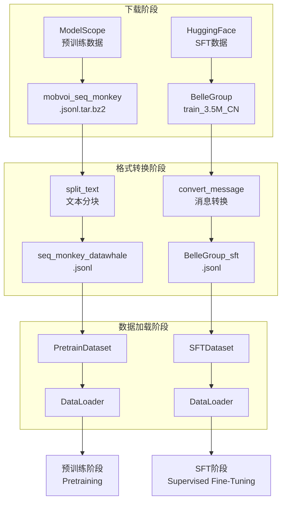
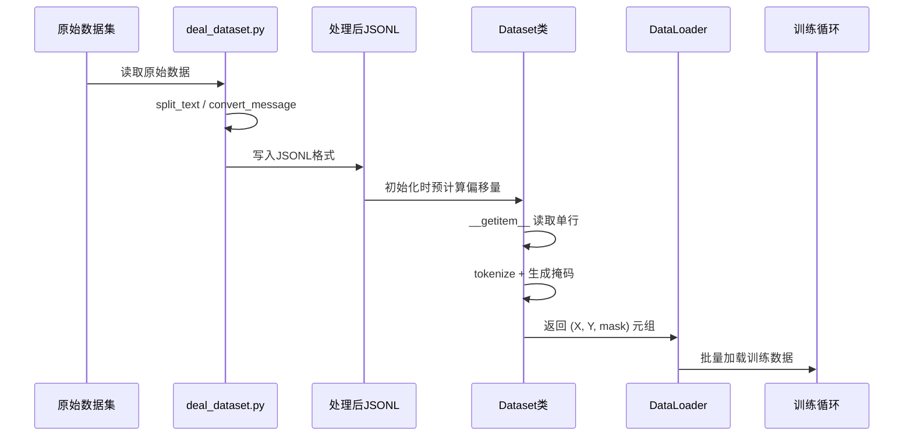

在大语言模型训练流程中，数据处理是连接原始语料与模型训练的关键环节。本页文档将详细介绍 Tiny-K 框架如何将原始数据集转换为符合训练要求的 JSONL 格式，以及如何通过分块处理实现高效的批量训练。我们将深入分析 `deal_dataset.py` 和 `dataset.py` 两个核心文件，揭示预训练数据与监督微调（SFT）数据处理的完整技术方案。

## 数据处理流程总览

Tiny-K 框架的数据处理流程可分为两个阶段：**格式转换阶段**和**数据加载阶段**。格式转换阶段负责将下载的原始数据转换为统一的 JSONL 格式，并进行必要的分块处理；数据加载阶段则通过 PyTorch Dataset 实现高效的数据读取与预处理。两阶段协同工作，确保数据能够以最佳方式输入模型进行训练。



## 原始数据集说明

在开始数据处理之前，需要了解框架所使用的两类原始数据集的格式差异。

| 数据集类型 | 来源 | 原始格式 | 处理目标 |
|-----------|------|---------|---------|
| **预训练数据** | ModelScope `ddzhu123/seq-monkey` | 每行包含 `text` 字段的长文本 | 按 512 token 分块 |
| **SFT 数据** | HuggingFace `BelleGroup/train_3.5M_CN` | 对话历史 `conversations` 数组 | 转换为 role-based 格式 |

预训练数据通常以纯文本形式存储，单个样本可能包含数千甚至数万字符。SFT 数据则采用对话格式，记录多轮交互过程中用户与助手的消息交换。

Sources: [download_dataset.sh](download_dataset.sh#L1-L21)

## 预训练数据处理：分块策略

### 长文本分块原理

预训练数据的核心挑战在于如何将超长文本切分为适合模型处理的固定长度片段。Tiny-K 采用简单的等长分块策略，代码中的 `split_text` 函数实现如下逻辑：

```python
def split_text(text, chunk_size=512):
    """将文本按指定长度切分成块"""
    return [text[i:i+chunk_size] for i in range(0, len(text), chunk_size)]
```

这个函数按照字符位置进行均匀切分，每块包含 512 个字符。需要注意的是，这里的 `chunk_size=512` 是字符数而非 token 数，由于 BPE 分词器的作用，实际转换后的 token 数量会有所差异。

### 分块处理流程

`deal_dataset.py` 中的预训练数据处理逻辑通过流式读取实现高效处理：

```python
with open(output_pretrain_data, 'a', encoding='utf-8') as pretrain:
    with open(pretrain_data, 'r', encoding='utf-8') as f:
        data = f.readlines()
        for line in tqdm(data, desc=f"Processing lines"):
            line = json.loads(line)
            text = line['text']
            chunks = split_text(text)
            for chunk in chunks:
                pretrain.write(json.dumps({'text': chunk}, ensure_ascii=False) + '\n')
```

代码使用 `tqdm` 提供处理进度可视化，每个原始样本经过分块后生成多个 JSONL 行。处理结果保存到 `seq_monkey_datawhale.jsonl` 文件，每行格式为 `{"text": "分块内容"}`。

Sources: [deal_dataset.py](deal_dataset.py#L1-L27)

### 分块策略的设计考量

这种分块策略的优势在于实现简单、计算效率高。但也存在明显的局限性：按照字符位置切分可能将语义完整的句子从中切断，导致模型学习到不完整的上下文表示。在实际生产环境中，更常见的做法是采用滑动窗口结合句子边界检测的分块方案。

## SFT 数据处理：消息格式转换

### 对话格式标准化

SFT 数据处理的复杂性在于需要对原始对话格式进行标准化转换。原始数据采用 `from` 字段标识发言者身份，而目标格式则采用 `role` 字段表示角色语义：

```python
def convert_message(data):
    """将原始数据转换为标准格式"""
    message = [
        {"role": "system", "content": "你是一个AI助手"},
    ]
    for item in data:
        if item['from'] == 'human':
            message.append({'role': 'user', 'content': item['value']})
        elif item['from'] == 'assistant':
            message.append({'role': 'assistant', 'content': item['value']})
    return message
```

该函数首先添加一条系统消息设定助手的角色定位，然后遍历原始对话历史，将 `human` 映射为 `user`，将 `assistant` 映射为 `assistant`。转换结果是一个标准的消息列表，符合 tokenizer 的 chat_template 要求。

### 转换后的数据格式

处理完成后，SFT 数据保存为 `BelleGroup_sft.jsonl`，每行是一个包含多轮对话的消息数组：

```json
[
  {"role": "system", "content": "你是一个AI助手"},
  {"role": "user", "content": "用户提问内容"},
  {"role": "assistant", "content": "助手回复内容"}
]
```

这种格式可以直接被 tokenizer 的 `apply_chat_template` 方法识别，生成模型可处理的对话文本。

Sources: [deal_dataset.py](deal_dataset.py#L28-L49)

## 数据加载器实现

### PretrainDataset 实现细节

`PretrainDataset` 是用于预训练阶段的 PyTorch Dataset 实现，其核心设计思路是通过预计算行偏移量实现高效随机访问：

```python
class PretrainDataset(Dataset):
    def __init__(self, data_path, tokenizer, max_length=512):
        super().__init__()
        self.data_path = data_path
        self.tokenizer = tokenizer
        self.max_length = max_length
        self.padding = tokenizer.pad_token_id if tokenizer.pad_token_id is not None else 0
        # 预计算每行的起始字节偏移量
        self._offsets = []
        with open(data_path, 'rb') as f:
            self._offsets.append(0)
            while f.readline():
                self._offsets.append(f.tell())
        self._total_lines = len(self._offsets) - 1
```

在初始化阶段，代码以二进制模式打开文件，逐行读取并记录每个起始位置的文件指针偏移量。这种预计算策略的优势在于支持 O(1) 时间复杂度的随机访问，避免每次读取时遍历文件的开销。

### 样本构建与标签生成

`__getitem__` 方法负责将 JSONL 行转换为模型输入格式：

```python
def __getitem__(self, index: int):
    with open(self.data_path, 'rb') as f:
        f.seek(self._offsets[index])
        line = f.readline().decode('utf-8')
    sample = json.loads(line)
    text = f"{self.tokenizer.bos_token}{sample['text']}"
    input_id = self.tokenizer(text).data['input_ids'][:self.max_length]
    text_len = len(input_id)
    padding_len = self.max_length - text_len
    input_id = input_id + [self.padding] * padding_len
    loss_mask = [1] * text_len + [0] * padding_len
    # ...
```

预训练采用因果语言模型的标准训练方式：在文本开头添加 `bos_token`，然后对输入进行 tokenize 和截断处理。标签通过将 `input_id` 向右偏移一位生成，这意味着模型需要根据前面的 token 预测下一个 token。

`loss_mask` 的设计确保填充部分不参与损失计算，而有效文本部分全部参与训练。这与 SFT 数据集中只对助手回复计算损失的方式形成对比。

Sources: [dataset.py](dataset.py#L10-L46)

### SFTDataset 的损失掩码机制

SFT 场景下的损失计算需要更精细的控制。模型只需学习生成助手的回复内容，而不应学习预测用户输入或系统提示。`SFTDataset` 通过 `generate_loss_mask` 方法实现这一目标：

```python
def generate_loss_mask(self, input_ids):
    mask = [0] * len(input_ids)
    a_sequence = self.tokenizer("<|im_start|>assistant\n")['input_ids']
    # 在 input_ids 中查找 assistant 标记的位置
    # 找到后，从该位置之后到 eos_token 之前的位置标记为 1
    # ...
    return mask
```

该方法的核心逻辑是在 tokenized 文本中定位 `<|im_start|>assistant\n` 序列，找到序列结束后的第一个 `<eos_token>` 位置，然后将两者之间的区域标记为计算损失的位置。这种基于特殊 token 定位的策略具有较强的鲁棒性，能够适应不同长度的对话历史。

Sources: [dataset.py](dataset.py#L48-L119)

## 特殊 Token 与对话模板

### Token 定义

框架在 `tokenizer_k/tokenizer_config.json` 中定义了四个核心特殊 token：

| Token | 用途 |
|------|------|
| `<\|im_start\|>` | 对话消息起始标记 |
| `<\|im_end\|>` | 对话消息结束标记（同时作为 pad_token） |
| `<unk>` | 未知词标记 |
| `<s>` / `</s>` | 句子边界标记 |

这些 token 共同构成了框架的对话处理基础设施。

Sources: [tokenizer_k/special_tokens_map.json](tokenizer_k/special_tokens_map.json#L1-L10)

### Chat Template 工作原理

Tokenizer 配置中包含完整的 `chat_template` 定义，它规定了消息数组如何转换为模型输入文本：

```jinja2


<|im_start|>system\n{{ message['content'] }}<|im_end|>\n

<|im_start|>user\n{{ message['content'] }}<|im_end|>\n

<|im_start|>assistant\n{{ message['content'] }}<|im_end|>\n


```

模板使用 Jinja2 语法循环遍历消息列表，根据角色类型添加相应的标记和换行符。生成prompt时，系统会添加 `<|im_start|>assistant\n` 作为生成提示，告知模型应开始生成助手回复。

Sources: [tokenizer_k/tokenizer_config.json](tokenizer_k/tokenizer_config.json#L1-L13)

## 训练脚本中的数据集成

数据处理模块在训练脚本中的集成方式反映了框架的设计理念。`ddp_pretrain.py` 和 `ddp_sft_full.py` 分别使用不同的 Dataset 类：

```python
# 预训练脚本
from dataset import PretrainDataset
# ...
train_dataset = PretrainDataset(args.train_file, tokenizer, max_length=args.max_length)
train_loader = DataLoader(train_dataset, batch_size=args.batch_size, shuffle=True)

# SFT 脚本
from dataset import SFTDataset
# ...
train_dataset = SFTDataset(args.train_file, tokenizer, max_length=args.max_length)
train_loader = DataLoader(train_dataset, batch_size=args.batch_size, shuffle=True)
```

两者的训练循环基本一致，都产生 `(X, Y, loss_mask)` 三元组，差异仅在于 loss_mask 的生成策略。这种设计使得预训练和微调可以在统一的数据加载框架下进行，同时保持各自特殊的处理逻辑。

Sources: [ddp_pretrain.py](ddp_pretrain.py#L1-L18)
Sources: [ddp_sft_full.py](ddp_sft_full.py#L1-L16)

## 完整数据处理工作流



整个流程的设计确保了数据处理的模块化和可扩展性。格式转换脚本独立运行一次，生成标准化的 JSONL 文件；Dataset 类负责高效读取和预处理；训练脚本通过 DataLoader 实现批量加载。这种分层设计使得各环节可以独立优化和调试。

## 进阶扩展方向

当前数据处理框架可以沿以下几个方向进行扩展。**动态分块策略**方面，可以引入语义分块算法，在句子边界处进行切分，提升模型学习效率。**数据增强**方面，可在预训练阶段引入回译、同义词替换等增强手段。**分布式数据加载**方面，结合多 worker 并行加载和 prefetch 机制，可进一步提升数据吞吐量。

如果希望深入了解 tokenizer 的训练过程，可以参考 [自定义分词器训练：BPE 算法实战](12-zi-ding-yi-fen-ci-qi-xun-lian-bpe-suan-fa-shi-zhan)；如果需要了解如何下载和配置数据集，可以参考 [数据集下载与配置](14-shu-ju-ji-xia-zai-yu-pei-zhi)；对于预训练的完整流程，可参考 [预训练流程：数据加载与模型训练](8-yu-xun-lian-liu-cheng-shu-ju-jia-zai-yu-mo-xing-xun-lian)。