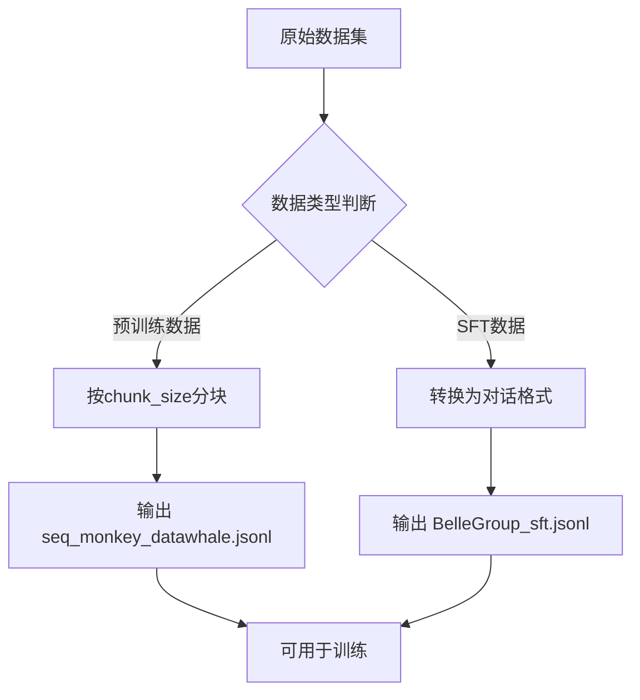
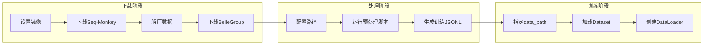

本章节将详细介绍 Tiny-K 语言模型训练框架中数据集的下载、预处理与配置流程。在开始训练之前，正确获取和配置数据集是至关重要的一步。我们将分别讲解预训练（SFT前）和监督微调（SFT）两个阶段所需的数据集准备工作。

## 数据集概述

Tiny-K 项目使用两个主要数据集进行模型训练：

| 数据集类型 | 用途 | 数据格式 | 下载来源 |
|:---:|:---:|:---:|:---:|
| **Seq-Monkey** | 预训练 | JSONL（text字段） | ModelScope |
| **BelleGroup/train_3.5M_CN** | 监督微调（SFT） | JSONL（conversations字段） | HuggingFace |

由于国内网络访问限制，项目默认使用 Mirror 镜像站点（`hf-mirror.com`）来加速 HuggingFace 数据集的下载。预训练数据来自 ModelScope 的 seq-monkey 数据集，包含了丰富的通用文本语料。

Sources: [download_dataset.sh](download_dataset.sh#L1-L21)

## 预训练数据集下载

### Linux/macOS 环境

在 Linux 或 macOS 系统中，使用 `download_dataset.sh` 脚本下载预训练数据集。脚本主要完成三件事：设置镜像环境变量、下载 Seq-Monkey 数据集、解压压缩包。

```bash
#!/bin/bash

# 设置环境变量，使用 HuggingFace 镜像加速下载
export HF_ENDPOINT=https://hf-mirror.com

# 设置本地数据集目录，请替换为你的实际路径
dataset_dir="your local dataset dir"

# 下载预训练数据集（需要预先安装 modelscope）
modelscope download --dataset ddzhu123/seq-monkey mobvoi_seq_monkey_general_open_corpus.jsonl.tar.bz2 --local_dir ${dataset_dir}

# 解压预训练数据集
tar -xvf "${dataset_dir}/mobvoi_seq_monkey_general_open_corpus.jsonl.tar.bz2" -C "${dataset_dir}"
```

执行脚本前，请确保已安装 `modelscope` 包（`pip3 install modelscope`），并将 `dataset_dir` 替换为实际的本机路径。下载完成后，原始数据为压缩的 BZ2 格式，脚本会自动解压得到 JSONL 文件。

Sources: [download_dataset.sh](download_dataset.sh#L1-L21)

### Windows 环境

Windows 用户可以使用 `windows_download_dataset.sh` 脚本，该脚本同时提供了 PowerShell 和 CMD 两种执行方式。

**PowerShell 方式：**
```powershell
# 设置环境变量
$env:HF_ENDPOINT = "https://hf-mirror.com"

# 设置数据集目录
$dataset_dir = "\path\to\your\dataset"

# 下载并解压
modelscope download --dataset ddzhu123/seq-monkey mobvoi_seq_monkey_general_open_corpus.jsonl.tar.bz2 --local_dir "$dataset_dir"
tar -xvf "$dataset_dir\mobvoi_seq_monkey_general_open_corpus.jsonl.tar.bz2" -C "$dataset_dir"
```

Sources: [windows_download_dataset.sh](windows_download_dataset.sh#L1-L36)

## SFT 微调数据集下载

SFT（监督微调）阶段使用 BelleGroup 提供的 `train_3.5M_CN` 中文对话数据集。该数据集包含约 350 万条中文对话样本，是训练对话能力的关键数据。

下载命令使用 `huggingface-cli` 工具，通过镜像站点加速：

```bash
huggingface-cli download \
  --repo-type dataset \
  --resume-download \
  BelleGroup/train_3.5M_CN \
  --local-dir "${dataset_dir}/BelleGroup"
```

参数说明：
- `--repo-type dataset`：指定下载类型为数据集
- `--resume-download`：支持断点续传，避免网络中断后重新下载
- `--local-dir`：指定本地存储路径

Sources: [download_dataset.sh](download_dataset.sh#L15-L21)

## 数据集预处理

原始下载的数据集格式与训练代码要求的格式不完全一致，需要通过 `deal_dataset.py` 进行预处理转换。预处理包括两个核心步骤：**预训练数据分块**和 **SFT数据格式转换**。

### 预处理流程图



### 预训练数据分块处理

预训练数据处理的核心函数 `split_text` 将长文本按指定长度（默认为 512 tokens）切分成块，这是训练语言模型的标准做法：

```python
def split_text(text, chunk_size=512):
    """将文本按指定长度切分成块"""
    return [text[i:i+chunk_size] for i in range(0, len(text), chunk_size)]
```

处理流程会逐行读取原始 JSONL 文件，解析 `text` 字段，然后按照 chunk_size 进行切分，最后写入新的 JSONL 文件。

Sources: [deal_dataset.py](deal_dataset.py#L13-L29)

### SFT 数据格式转换

SFT 数据的格式转换需要将原始数据中的 `conversations` 字段转换为标准对话格式。每个样本包含 `human` 和 `assistant` 两种角色：

```python
def convert_message(data):
    """
    将原始数据转换为标准格式
    """
    message = [
        {"role": "system", "content": "你是一个AI助手"},
    ]
    for item in data:
        if item['from'] == 'human':
            message.append({'role': 'user', 'content': item['value']})
        elif item['from'] == 'assistant':
            message.append({'role': 'assistant', 'content': item['value']})
    return message
```

转换后的数据会自动添加系统提示 "你是一个AI助手"，并按照 `user → assistant` 的顺序组织对话历史。

Sources: [deal_dataset.py](deal_dataset.py#L31-L47)

### 配置文件修改

使用预处理脚本前，需要修改 `deal_dataset.py` 中的路径配置：

```python
# pretrain_data 为预训练数据本地路径
pretrain_data = 'your local pretrain_data'
output_pretrain_data = 'seq_monkey_datawhale.jsonl'

# sft_data 为 SFT 数据本地路径
sft_data = 'your local sft_data'
output_sft_data = 'BelleGroup_sft.jsonl'
```

将 `'your local pretrain_data'` 和 `'your local sft_data'` 替换为实际下载的数据文件路径后，运行脚本即可完成数据转换：

```bash
python deal_dataset.py
```

Sources: [deal_dataset.py](deal_dataset.py#L1-L12)

## 训练脚本中的数据集配置

### 预训练数据集配置

在 `ddp_pretrain.py` 中，数据集路径通过命令行参数 `--data_path` 指定：

```python
parser.add_argument("--data_path", type=str, default="./seq_monkey_datawhale.jsonl", help="训练数据路径")
```

启动预训练时指定数据路径：

```bash
python ddp_pretrain.py --data_path ./seq_monkey_datawhale.jsonl --batch_size 64
```

数据集会被加载为 `PretrainDataset` 对象，与分词器配合处理数据：

```python
train_ds = PretrainDataset(args.data_path, tokenizer, max_length=max_seq_len)
```

Sources: [ddp_pretrain.py](ddp_pretrain.py#L227-L234)

### SFT 微调数据集配置

在 `ddp_sft_full.py` 中，同样通过 `--data_path` 参数配置数据集路径：

```python
parser.add_argument("--data_path", type=str, default="./BelleGroup_sft.jsonl", help="训练数据路径")
```

启动 SFT 训练时指定处理后的对话数据集：

```bash
python ddp_sft_full.py --data_path ./BelleGroup_sft.jsonl --batch_size 32
```

SFT 数据集使用 `SFTDataset` 类加载，该类会自动处理对话模板和损失掩码。

Sources: [ddp_sft_full.py](ddp_sft_full.py#L167-L177)

## 数据集类实现解析

### PretrainDataset 实现

`PretrainDataset` 类采用了高效的字节偏移量预计算策略，能够快速随机访问大型 JSONL 文件中的任意行：

```python
class PretrainDataset(Dataset):
    def __init__(self, data_path, tokenizer, max_length=512):
        super().__init__()
        self.data_path = data_path
        self.tokenizer = tokenizer
        self.max_length = max_length
        self.padding = tokenizer.pad_token_id if tokenizer.pad_token_id is not None else 0
        # 预计算每行的起始字节偏移量
        self._offsets = []
        with open(data_path, 'rb') as f:
            self._offsets.append(0)
            while f.readline():
                self._offsets.append(f.tell())
        self._total_lines = len(self._offsets) - 1
```

在 `__getitem__` 方法中，每个样本会被处理为输入 `X` 和目标 `Y` 的序列对，并生成对应的损失掩码：

```python
def __getitem__(self, index: int):
    # ... 读取数据 ...
    text = f"{self.tokenizer.bos_token}{sample['text']}"
    input_id = self.tokenizer(text).data['input_ids'][:self.max_length]
    # ...
    X = np.array(input_id[:-1]).astype(np.int64)  # 输入序列
    Y = np.array(input_id[1:]).astype(np.int64)   # 目标序列
    loss_mask = np.array(loss_mask[1:]).astype(np.int64)  # 损失掩码
    return torch.from_numpy(X), torch.from_numpy(Y), torch.from_numpy(loss_mask)
```

Sources: [dataset.py](dataset.py#L1-L40)

### SFTDataset 实现

`SFTDataset` 类的核心功能是生成智能损失掩码。由于 SFT 训练只需计算 assistant 回复部分的损失，`generate_loss_mask` 方法会识别对话模板 `<|im_start|>assistant\n` 的位置，并只对 assistant 回复到 EOS token 之间的 token 标记为计算损失：

```python
def generate_loss_mask(self, input_ids):
    # 生成 loss mask, 0 表示不计算损失, 1 表示计算损失
    mask = [0] * len(input_ids)
    a_sequence = self.tokenizer("<|im_start|>assistant\n")['input_ids']
    # ... 模式匹配找到 assistant 回复区间 ...
    # ... 标记损失掩码 ...
    return mask
```

这种设计确保了训练时只优化模型生成回复的能力，而不会对用户输入和系统提示计算损失。

Sources: [dataset.py](dataset.py#L42-L85)

## 完整数据准备流程



**操作步骤总结：**

1. **环境准备**：安装必要依赖（`modelscope`、`huggingface_hub`）
2. **执行下载**：运行 `download_dataset.sh` 脚本
3. **修改配置**：在 `deal_dataset.py` 中设置本地路径
4. **数据处理**：运行 `python deal_dataset.py` 生成标准格式数据
5. **开始训练**：在训练命令中指定 `--data_path` 参数

## 常见问题排查

| 问题 | 原因 | 解决方案 |
|:---|:---|:---|
| 模型下载失败 | 网络连接问题 | 检查网络或使用 VPN |
| 解压失败 | 压缩包损坏 | 重新下载压缩包 |
| 训练报错找不到数据 | 路径配置错误 | 确认 `--data_path` 参数正确 |
| 内存不足 | 数据文件过大 | 确保系统有足够 RAM |

## 下一步

完成数据集下载与配置后，你可以开始进行模型训练：

- **继续预训练**：了解 [预训练流程：数据加载与模型训练](8-yu-xun-lian-liu-cheng-shu-ju-jia-zai-yu-mo-xing-xun-lian) 的详细实现
- **开始微调**：参考 [监督微调（SFT）：对话能力训练](9-jian-du-wei-diao-sft-dui-hua-neng-li-xun-lian) 提升对话能力
- **查看数据格式**：阅读 [数据集处理：JSONL 格式转换与分块](13-shu-ju-ji-chu-li-jsonl-ge-shi-zhuan-huan-yu-fen-kuai) 深入理解数据处理