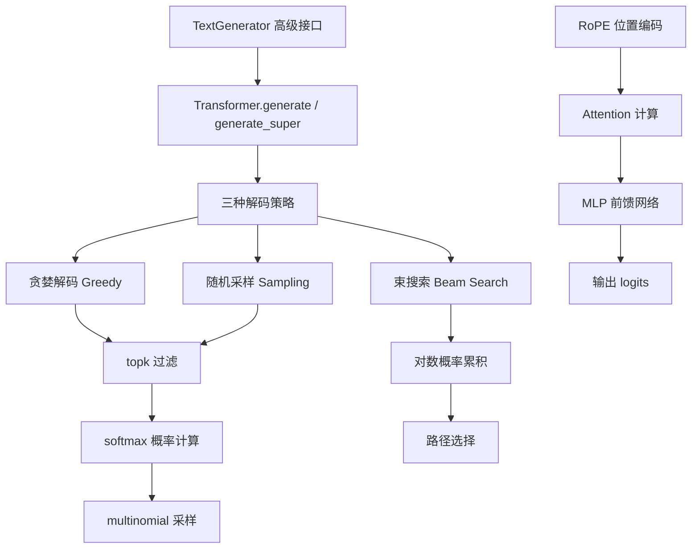
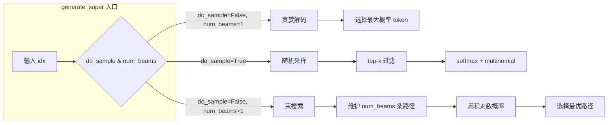

Tiny-K 语言模型提供了完整的文本生成推理框架，涵盖从基础生成到高级解码策略的完整实现。本文档详细介绍模型推理的核心架构、生成算法以及实际使用方法。

## 架构概览

Tiny-K 的推理系统采用分层设计，从高层到底层依次为：**TextGenerator 高级接口** → **Transformer.generate() 生成引擎** → **底层解码策略**。



**核心组件关系**：

| 组件 | 文件位置 | 职责 |
|------|---------|------|
| `TextGenerator` | [model_sample.py#L9-L161](model_sample.py#L9-L161) | 高级生成接口，处理分词器与聊天模板 |
| `Transformer.generate` | [k_model.py#L460-L523](k_model.py#L460-L523) | 基础自回归生成循环 |
| `Transformer.generate_super` | [k_model.py#L674-L772](k_model.py#L674-L772) | 支持多种解码策略的统一接口 |
| 解码策略 | [k_model.py#L525-L672](k_model.py#L525-L672) | 贪婪、采样、束搜索具体实现 |

Sources: [model_sample.py](model_sample.py) [k_model.py](k_model.py)

## TextGenerator 高级接口

`TextGenerator` 类封装了模型加载与文本生成的完整流程，提供开箱即用的推理能力。

### 初始化流程

```python
class TextGenerator:
    def __init__(self, 
                 checkpoint='./base_model_215M/pretrain_1024_18_6144.pth',
                 tokenizer_model_path='./tokenizer_k/',
                 seed=42,
                 device=None,
                 dtype="bfloat16"):
```

初始化过程完成三件核心工作：

1. **设备与精度配置**：根据硬件环境自动选择 CUDA 或 CPU，设置 TF32 加速与自动混合精度上下文
2. **分词器加载**：使用 HuggingFace AutoTokenizer 从本地路径加载自定义分词器
3. **模型加载**：构建 Transformer 模型结构，从检查点加载权重

```python
# 关键初始化代码
self.device = device or ('cuda:0' if torch.cuda.is_available() else 'cpu')
self.ctx = nullcontext() if self.device_type == 'cpu' else torch.amp.autocast(device_type=self.device_type, dtype=ptdtype)
self.tokenizer = AutoTokenizer.from_pretrained(self.tokenizer_model_path)
```

Sources: [model_sample.py#L19-L37](model_sample.py#L19-L37)

### 聊天模板处理

SFT 模型采用对话格式，`chat_template` 方法将用户输入转换为标准对话格式：

```python
def chat_template(self, prompt):
    message = [
        {"role": "system", "content": "你是一个AI助手，你的名字叫小明。"},
        {"role": "user", "content": prompt}
    ]
    return self.tokenizer.apply_chat_template(message, tokenize=False, add_generation_prompt=True)
```

该方法生成的格式为：
```
<|im_start|>system
你是一个AI助手，你的名字叫小明。<|im_end|>
<|im_start|>user
{prompt}<|im_end|>
<|im_start|>assistant
```

Sources: [model_sample.py#L62-L67](model_sample.py#L62-L67)

### 生成方法对比

| 方法 | 适用场景 | 聊天模板 | 停止机制 |
|------|---------|---------|---------|
| `pretrain_sample` | 预训练模型续写 | ❌ 无 | 达到 max_new_tokens |
| `sft_sample` | SFT 模型对话 | ✅ 使用 | 使用 eos_token_id |

```python
def sft_sample(self, start, num_samples=3, max_new_tokens=256, temperature=0.7, top_k=300):
    start = self.chat_template(start)  # 应用聊天模板
    start_ids = self.tokenizer(start).data['input_ids']
    x = torch.tensor(start_ids, dtype=torch.long, device=self.device)[None, ...]
    
    with torch.no_grad():
        with self.ctx:
            for k in range(num_samples):
                y = self.model.generate(x, self.tokenizer.eos_token_id, 
                                        max_new_tokens, temperature=temperature, top_k=top_k)
                generated_texts.append(self.tokenizer.decode(y[0].tolist()))
    return generated_texts
```

Sources: [model_sample.py#L69-L96](model_sample.py#L69-L96)

## 自回归生成机制

### Transformer.generate 基础实现

自回归生成的核心思想是：**给定前文，预测下一个 token，然后将预测的 token 加入输入，循环直到达到停止条件**。

```python
@torch.inference_mode()
def generate(self, idx, stop_id=None, max_new_tokens=256, temperature=1.0, top_k=None):
    """
    自回归文本生成
    - idx: 输入序列，形状 (batch_size, seq_len)
    - stop_id: 遇到该 token 停止生成
    - max_new_tokens: 最大生成 token 数
    """
    finished = torch.zeros(idx.size(0), dtype=torch.bool, device=idx.device)
    index = idx.shape[1]  # 记录原始序列长度
    
    for _ in range(max_new_tokens):
        # 序列过长时截断
        idx_cond = idx if idx.size(1) <= self.args.max_seq_len else idx[:, -self.args.max_seq_len:]
        
        # 前向传播获取最后一个位置的 logits
        logits = self(idx_cond).logits
        logits = logits[:, -1, :]  # 只保留最后一个时间步
        
        # token 选择
        if temperature == 0.0:
            _, idx_next = torch.topk(logits, k=1, dim=-1)  # 贪婪
        else:
            logits = logits / temperature
            if top_k is not None:
                v, _ = torch.topk(logits, min(top_k, logits.size(-1)))
                logits[logits < v[:, [-1]]] = -float('Inf')  # top-k 过滤
            probs = F.softmax(logits, dim=-1)
            idx_next = torch.multinomial(probs, num_samples=1)  # 采样
        
        # 更新序列
        idx = torch.cat((idx, idx_next), dim=1)
        
        # 停止检查
        if stop_id is not None:
            finished = finished | idx_next[:, 0].eq(stop_id)
            if finished.all():
                break
    
    return idx[:, index:]  # 只返回生成的 token
```

Sources: [k_model.py#L460-L523](k_model.py#L460-L523)

### 前向传播优化

推理时使用特殊的优化策略：**只计算最后一个位置的 logits**。在 `Transformer.forward()` 中：

```python
if targets is not None:
    # 训练模式：计算所有位置的损失
    logits = self.output(h)
else:
    # 推理模式：只计算最后一个位置的输出
    if attention_mask is None:
        logits = self.output(h[:, [-1], :])
    else:
        # 处理 padding 的情况
        last_token_pos = attention_mask.long().sum(dim=1).clamp(min=1) - 1
        logits = full_logits[torch.arange(_bsz, device=tokens.device), last_token_pos].unsqueeze(1)
```

Sources: [k_model.py#L444-L452](k_model.py#L444-L452)

## 解码策略详解

Tiny-K 实现了三种主流解码策略，通过 `generate_super` 方法统一调用：



### 贪婪解码

贪婪解码在每一步选择概率最高的 token，速度最快但缺乏多样性：

```python
def _greedy_decode(self, logits: torch.Tensor) -> torch.Tensor:
    """
    贪婪解码：选择概率最大的 token
    - logits: 形状 (batch_size, vocab_size)
    - 返回: 形状 (batch_size, 1)
    """
    _, idx_next = torch.topk(logits, k=1, dim=-1)
    return idx_next
```

当 temperature 设置为 0 时，`generate` 方法会自动使用贪婪解码：

```python
if temperature == 0.0:
    _, idx_next = torch.topk(logits, k=1, dim=-1)
```

Sources: [k_model.py#L525-L536](k_model.py#L525-L536)

### 随机采样

随机采样基于概率分布进行随机选择，配合 temperature 和 top-k 控制生成质量：

```python
def _random_sample(self, logits: torch.Tensor, temperature: float = 1.0, top_k: int = None) -> torch.Tensor:
    """
    随机采样：基于概率分布随机选择 token
    """
    # 1. 温度缩放
    logits = logits / temperature
    
    # 2. top-k 过滤
    if top_k is not None:
        v, _ = torch.topk(logits, min(top_k, logits.size(-1)))
        logits[logits < v[:, [-1]]] = -float('Inf')
    
    # 3. softmax + 采样
    probs = F.softmax(logits, dim=-1)
    idx_next = torch.multinomial(probs, num_samples=1)
    return idx_next
```

**参数作用**：

| 参数 | 作用 | 建议值 |
|------|-----|-------|
| `temperature` | 控制随机性，值越大越随机，越小越确定 | 0.7-1.0 |
| `top_k` | 限制候选 token 范围，只保留概率前 k 个 | 50-300 |

Sources: [k_model.py#L538-L562](k_model.py#L538-L562)

### 束搜索

束搜索（Beam Search）维护多条候选路径，选择累积概率最高的序列：

```python
def _beam_search(self, idx: torch.Tensor, max_new_tokens: int, num_beams: int,
                 temperature: float = 1.0, top_k: int = None, stop_id: int = None):
    """
    束搜索：维护多个候选序列，选择总概率最高的完整序列
    - num_beams: 束宽度，保留的候选路径数量
    """
    batch_size = idx.shape[0]
    seq_len = idx.shape[1]
    
    # 初始化束
    beams = [idx.clone() for _ in range(num_beams)]
    beam_scores = torch.zeros(num_beams, device=idx.device)
    beam_scores[1:] = float('-inf')
    
    for step in range(max_new_tokens):
        new_beams = []
        new_scores = []
        
        for beam_idx, beam in enumerate(beams):
            if beam_scores[beam_idx] == float('-inf'):
                continue
            
            # 前向传播
            output = self(beam)
            logits = output.logits[:, -1, :]
            
            # 温度缩放 + top-k
            if temperature != 1.0:
                logits = logits / temperature
            if top_k is not None:
                v, _ = torch.topk(logits, min(top_k, logits.size(-1)))
                logits[logits < v[:, [-1]]] = -float('Inf')
            
            # 计算对数概率
            log_probs = F.log_softmax(logits, dim=-1)
            top_log_probs, top_indices = torch.topk(log_probs, k=num_beams, dim=-1)
            
            # 扩展所有候选
            for k in range(num_beams):
                token = top_indices[:, k:k+1]
                new_beam = torch.cat([beam, token], dim=1)
                new_score = beam_scores[beam_idx] + log_probs[:, k].item()
                new_beams.append(new_beam)
                new_scores.append(new_score)
        
        # 选择最优的 num_beams 个候选
        sorted_indices = sorted(range(len(new_scores)), key=lambda i: new_scores[i], reverse=True)
        beams = [new_beams[i] for i in sorted_indices[:num_beams]]
        beam_scores = torch.tensor([new_scores[i] for i in sorted_indices[:num_beams]], device=idx.device)
        
        # 停止检查
        if stop_id is not None and beams[0][0, -1] == stop_id:
            break
    
    return beams[0][:, seq_len:]
```

**束搜索特点**：
- 时间复杂度：O(num_beams × max_new_tokens)
- 空间复杂度：O(num_beams)
- 适合需要高质量输出的场景

Sources: [k_model.py#L564-L672](k_model.py#L564-L672)

## 模型导出与部署

Tiny-K 支持将训练好的模型导出为 HuggingFace 格式，便于后续部署和推理：

```python
def export_model(tokenizer_path, model_config, model_ckpt_path, save_directory):
    # 注册自定义类
    ModelConfig.register_for_auto_class()
    Transformer.register_for_auto_class("AutoModelForCausalLM")
    
    # 加载 tokenizer
    tokenizer = AutoTokenizer.from_pretrained(tokenizer_path, trust_remote_code=True)
    
    # 初始化模型
    model = Transformer(model_config)
    
    # 加载权重
    state_dict = torch.load(model_ckpt_path, map_location=device)
    # 移除可能存在的前缀
    unwanted_prefix = '_orig_mod.'
    for k in list(state_dict.keys()):
        if k.startswith(unwanted_prefix):
            state_dict[k[len(unwanted_prefix):]] = state_dict.pop(k)
    
    model.load_state_dict(state_dict, strict=False)
    
    # 保存为 HuggingFace 格式
    model.save_pretrained(save_directory, safe_serialization=False)
    tokenizer.save_pretrained(save_directory)
```

导出后的模型目录结构：
```
save_directory/
├── config.json           # ModelConfig 配置
├── model.safetensors     # 模型权重
├── tokenizer.json       # 分词器定义
├── tokenizer_config.json # 分词器配置
└── special_tokens_map.json
```

Sources: [export_model.py](export_model.py)

## 实际使用示例

### 基础文本生成

```python
from model_sample import TextGenerator

# 初始化生成器
generator = TextGenerator(
    checkpoint='./base_model_215M/pretrain_1024_18_6144.pth',
    tokenizer_model_path='./tokenizer_k/'
)

# 预训练模型续写
prompt = '<|im_start|>北京大学是'
samples = generator.pretrain_sample(
    start=prompt,
    num_samples=1,
    max_new_tokens=120,
    temperature=0.75
)
print(samples[0])
```

### SFT 对话生成

```python
# 使用 SFT 模型进行对话
generator = TextGenerator(
    checkpoint='./sft_model_215M/sft_dim1024_layers18_vocab_size6144.pth'
)

# 对话提示
samples = generator.sft_sample(
    start="你好呀",
    num_samples=1,
    max_new_tokens=128,
    temperature=0.6
)
print(samples[0])
```

### 使用高级生成接口

```python
from k_model import Transformer, ModelConfig
import torch

# 加载模型
config = ModelConfig(dim=1024, n_layers=18, pad_token_id=0)
model = Transformer(config)
state_dict = torch.load('./sft_model_215M/sft_dim1024_layers18_vocab_size6144.pth')
model.load_state_dict(state_dict, strict=False)
model.eval()

# 使用 generate_super 支持更多参数
result = model.generate_super(
    idx=input_ids,
    stop_id=eos_token_id,
    max_new_tokens=256,
    temperature=0.8,
    top_k=100,
    do_sample=True,      # 启用随机采样
    num_beams=1          # 束宽度
)
```

## 参数调优指南

| 场景 | temperature | top_k | num_beams | 特点 |
|------|-------------|-------|-----------|------|
| 代码生成 | 0.2-0.5 | 50-100 | 1 | 确定性强 |
| 创意写作 | 0.8-1.2 | 200-500 | 1 | 多样性高 |
| 问答系统 | 0.5-0.8 | 100-200 | 3-5 | 质量与效率平衡 |
| 机器翻译 | 0.3-0.7 | 50-100 | 5-10 | 高质量输出 |

## 后续步骤

掌握模型推理后，建议继续学习：

- [模型导出与部署：HuggingFace 格式转换](16-mo-xing-dao-chu-yu-bu-shu-huggingface-ge-shi-zhuan-huan) - 学习将模型导出为标准格式进行部署
- [多GPU分布式训练配置](17-duo-gpufen-bu-shi-xun-lian-pei-zhi) - 了解大规模推理的并行策略
- [Transformer 架构详解](4-transformer-jia-gou-xiang-jie-he-xin-zu-jian-yu-she-ji-yuan-li) - 深入理解模型内部机制