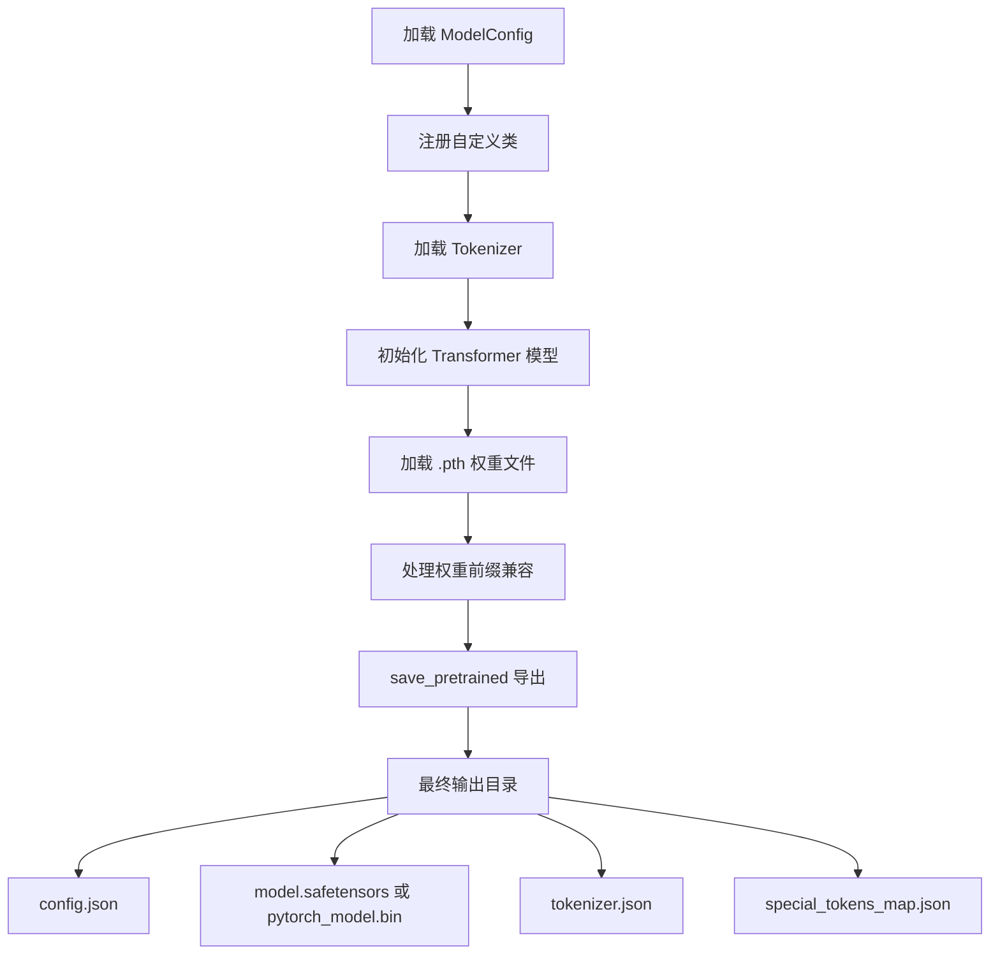

本章节介绍 Tiny-K 语言模型如何从自定义训练格式导出为 HuggingFace 兼容格式，实现与主流推理框架的无缝对接。导出流程涵盖自定义配置注册、权重格式转换、分词器集成等核心环节，使模型能够直接加载到 `transformers` 库或通过 `text-generation-inference` (TGI) 等高性能推理服务进行部署。

## 为什么需要格式转换

Tiny-K 在训练阶段使用自定义的 PyTorch 模型结构（`k_model.py`），这种原生格式具有以下特点：权重以 `.pth` 文件存储，模型配置通过 `ModelConfig` 数据类管理，分词器独立保存在 `tokenizer_k/` 目录。然而，这种格式存在两个主要限制——无法直接被 `transformers.AutoModelForCausalLM.from_pretrained()` 加载，也无法利用 HuggingFace 生态中的量化压缩、推理加速等工具。

HuggingFace 格式的核心优势在于标准化。通过将模型转换为 `safetensors` 或标准 PyTorch 格式，并附带 `config.json` 和 `tokenizer.json` 元数据文件，模型获得了跨平台兼容性。部署者可使用 `vLLM`、`TGI` 或 `llama.cpp` 等工具进行推理，同时也便于在 [模型推理与文本生成](15-mo-xing-tui-li-yu-wen-ben-sheng-cheng) 流程中调用 `transformers` 库的高级功能如 `pipeline` 和 `generate` API。

## 导出脚本核心实现

`export_model.py` 文件包含了模型格式转换的完整逻辑，其设计遵循 HuggingFace 的"配置即代码"理念，允许在加载时动态重建模型结构。



### 自定义类注册机制

导出流程的第一步是向 HuggingFace 注册自定义配置和模型类。这一机制依赖于 `PretrainedConfig` 的 `register_for_auto_class()` 方法和 `PreTrainedModel` 的 `register_for_auto_class()` 方法：

```python
# export_model.py 第 14-16 行
ModelConfig.register_for_auto_class()
Transformer.register_for_auto_class("AutoModelForCausalLM")
```

这段代码的作用是将 `ModelConfig` 注册为 HuggingFace 的配置解析器，将 `Transformer` 注册为因果语言模型（Causal LM）的自动加载处理器。注册后，当 `from_pretrained()` 遇到 `model_type: "Tiny-K"` 的配置时，会自动导入并使用我们自定义的类来构建模型。这种"配置驱动"的架构设计使得模型导出无需修改核心逻辑，只需确保 `config.json` 中的 `model_type` 字段与注册时一致即可。

Sources: [export_model.py](export_model.py#L14-L16)

### 分词器加载与配置同步

分词器的加载采用 `AutoTokenizer.from_pretrained()` 方法，这确保了与 HuggingFace tokenizer 生态的完全兼容：

```python
# export_model.py 第 18-25 行
tokenizer = AutoTokenizer.from_pretrained(
    tokenizer_path,
    trust_remote_code=True,
    use_fast=False
)
if tokenizer.pad_token_id is not None:
    model_config.pad_token_id = tokenizer.pad_token_id
```

`trust_remote_code=True` 参数允许加载包含自定义代码的 tokenizer，这在处理特殊分词逻辑时必不可少。`use_fast=False` 则指定使用 Python 原生实现而非 Rust 实现的分词器。代码还自动将分词器的 `pad_token_id` 同步到模型配置中，确保训练和推理阶段的填充策略一致。

分词器配置存储在 `tokenizer_k/tokenizer_config.json`，其中定义了模型支持的特殊 token：

| Token 类型 | 值 | 用途 |
|-----------|-----|------|
| `bos_token` | `<\|im_start\|>` | 序列起始标记 |
| `eos_token` | `<\|im_end\|>` | 序列结束标记 |
| `pad_token` | `<\|im_end\|>` | 填充标记 |
| `unk_token` | `<unk>` | 未知词标记 |

Sources: [export_model.py](export_model.py#L18-L25)
Sources: [tokenizer_k/tokenizer_config.json](tokenizer_k/tokenizer_config.json#L1-L13)

### 权重文件加载与前缀处理

模型权重的加载需要处理一个关键兼容性问题——PyTorch 2.0 引入的编译（`torch.compile`）机制会在保存的权重键名前添加 `_orig_mod.` 前缀：

```python
# export_model.py 第 31-37 行
state_dict = torch.load(model_ckpt_path, map_location=device)
unwanted_prefix = '_orig_mod.'
for k in list(state_dict.keys()):
    if k.startswith(unwanted_prefix):
        state_dict[k[len(unwanted_prefix):]] = state_dict.pop(k)
```

这段代码遍历所有权重键，检测并移除 `_orig_mod.` 前缀，确保权重能够正确映射到模型的参数结构。`list(state_dict.keys())` 的使用是为了在迭代过程中安全地修改字典。最后使用 `strict=False` 参数加载权重，允许缺失的键不会触发异常。

Sources: [export_model.py](export_model.py#L31-L40)

### 完整导出示例

以下是从头到尾的完整导出流程：

```python
# export_model.py 第 49-61 行
if __name__ == '__main__':
    config = ModelConfig(
        dim=1024,
        n_layers=18,
    )

    export_model(
        tokenizer_path='./tokenizer_k/',
        model_config=config,
        model_ckpt_path='./BeelGroup_sft_model_215M/sft_dim1024_layers18_vocab_size6144.pth',
        save_directory="k-model-215M"
    )
```

导出后的 `k-model-215M/` 目录结构如下：

| 文件 | 说明 |
|-----|------|
| `config.json` | 模型架构配置，包含 `dim`、`n_layers`、`n_heads` 等参数 |
| `model.safetensors` | 模型权重（使用 `safe_serialization=False` 时为 `pytorch_model.bin`） |
| `tokenizer.json` | 分词器完整定义 |
| `tokenizer_config.json` | 分词器配置 |
| `special_tokens_map.json` | 特殊 token 映射 |

Sources: [export_model.py](export_model.py#L49-L61)

## 模型架构与配置对应关系

理解导出后的模型如何被重建，需要掌握 `ModelConfig` 与 `Transformer` 之间的对应关系。`ModelConfig` 继承自 `PretrainedConfig`，将所有超参数存储为实例属性：

```python
# k_model.py 第 14-42 行
class ModelConfig(PretrainedConfig):
    model_type = "Tiny-K"
    def __init__(
            self,
            dim: int = 768,        # 模型隐藏层维度
            n_layers: int = 12,     # Transformer 层数
            n_heads: int = 16,      # 注意力头数
            n_kv_heads: int = 8,    # 键值头数（GQA）
            vocab_size: int = 6144,  # 词汇表大小
            hidden_dim: int = None, # FFN 隐藏维度
            norm_eps: float = 1e-5, # RMSNorm  epsilon
            max_seq_len: int = 512, # 最大序列长度
            dropout: float = 0.0,   # Dropout 概率
            flash_attn: bool = True # 是否启用 Flash Attention
    ):
```

当 `Transformer` 继承 `PreTrainedModel` 并接收 `ModelConfig` 实例时，其 `__init__` 方法会从配置中读取这些参数来初始化网络结构。`config_class = ModelConfig` 属性确保配置类与模型类正确关联。

Sources: [k_model.py](k_model.py#L14-L42)

## 导出后的加载与推理

导出的模型可以通过标准的 HuggingFace 接口加载：

```python
from transformers import AutoModelForCausalLM, AutoTokenizer

model = AutoModelForCausalLM.from_pretrained("k-model-215M")
tokenizer = AutoTokenizer.from_pretrained("k-model-215M")

# 推理示例
prompt = "你好，今天天气如何？"
inputs = tokenizer(prompt, return_tensors="pt")
outputs = model.generate(**inputs, max_new_tokens=100)
print(tokenizer.decode(outputs[0]))
```

这种加载方式的优势在于完全隐藏了自定义模型类的实现细节，用户无需了解 RoPE、GQA 等复杂机制即可使用模型进行推理。

## 常见问题与解决方案

在模型导出过程中，可能遇到以下问题：

**问题一：权重形状不匹配**
训练时使用的模型配置（`dim`、`n_layers` 等）必须与导出时的配置完全一致。建议在导出脚本中显式指定所有关键参数，而非依赖默认值。

**问题二：分词器特殊 token 缺失**
如果训练数据使用了特殊的分隔符或控制 token，确保 `tokenizer_config.json` 中正确定义了这些 token。否则推理时可能出现解码错误。

**问题三：设备兼容性**
`torch.load()` 时显式指定 `map_location=device`，确保权重被加载到目标设备（CPU 或 CUDA）。

## 进阶部署选项

完成 HuggingFace 格式转换后，可选择以下部署方案：

| 部署工具 | 适用场景 | 核心优势 |
|---------|---------|---------|
| `transformers` pipeline | 开发测试 | API 简洁，支持快速迭代 |
| `vLLM` | 高并发服务 | PagedAttention，吞吐量大 |
| `TGI` | 生产部署 | 支持连续批处理、量化压缩 |
| `llama.cpp` | 边缘设备 | 量化推理，CPU 友好 |

关于模型推理的详细用法，请参考 [模型推理与文本生成](15-mo-xing-tui-li-yu-wen-ben-sheng-cheng)。如需了解分布式训练配置，请参阅 [多GPU分布式训练配置](17-duo-gpufen-bu-shi-xun-lian-pei-zhi)。

## 下一步

完成模型导出后，建议继续学习以下内容：
- [模型推理与文本生成](15-mo-xing-tui-li-yu-wen-ben-sheng-cheng) — 掌握 `generate()` 方法的高级用法
- [实验跟踪：SwanLab 日志集成](18-shi-yan-gen-zong-swanlab-ri-zhi-ji-cheng) — 监控模型性能指标
- [多GPU分布式训练配置](17-duo-gpufen-bu-shi-xun-lian-pei-zhi) — 扩大训练规模