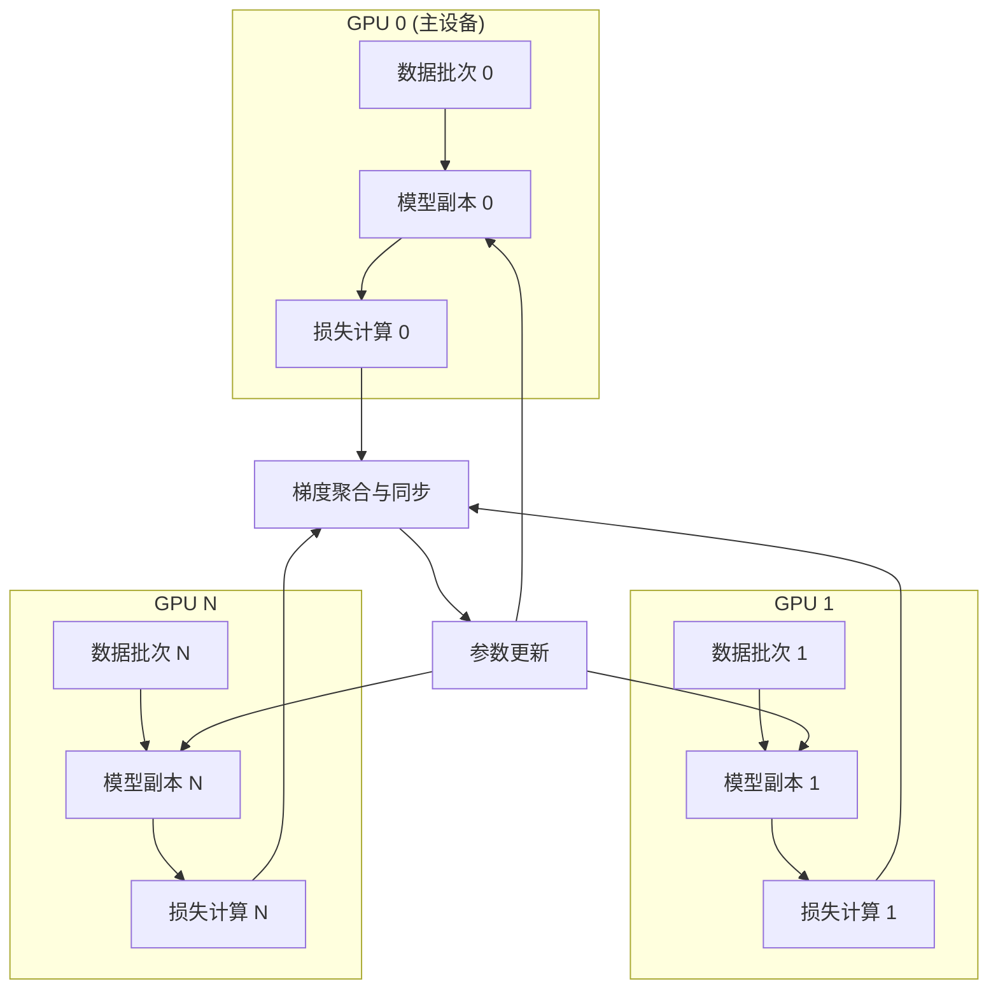
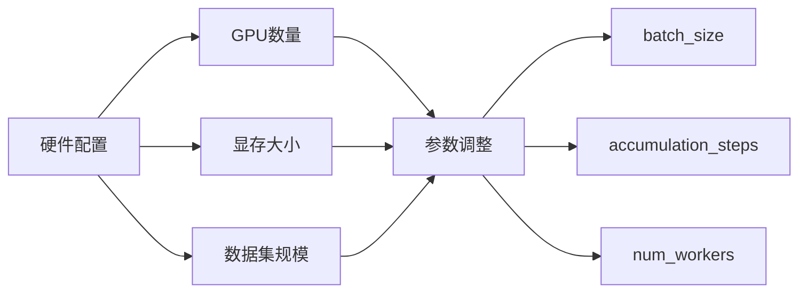

本文档介绍 Tiny-K 语言模型训练框架中的多GPU分布式训练配置方案。通过 PyTorch 的 `DataParallel` 模块，框架支持在单节点多GPU环境下高效地进行预训练和监督微调（SFT）任务。

## 多GPU训练架构概述

Tiny-K 框架采用 **DataParallel（DP）** 策略实现多GPU训练。该策略通过在多个GPU上复制模型，将输入数据分片并行处理，最后汇总梯度更新模型参数。



**DataParallel 工作流程**：

1. 主GPU接收完整批次数据
2. 数据自动分割并分配到各GPU
3. 各GPU并行执行前向传播
4. 损失在主GPU聚合
5. 梯度同步回传各GPU
6. 参数统一更新

Sources: [ddp_pretrain.py](ddp_pretrain.py#L205-L210), [ddp_sft_full.py](ddp_sft_full.py#L145-L149)

## 核心配置参数

框架通过命令行参数提供灵活的多GPU配置选项。以下是关键参数说明：

| 参数名称 | 默认值 | 类型 | 说明 |
|---------|--------|------|------|
| `--gpus` | `'0,1,2,3,4,5,6,7'` | str | 逗号分隔的GPU ID列表 |
| `--batch_size` | `64` | int | 训练批次大小 |
| `--device` | `cuda:0` | str | 主设备标识 |
| `--num_workers` | `8` | int | DataLoader工作进程数 |

**GPU配置示例**：

```bash
# 使用GPU 0, 1, 2, 3 共4张卡
python ddp_pretrain.py --gpus '0,1,2,3'

# 使用所有8张卡
python ddp_pretrain.py --gpus '0,1,2,3,4,5,6,7'

# SFT训练使用2张卡
python ddp_sft_full.py --gpus '0,1'
```

Sources: [ddp_pretrain.py](ddp_pretrain.py#L246-L247), [ddp_sft_full.py](ddp_sft_full.py#L172-L173)

## 环境初始化流程

### GPU设备设置

框架在启动时通过以下逻辑设置可见GPU设备：

```python
# 设置可见GPU
if args.gpus is not None:
    os.environ["CUDA_VISIBLE_DEVICES"] = args.gpus
    # 自动设置主设备为第一个GPU
    if torch.cuda.is_available():
        args.device = "cuda:0"
    else:
        args.device = "cpu"
```

**关键点说明**：
- 通过设置 `CUDA_VISIBLE_DEVICES` 环境变量控制PyTorch可见的GPU
- 主设备自动指定为列表中的第一个GPU（cuda:0）
- 框架自动检测CUDA可用性，无GPU时回退到CPU训练

Sources: [ddp_pretrain.py](ddp_pretrain.py#L251-L259)

### 模型多卡初始化

在 `init_model()` 函数中完成多GPU模型的初始化与包装：

```python
def init_model():
    # ... 模型加载代码 ...
    
    # 多卡初始化：检查可用GPU数量并设置DataParallel
    num_gpus = torch.cuda.device_count()
    if num_gpus > 1:
        Logger(f"Using {num_gpus} GPUs with DataParallel!")
        # 使用DataParallel包装模型以支持多GPU训练
        model = torch.nn.DataParallel(model)
    
    # 将模型移动到指定设备（GPU或CPU）
    model = model.to(args.device)
    
    # 计算并打印模型参数量
    Logger(f'LLM总参数量：{count_parameters(model) / 1e6:.3f} 百万')
    return model, tokenizer
```

**初始化判断逻辑**：
- `torch.cuda.device_count()` 返回可见GPU数量
- 当GPU数量大于1时，自动启用DataParallel
- 单GPU或CPU环境下保持原模型不变

Sources: [ddp_pretrain.py](ddp_pretrain.py#L205-L217), [ddp_sft_full.py](ddp_sft_full.py#L145-L153)

## 模型保存与加载

### 多卡模型状态字典处理

DataParallel包装后的模型，其状态字典存储在 `.module` 属性中。保存时需要特别处理：

```python
# 训练循环中的保存逻辑
if (step + 1) % args.save_interval == 0:
    model.eval()
    ckp = f'{args.save_dir}/pretrain_{lm_config.dim}_{lm_config.n_layers}_{lm_config.vocab_size}.pth'

    # 处理多卡保存：如果是DataParallel模型，需要访问.module属性
    state_dict = model.module.state_dict() if isinstance(model, torch.nn.DataParallel) else model.state_dict()
    torch.save(state_dict, ckp)
    model.train()
```

**关键代码解释**：
- `isinstance(model, torch.nn.DataParallel)` 检查模型是否被DP包装
- 如果是DP模型，通过 `.module` 访问原始模型的状态字典
- 保存时去除 `_orig_mod.` 前缀以兼容加载

Sources: [ddp_pretrain.py](ddp_pretrain.py#L148-L157), [ddp_sft_full.py](ddp_sft_full.py#L102-L110)

### 预训练权重加载

SFT训练前加载预训练权重时，同样需要处理前缀问题：

```python
# 加载预训练权重
ckp = './base_model_215M/pretrain_1024_18_6144.pth'
state_dict = torch.load(ckp, map_location=args.device)
unwanted_prefix = '_orig_mod.'
for k, v in list(state_dict.items()):
    if k.startswith(unwanted_prefix):
        state_dict[k[len(unwanted_prefix):]] = state_dict.pop(k)
model.load_state_dict(state_dict, strict=False)
```

Sources: [ddp_sft_full.py](ddp_sft_full.py#L136-L143)

## 训练配置组合建议

针对不同的硬件配置，框架提供可调节的训练参数：



### 配置推荐表

| GPU数量 | 推荐batch_size | accumulation_steps | 有效batch_size | 适用场景 |
|---------|---------------|-------------------|---------------|---------|
| 1 | 8 | 8 | 64 | 调试/小数据集 |
| 2 | 16 | 4 | 64 | 快速实验 |
| 4 | 32 | 2 | 64 | 标准训练 |
| 8 | 64 | 1 | 64 | 生产训练 |

**有效batch_size计算公式**：`effective_batch_size = batch_size × accumulation_steps × num_gpus`

Sources: [ddp_pretrain.py](ddp_pretrain.py#L237-L238), [ddp_sft_full.py](ddp_sft_full.py#L167)

## 完整训练命令示例

### 预训练命令

```bash
python ddp_pretrain.py \
    --out_dir base_model_215M \
    --epochs 3 \
    --batch_size 64 \
    --learning_rate 2e-4 \
    --gpus '0,1,2,3,4,5,6,7' \
    --data_path ./seq_monkey_datawhale.jsonl \
    --use_swanlab \
    --accumulation_steps 8 \
    --log_interval 100 \
    --save_interval 1000
```

### 监督微调命令

```bash
python ddp_sft_full.py \
    --out_dir sft_model_215M \
    --epochs 1 \
    --batch_size 64 \
    --learning_rate 2e-5 \
    --gpus '0,1,2,3' \
    --data_path ./BelleGroup_sft.jsonl \
    --use_swanlab \
    --accumulation_steps 8 \
    --warmup_iters 100
```

Sources: [ddp_pretrain.py](ddp_pretrain.py#L220-L259), [ddp_sft_full.py](ddp_sft_full.py#L156-L193)

## 注意事项与最佳实践

### 1. 显存优化

- 启用混合精度训练（`--dtype bfloat16`）可显著降低显存占用
- 调整 `max_seq_len` 参数适应显存容量
- 使用 `pin_memory=True` 加速数据传输

### 2. 数据加载优化

```python
train_loader = DataLoader(
    train_ds,
    batch_size=args.batch_size,
    pin_memory=True,             # 将数据加载到固定内存中，加速GPU传输
    drop_last=False,             # 不丢弃最后一个不完整的批次
    shuffle=True,                # 随机打乱数据
    num_workers=args.num_workers # 数据加载的并行工作进程数
)
```

**num_workers配置建议**：通常设置为GPU数量或CPU核心数的1/4到1/2

Sources: [ddp_pretrain.py](ddp_pretrain.py#L301-L309)

### 3. 模型保存策略

框架实现两种保存机制：
- **定期保存**：每 `save_interval` 步保存一次
- **里程碑保存**：每20000步保存带步数标记的检查点

```python
# 每20000步保存一个带步数标记的检查点
if (step + 1) % 20000 == 0:
    ckp = f'{args.save_dir}/pretrain_{...}_step{step+1}.pth'
    state_dict = model.module.state_dict() if isinstance(model, torch.nn.DataParallel) else model.state_dict()
    torch.save(state_dict, ckp)
```

Sources: [ddp_pretrain.py](ddp_pretrain.py#L159-L168)

## 扩展阅读

完成多GPU训练配置后，建议继续学习以下内容：

- **[模型推理与文本生成](15-mo-xing-tui-li-yu-wen-ben-sheng-cheng)**：学习如何使用训练好的模型进行推理
- **[模型导出与部署](16-mo-xing-dao-chu-yu-bu-shu-huggingface-ge-shi-zhuan-huan)**：掌握模型格式转换与部署方法
- **[实验跟踪：SwanLab 日志集成](18-shi-yan-gen-zong-swanlab-ri-zhi-ji-cheng)**：深入了解训练过程的监控与分析