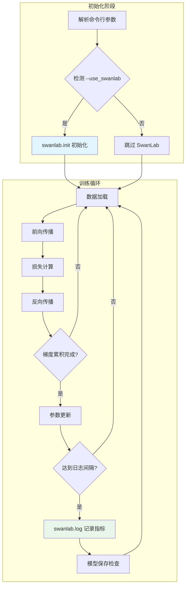

在深度学习训练过程中，可视化实验指标是理解模型学习行为的关键。SwanLab 作为一款轻量级的实验跟踪工具，为本项目提供了直观的训练监控能力。通过集成 SwanLab，开发者可以实时追踪 loss 变化、学习率调度以及训练时长等核心指标，从而更高效地进行超参数调优和实验对比。

## SwanLab 概述

SwanLab 是一个开源的机器学习实验管理平台，支持训练指标记录、超参数配置保存和可视化图表生成。与 Weights & Biases 和 MLflow 等商业工具相比，SwanLab 提供了更加简洁的 API 接口和免费的服务额度，非常适合个人开发者和小型团队使用。

本项目在预训练脚本和监督微调脚本中均集成了 SwanLab，用户只需通过简单的命令行参数即可启用实验跟踪功能。训练过程中记录的 loss 和学习率会以图表形式展示在 SwanLab 平台上，便于用户分析模型收敛特性。

## 快速启用实验跟踪

启用 SwanLab 只需要在训练命令中添加 `--use_swanlab` 参数。训练脚本会自动初始化实验会话并开始记录关键指标。以下是预训练阶段启用 SwanLab 的命令示例：

```bash
python ddp_pretrain.py --use_swanlab --epochs 10 --batch_size 64 --learning_rate 2e-4
```

对于监督微调训练，同样可以通过添加该参数启用跟踪功能：

```bash
python ddp_sft_full.py --use_swanlab --epochs 3 --batch_size 32 --data_path ./BelleGroup_sft.jsonl
```

启用后，训练过程中会看到 SwanLab 相关的日志输出，确认实验已成功上传到平台。用户可以在 SwanLab 官网登录查看完整的训练仪表盘，包括 loss 曲线、学习率曲线以及训练配置信息。

## 核心参数配置

SwanLab 的初始化配置通过 `swanlab.init()` 函数完成，在本项目中定义了三个核心参数来组织实验数据：

| 参数 | 说明 | 取值示例 |
|------|------|----------|
| `project` | 项目名称，用于归类相关实验 | `Happy-LLM` |
| `experiment_name` | 实验名称，区分不同训练任务 | `Pretrain-215M`、`SFT-215M` |
| `config` | 超参数配置字典，自动保存所有训练参数 | 包含 batch_size、lr 等 |

预训练脚本中的 SwanLab 初始化代码位于 [ddp_pretrain.py#L262-L268](ddp_pretrain.py#L262-L268)：

```python
if args.use_swanlab:
    run = swanlab.init(
        project="Happy-LLM",
        experiment_name="Pretrain-215M",
        config=args,
    )
```

监督微调脚本中的初始化位于 [ddp_sft_full.py#L186-L192](ddp_sft_full.py#L186-L192)，配置方式基本一致，仅实验名称不同。

## 命令行参数设计

项目为 SwanLab 集成设计了简洁的命令行接口，主要参数如下：

| 参数 | 类型 | 默认值 | 说明 |
|------|------|--------|------|
| `--use_swanlab` | flag | False | 启用 SwanLab 实验跟踪 |
| `--log_interval` | int | 100 | 日志记录间隔（步数） |
| `--save_interval` | int | 1000 | 模型保存间隔（步数） |

`--use_swanlab` 采用 `action="store_true"` 方式定义，这意味着该参数不需要赋值，出现在命令行中即表示启用。相关定义位于 [ddp_pretrain.py#L233](ddp_pretrain.py#L233) 和 [ddp_sft_full.py#L164](ddp_sft_full.py#L164)：

```python
parser.add_argument("--use_swanlab", action="store_true", help="是否使用SwanLab进行实验跟踪")
```

## 训练指标记录机制

在训练循环的关键节点，脚本会调用 `swanlab.log()` 函数记录实时指标。每次日志记录包含两个核心指标：

```python
if args.use_swanlab:
    swanlab.log({
        "loss": loss.item() * args.accumulation_steps,
        "lr": optimizer.param_groups[-1]['lr']
    })
```

这段代码位于训练循环的日志打印部分 [ddp_pretrain.py#L142-L146](ddp_pretrain.py#L142-L146) 和 [ddp_sft_full.py#L96-L100](ddp_sft_full.py#L96-L100)。记录的指标含义如下：

| 指标 | 描述 | 记录时机 |
|------|------|----------|
| `loss` | 训练损失值，经过梯度累积步数还原 | 每 `log_interval` 步 |
| `lr` | 当前学习率 | 每 `log_interval` 步 |

`loss` 值在记录前会乘以 `accumulation_steps`，这是因为在梯度累积模式下，每次反向传播的 loss 被除以了累积步数，需要还原为实际值才能正确反映训练状态。

## 架构集成流程

下图展示了 SwanLab 在训练流程中的集成位置和数据流向：



从架构图可以看出，SwanLab 的初始化发生在训练循环开始前，而日志记录则嵌入在每个训练步的检查点中。这种设计确保了即使 SwanLab 服务不可用，也不会影响正常训练流程。

## 依赖配置

SwanLab 作为项目依赖之一，已添加到 `requirements.txt` 文件中：

```
swanlab
```

完整依赖列表位于 [requirements.txt#L1-L24](requirements.txt#L1-L24)。安装所有依赖后，SwanLab 会自动与 PyTorch 训练环境集成，无需额外配置。

首次使用时，SwanLab 会提示用户登录。用户可以通过 `swanlab.login(api_key='your-key')` 以编程方式登录，或在终端运行 `swanlab login` 命令进行交互式登录。登录凭证会被缓存，后续训练无需重复登录。

## 多实验对比

SwanLab 支持在同一个项目下创建多个实验，便于进行超参数对比。开发者可以通过修改 `experiment_name` 参数来区分不同的实验配置：

```bash
# 实验1：学习率 2e-4
python ddp_pretrain.py --use_swanlab --learning_rate 2e-4 --epochs 10

# 实验2：学习率 1e-4
python ddp_pretrain.py --use_swanlab --learning_rate 1e-4 --epochs 10
```

在 SwanLab 平台上，同一项目的不同实验会以列表形式展示，包含关键指标对比和训练曲线叠加视图，帮助开发者快速识别最优超参数组合。

## 最佳实践建议

**启用条件判断**：代码中 `if args.use_swanlab:` 的判断确保了 SwanLab 是可选依赖。当未启用时，训练流程完全不受影响，适合在没有网络环境的服务器上进行纯训练任务。

**日志间隔调整**：默认的 `log_interval=100` 在大多数场景下提供了足够的采样密度。如果训练步数较少，可以适当降低间隔值以获取更平滑的曲线；如果训练步数极多，保持较大间隔可以减少网络开销。

**配置保存价值**：通过 `config=args` 参数，所有命令行超参数会被自动保存到 SwanLab。这对于实验复现非常有价值，建议在对比实验时保持参数命名的一致性。

---

本项目通过简洁的集成方式，将 SwanLab 打造成训练监控的默认选项。开发者可以随时通过添加 `--use_swanlab` 参数开启实验跟踪，而无需修改任何代码逻辑。这种设计平衡了功能性与易用性，非常适合快速迭代的模型开发场景。

**相关资源**：

- [预训练流程：数据加载与模型训练](8-yu-xun-lian-liu-cheng-shu-ju-jia-zai-yu-mo-xing-xun-lian) — 了解预训练脚本的完整流程
- [监督微调（SFT）：对话能力训练](9-jian-du-wei-diao-sft-dui-hua-neng-li-xun-lian) — 了解 SFT 训练细节
- [学习率调度：Warmup 与余弦退火策略](10-xue-xi-lu-diao-du-warmup-yu-yu-xian-tui-huo-ce-lue) — 结合 SwanLab 可视化学习率曲线