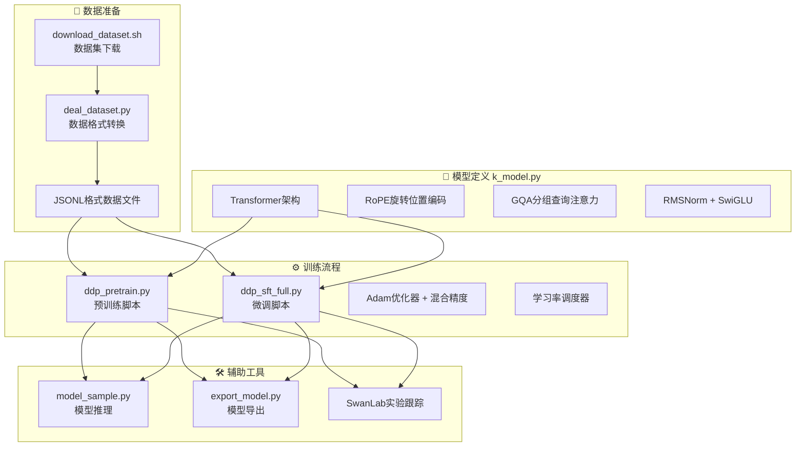

本文档将引导你快速上手 Happy-LLM 训练框架，通过三个简洁的步骤即可完成环境准备、数据下载和模型训练。整个流程经过精心设计，让开发者能够在几分钟内启动预训练或监督微调任务。

## 整体架构概览

在深入实践之前，让我们先了解 Happy-LLM 的训练体系架构。框架采用模块化设计，将数据处理、模型训练和实验跟踪解耦，使开发者能够灵活替换和扩展各个组件。



整个训练流程遵循标准的深度学习范式：从原始数据下载开始，经过格式转换得到标准化的 JSONL 文件，然后分别送入预训练脚本或微调脚本进行训练，最终通过模型导出工具转换为 HuggingFace 格式用于部署推理。SwanLab 作为实验跟踪工具，全程记录训练指标变化。

Sources: [ddp_pretrain.py](ddp_pretrain.py#L1-L50), [ddp_sft_full.py](ddp_sft_full.py#L1-L30)

## 快速开始：三步完成训练

### 步骤一：环境配置与依赖安装

在开始训练之前，需要确保 Python 环境满足框架要求。Happy-LLM 基于 PyTorch 2.4.0 构建，推荐使用 CUDA 12.1 及以上版本的 GPU 环境。安装依赖非常简单，只需执行一条命令即可完成所有必要包的安装。

```bash
pip install -r requirements.txt
```

`requirements.txt` 文件定义了框架的核心依赖，包括 PyTorch、Transformers、SwanLab 等关键库。特别值得注意的是，框架使用 `swanlab` 进行实验跟踪，这是一款轻量级的训练可视化工具，能够帮助你监控损失曲线、学习率变化等关键指标。

Sources: [requirements.txt](requirements.txt#L1-L24)

### 步骤二：数据集下载与预处理

数据是模型训练的基础。Happy-LLM 提供了完整的数据准备流程，包括预训练数据和微调数据的下载与格式转换。

#### 2.1 下载原始数据集

执行数据下载脚本前，请先设置本地存储路径。脚本会自动从 ModelScope 下载预训练语料，并从 HuggingFace 获取监督微调数据。

```bash
# 编辑 download_dataset.sh，设置本地存储目录
dataset_dir="your local dataset dir"

# 执行下载脚本
bash download_dataset.sh
```

下载脚本内部调用了 ModelScope 和 HuggingFace 的命令行工具。对于国内用户，脚本已配置使用 HF Mirror 镜像站点以提升下载速度。预训练数据来自 SeqMonkey 通用语料库，微调数据则采用 BelleGroup 的中文对话数据集。

Sources: [download_dataset.sh](download_dataset.sh#L1-L21)

#### 2.2 格式转换与分块

原始下载的数据需要经过格式转换才能被框架使用。`deal_dataset.py` 脚本负责将数据转换为标准的 JSONL 格式，并对长文本进行合理分块。

```python
# 编辑 deal_dataset.py 中的路径配置
pretrain_data = 'your local pretrain_data'
sft_data = 'your local sft_data'

# 执行格式转换
python deal_dataset.py
```

转换流程包含两个独立的数据处理管道。预训练数据处理会将长文本按 512 token 的长度切分为均匀的块，确保训练样本的长度一致性。SFT 数据处理则将原始对话格式转换为标准的多轮对话格式，每个样本包含 system、user、assistant 三种角色的消息。

Sources: [deal_dataset.py](deal_dataset.py#L1-L49)

### 步骤三：启动训练任务

环境就绪、数据完备后，就可以开始激动人心的模型训练了。框架提供了两个核心训练脚本，分别用于预训练和监督微调。

#### 3.1 预训练（Pretraining）

预训练阶段的目标是让模型学习语言的基本结构和语义知识。模型会在海量通用文本上进行语言建模训练，不针对特定任务进行优化。

```bash
# 标准预训练命令
python ddp_pretrain.py \
    --out_dir ./base_model_215M \
    --epochs 1 \
    --batch_size 64 \
    --learning_rate 1e-4 \
    --data_path ./seq_monkey_datawhale.jsonl
```

预训练脚本采用余弦退火学习率调度策略，起始学习率为 1e-4，配合 8 步梯度累积实现等效 512 的大批次训练。模型架构为 18 层 Transformer，隐藏维度 1024，词表大小 6144，总参数量约 215M。脚本支持多 GPU 并行训练，通过 `--gpus` 参数指定可用的 GPU 设备。

Sources: [ddp_pretrain.py](ddp_pretrain.py#L1-L326)

#### 3.2 监督微调（SFT）

微调阶段使用高质量的对话数据对预训练模型进行任务适配。这个阶段会让模型学会遵循指令、进行多轮对话等能力。

```bash
# 标准微调命令
python ddp_sft_full.py \
    --out_dir ./sft_model_215M \
    --epochs 1 \
    --batch_size 64 \
    --learning_rate 2e-4 \
    --data_path ./BelleGroup_sft.jsonl
```

微调采用 2e-4 的学习率，比预训练略高以加速任务适配。与预训练不同，微调仅计算 assistant 回复部分的损失，忽略 system 和 user 的内容。这种训练目标设计让模型专注于学习如何生成高质量的回复。

Sources: [ddp_sft_full.py](ddp_sft_full.py#L156-L230)

## 训练脚本参数详解

理解关键参数对于调优训练过程至关重要。以下是各脚本的核心超参数说明。

| 参数名 | 预训练默认值 | 微调默认值 | 说明 |
|--------|-------------|-----------|------|
| `--out_dir` | `base_model_215M` | `sft_model_215M` | 模型检查点输出目录 |
| `--epochs` | 1 | 1 | 训练轮数，建议微调 1-3 轮 |
| `--batch_size` | 64 | 64 | 每个 GPU 的批次大小 |
| `--learning_rate` | 1e-4 | 2e-4 | 预训练较低、微调较高 |
| `--accumulation_steps` | 8 | 8 | 梯度累积步数 |
| `--grad_clip` | 1.0 | 1.0 | 梯度裁剪阈值，防止梯度爆炸 |
| `--warmup_iters` | 0 | 0 | 学习率预热步数 |
| `--log_interval` | 100 | 100 | 日志打印间隔（步） |
| `--save_interval` | 1000 | 1000 | 模型保存间隔（步） |
| `--gpus` | `0,1,2,3,4,5,6,7` | `0,1,2,3,4,5,6,7` | 使用的 GPU 编号 |

预训练和微调虽然共享相似的超参数体系，但学习率策略有所不同。预训练阶段模型从零开始学习语言知识，较低的学习率有助于稳定收敛；微调阶段模型已有良好的初始化，较高的学习率能更快地适配新任务。

Sources: [ddp_pretrain.py](ddp_pretrain.py#L219-L245), [ddp_sft_full.py](ddp_sft_full.py#L156-L185)

## 训练输出与模型检查点

训练过程中，框架会在指定目录生成模型检查点和训练日志。检查点文件名遵循统一的命名规范，便于后续加载和版本管理。

```bash
# 预训练检查点示例
./base_model_215M/pretrain_1024_18_6144.pth
./base_model_215M/pretrain_1024_18_6144_step20000.pth

# 微调检查点示例
./sft_model_215M/sft_dim1024_layers18_vocab_size6144.pth
./sft_model_215M/sft_dim1024_layers18_vocab_size6144_step20000.pth
```

检查点文件包含完整的模型权重，可以直接用于推理或继续训练。框架还支持在训练过程中启用 SwanLab 实验跟踪，通过可视化界面监控训练进度和指标变化。

```bash
# 启用 SwanLab 实验跟踪
python ddp_pretrain.py --use_swanlab
python ddp_sft_full.py --use_swanlab
```

Sources: [ddp_pretrain.py](ddp_pretrain.py#L142-L160), [ddp_sft_full.py](ddp_sft_full.py#L186-L195)

## 模型推理与导出

训练完成后，可以使用 `model_sample.py` 快速验证模型效果，或通过 `export_model.py` 将模型导出为 HuggingFace 格式进行部署。

```bash
# 运行推理示例
python model_sample.py
```

推理脚本支持预训练模型和微调模型两种模式。预训练模型直接基于文本补全进行生成，微调模型则支持多轮对话格式，能够更好地理解用户意图。

```python
# 模型导出为 HuggingFace 格式
python export_model.py
```

导出后的模型可以直接使用 Transformers 库加载和推理，也可以部署到各种推理服务框架中。

Sources: [model_sample.py](model_sample.py#L1-L161), [export_model.py](export_model.py#L1-L62)

## 下一步学习路径

完成快速启动后，建议深入学习以下主题以全面掌握框架：

| 学习方向 | 推荐文档 |
|---------|---------|
| 模型架构 | [Transformer 架构详解](4-transformer-jia-gou-xiang-jie-he-xin-zu-jian-yu-she-ji-yuan-li) - 深入理解核心组件 |
| 位置编码 | [旋转位置编码（RoPE）](5-xuan-zhuan-wei-zhi-bian-ma-rope-yuan-li-yu-shi-xian) - 理解位置编码原理 |
| 注意力优化 | [分组查询注意力机制（GQA）](6-fen-zu-cha-xun-zhu-yi-li-ji-zhi-gqa-gao-xiao-zhu-yi-li-ji-suan) - 掌握高效注意力实现 |
| 训练优化 | [混合精度训练与梯度累积](11-hun-he-jing-du-xun-lian-yu-ti-du-lei-ji) - 学习高级训练技巧 |
| 实验跟踪 | [SwanLab 日志集成](18-shi-yan-gen-zong-swanlab-ri-zhi-ji-cheng) - 掌握可视化监控 |