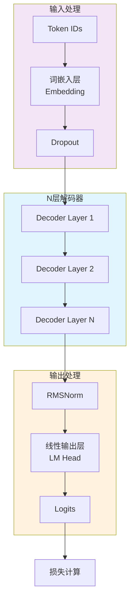
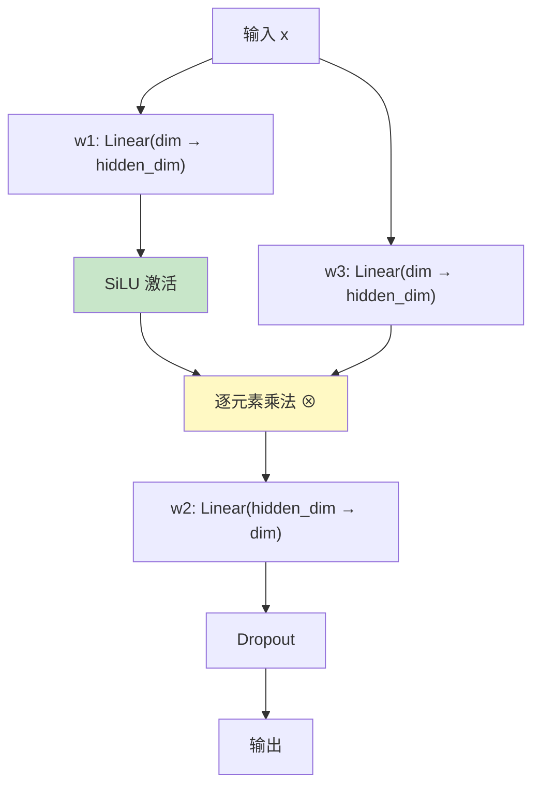
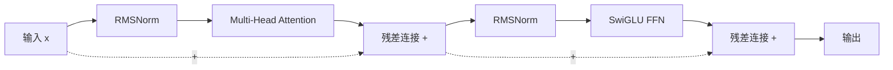

本章节深入解析 Tiny-K 语言模型框架中 Transformer 架构的实现细节，涵盖从配置定义到各层组件的完整设计逻辑。通过阅读本文档，你将理解自注意力机制、分层归一化、残差连接等核心设计决策背后的工程考量。

## 整体架构概览

Tiny-K 采用经典的仅解码器（Decoder-only）Transformer 架构，这是当代大语言模型（如 GPT、LLaMA 系列）的主流选择。模型由词嵌入层、堆叠的解码器层、最终归一化层和语言模型输出头组成，整体遵循"嵌入 → 变换 → 投影"的标准流程。



模型配置通过 `ModelConfig` 类统一管理，支持的关键参数包括模型维度 `dim`、层数 `n_layers`、注意力头数 `n_heads`、键值头数 `n_kv_heads`（用于 GQA 优化）以及最大序列长度 `max_seq_len` 等。这种集中化配置方式便于超参数调优和模型变体创建。

Sources: [k_model.py](k_model.py#L14-L44)
Sources: [k_model.py](k_model.py#L309-L353)

## 模型配置：超参数的集中定义

`ModelConfig` 类继承自 `PretrainedConfig`，将所有模型超参数封装在一个统一的数据结构中。这种设计遵循了配置驱动（Configuration-driven）的最佳实践，使得模型实例化和序列化变得简洁可靠。

配置类中定义的核心参数分为三类：**架构参数**控制模型的结构特性，**训练参数**影响优化过程，**工程参数**处理输入输出边界。架构参数包括 `dim`（隐藏层维度，默认768）、`n_layers`（解码器层数，默认12）和 `n_heads`（注意力头数，默认16）；训练参数涵盖 `dropout`（防止过拟合）和 `norm_eps`（数值稳定性）；工程参数则包含 `max_seq_len`（最大上下文长度）和 `pad_token_id` 等。

值得注意的是，`hidden_dim` 参数采用智能默认值计算策略：当未指定时，自动设为 `4 * dim`，再缩减至 `2/3`，最后对齐到 `multiple_of`（默认64）的倍数。这种计算方式源自 LLaMA 论文的建议，能够在计算效率和表达能力之间取得平衡。

Sources: [k_model.py](k_model.py#L14-L44)

## RMSNorm：高效归一化的实现

Tiny-K 采用 RMSNorm（Root Mean Square Normalization）作为归一化方案，这是 LayerNorm 的轻量级变体。RMSNorm 的核心优势在于省略了均值计算，只保留均方根（Root Mean Square）操作，从而将计算复杂度从 O(2n) 降低到 O(n)。


在代码实现中，`_norm` 方法首先计算输入张量的平方均值，然后取平方根的倒数（即 `rsqrt`），最后用该值对输入进行缩放。`eps` 参数（默认 1e-5）被加到平方均值中以防止除零错误。可学习的 `weight` 参数初始化为全1向量，在训练过程中学习最佳的通道级缩放因子。前向传播时将输入转换为 float32 进行计算以保证数值精度，最后再转回原始数据类型。

Sources: [k_model.py](k_model.py#L46-L66)

## 旋转位置编码（RoPE）：位置信息的编码机制

旋转位置编码（Rotary Position Embedding, RoPE）是 LLaMA 模型采用的位置编码方案，相比绝对位置编码和相对位置编码，RoPE 具有更好的外推能力和理论优雅性。RoPE 的核心思想是将位置信息编码为旋转矩阵，直接作用于 Query 和 Key 向量。

### 频率预计算

`precompute_freqs_cis` 函数负责预计算位置编码所需的余弦和正弦值。频率的计算公式为 `freq = 1 / θ^(2i/dim)`，其中 θ 默认值为 10000，索引 i 从 0 到 dim/2。这种指数级递减的频率设计确保高频分量对应短期依赖，低频分量对应长期依赖。

```python
freqs = 1.0 / (theta ** (torch.arange(0, dim, 2)[: (dim // 2)].float() / dim))
t = torch.arange(end, device=freqs.device)
freqs = torch.outer(t, freqs).float()
```

外积操作 `torch.outer(t, freqs)` 生成二维频率矩阵，行索引对应位置，列索引对应维度。最终通过三角函数分别得到实部（cos）和虚部（sin）用于后续的复数旋转操作。

Sources: [k_model.py](k_model.py#L68-L82)

### 旋转嵌入的应用

`apply_rotary_emb` 函数将预计算的频率应用到 Query 和 Key 张量上。实现采用复数旋转的几何直觉：将向量视为复数平面上的点，通过乘以单位复数 `e^(iθ)` 实现旋转。

旋转公式的实部/虚部分解为：
- `xq_out_r = xq_r * cos - xq_i * sin`
- `xq_out_i = xq_r * sin + xq_i * cos`

函数首先将张量重塑为 `(..., dim/2, 2)` 格式以分离实部和虚部，然后通过广播将频率张量对齐到正确形状，最后应用上述旋转公式。输出再通过 `flatten(3)` 恢复原始维度布局。

Sources: [k_model.py](k_model.py#L85-L122)

## 注意力机制：核心计算单元

`Attention` 类实现了完整的自注意力机制，支持分组查询注意力（GQA）和 Flash Attention 两种优化路径。GQA 通过减少 Key/Value 头的数量显著降低了显存占用，而 Flash Attention 则利用 IO-aware 算法实现了更高效的注意力计算。

### 分组查询注意力的实现

GQA 的核心思想是让多个 Query 头共享同一个 Key/Value 头。配置中的 `n_kv_heads` 参数控制 Key/Value 头的数量，当 `n_kv_heads < n_heads` 时启用 GQA。`n_rep` 参数计算每个 KV 头需要复制的次数：`n_rep = n_local_heads // n_local_kv_heads`。

```python
self.n_kv_heads = args.n_heads if args.n_kv_heads is None else args.n_kv_heads
self.n_rep = self.n_local_heads // self.n_local_kv_heads
```

`repeat_kv` 函数通过扩展和重塑操作实现 KV 头的复制：将张量在第四维插入新轴，扩展到 `n_rep` 大小，然后合并维度。这种实现方式利用了 PyTorch 的广播机制，内存效率优于显式循环复制。

Sources: [k_model.py](k_model.py#L124-L137)
Sources: [k_model.py](k_model.py#L139-L198)

### Flash Attention 与回退机制

代码首先检查 PyTorch 版本是否支持 Flash Attention（需要 >= 2.0）：`self.flash = hasattr(torch.nn.functional, 'scaled_dot_product_attention')`。如果支持，则使用 `scaled_dot_product_attention` 函数，它内部实现了 Flash Attention 的核心逻辑，包括分块计算和数值稳定性优化。

当不支持 Flash Attention 时，代码回退到手动实现的注意力计算：先计算 QK^T / √d，通过掩码遮蔽未来位置，应用 softmax 得到注意力权重，最后与 V 相乘。掩码矩阵在初始化时创建为上三角矩阵，对角线以上位置设为负无穷。

```python
mask = torch.full((1, 1, args.max_seq_len, args.max_seq_len), float("-inf"))
mask = torch.triu(mask, diagonal=1)
self.register_buffer("mask", mask)
```

Sources: [k_model.py](k_model.py#L171-L248)

## SwiGLU 前馈网络：门控激活机制

`MLP` 类实现了 SwiGLU（Swish-Gated Linear Unit）前馈网络，这是 LLaMA 模型采用的激活函数变体。SwiGLU 在标准 FFN 的基础上引入了门控机制，增强了网络的非线性表达能力。



SwiGLU 的前向传播计算为：`output = W2(SiLU(W1(x)) ⊗ W3(x))`。三个线性层 W1、W2、W3 各自独立学习，SiLU 激活函数（也称为 SILU）定义为 `x * sigmoid(x)`。代码中的实现简洁地使用 `F.silu()` 函数计算激活值，然后与 W3(x) 进行逐元素相乘。

这种设计相比标准 ReLU FFN 增加了约 50% 的参数量（从 2 个线性层增加到 3 个），但实验证明 SwiGLU 在各种语言建模任务上都能带来性能提升。

Sources: [k_model.py](k_model.py#L250-L273)

## 解码器层：残差连接与层归一化

`DecoderLayer` 类将注意力机制和前馈网络封装为完整的解码器层。每个解码器层包含两个主要组件：多头注意力块和 SwiGLU 前馈网络，中间和末尾分别应用 RMSNorm 进行归一化。



前向传播遵循标准的 Pre-LN（Pre-LayerNorm）布局：首先对输入进行归一化，然后通过注意力或 FFN 模块，最后通过残差连接将输出与输入相加。这种设计相比原始 Transformer 的 Post-LN 更加稳定，能够支持更大的学习率和更深的网络堆叠。

```python
h = x + self.attention.forward(self.attention_norm(x), freqs_cos, freqs_sin, attention_mask=attention_mask)
out = h + self.feed_forward.forward(self.ffn_norm(h))
```

Sources: [k_model.py](k_model.py#L276-L307)

## Transformer 主模型：层级组装与训练支持

`Transformer` 类是整个模型的入口点，负责各层组件的组装、权重初始化和前向传播逻辑的编排。在 `__init__` 方法中，模型按以下顺序构建：

1. **词嵌入层**：`nn.Embedding(vocab_size, dim)` 将 token ID 映射为密集向量
2. **Dropout 层**：在嵌入后应用正则化
3. **N 个解码器层**：通过 `torch.nn.ModuleList` 存储，支持任意层数配置
4. **最终归一化层**：对整个序列输出进行 RMSNorm
5. **语言模型头**：`nn.Linear(dim, vocab_size, bias=False)` 输出 logit

### 权重共享策略

Tiny-K 实现了输入嵌入与输出投影之间的权重共享：`self.tok_embeddings.weight = self.output.weight`。这种 tied embedding 技术来自 GPT-2 的设计，能够显著减少参数量（通常可节省约 20% 的参数），同时保持模型性能。共享权重的初始化由 Embedding 的初始化逻辑统一处理。

### 频率缓冲区的持久化

RoPE 所需的频率张量通过 `register_buffer` 注册为非持久化缓冲区：

```python
freqs_cos, freqs_sin = precompute_freqs_cis(self.args.dim // self.args.n_heads, self.args.max_seq_len)
self.register_buffer("freqs_cos", freqs_cos, persistent=False)
self.register_buffer("freqs_sin", freqs_sin, persistent=False)
```

`persistent=False` 表示这些缓冲区不会被保存到模型 checkpoint 中，因为它们可以从配置参数完全重建。这种设计既节省了存储空间，也避免了版本不匹配问题。

Sources: [k_model.py](k_model.py#L309-L353)

## 前向传播：训练与推理的差异处理

`forward` 方法支持训练和推理两种模式，根据是否提供 `targets` 参数自动切换。训练模式下计算交叉熵损失，推理模式下只返回最后一个位置的 logits 用于自回归生成。

```python
if targets is not None:
    logits = self.output(h)
    self.last_loss = F.cross_entropy(
        logits.view(-1, logits.size(-1)),
        targets.view(-1),
        ignore_index=ignore_index,
        reduction='none'
    )
else:
    logits = self.output(h[:, [-1], :])  # 只保留最后一个位置
    self.last_loss = None
```

损失计算使用 `ignore_index` 参数处理 padding token，当 targets 中存在 -100 时使用 -100 作为忽略标记。`reduction='none'` 返回每个位置的损失值，便于后续的损失掩码处理。

Sources: [k_model.py](k_model.py#L403-L459)

## 参数初始化：训练稳定性的保障

`_init_weights` 方法为不同类型的层设置合适的初始化策略。线性层使用均值为 0、标准差为 0.02 的正态分布初始化；Embedding 层采用相同的初始化分布。对于残差投影层（W3 和 WO），应用额外的缩放因子 `0.02/√(2N)`，其中 N 是总层数。

这种初始化策略源自 ResNet 的理论分析：深层网络中残差路径的方差会随深度累积，通过适当缩放可以保持前向传播和反向传播的方差稳定。

```python
for pn, p in self.named_parameters():
    if pn.endswith('w3.weight') or pn.endswith('wo.weight'):
        torch.nn.init.normal_(p, mean=0.0, std=0.02/math.sqrt(2 * args.n_layers))
```

Sources: [k_model.py](k_model.py#L355-L363)

## 组件参数对比

| 组件 | 类名 | 输入维度 | 输出维度 | 关键特性 |
|------|------|---------|---------|---------|
| 词嵌入 | nn.Embedding | vocab_size | dim | 权重共享给 LM Head |
| 注意力 | Attention | dim | dim | GQA + Flash Attention |
| 前馈网络 | MLP | dim | dim | SwiGLU 激活 |
| 归一化 | RMSNorm | dim | dim | 可学习 weight |

## 总结与延伸阅读

Tiny-K 的 Transformer 实现融合了多个当代大语言模型的关键优化：**RMSNorm** 提供高效的归一化方案，**旋转位置编码** 实现无需外部记忆的位置表示，**分组查询注意力** 大幅降低显存占用，**SwiGLU** 增强前馈网络的表达能力。这些组件的协同设计使得模型能够在保持竞争力的同时具有良好的计算效率。

如需深入了解特定技术的实现细节，建议阅读以下章节：
- [旋转位置编码（RoPE）：原理与实现](5-xuan-zhuan-wei-zhi-bian-ma-rope-yuan-li-yu-shi-xian) — 深入分析 RoPE 的数学推导
- [分组查询注意力机制（GQA）：高效注意力计算](6-fen-zu-cha-xun-zhu-yi-li-ji-zhi-gqa-gao-xiao-zhu-yi-li-ji-suan) — GQA 的工程实现细节
- [RMSNorm 与 SwiGLU：归一化与激活函数](7-rmsnorm-yu-swiglu-gui-hua-yu-ji-huo-han-shu) — 归一化与激活函数的设计考量
- [模型推理与文本生成](15-mo-xing-tui-li-yu-wen-ben-sheng-cheng) — 了解自回归生成的解码策略