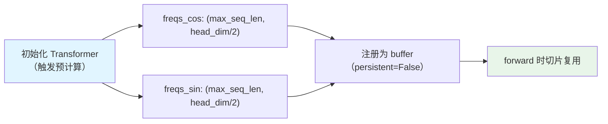
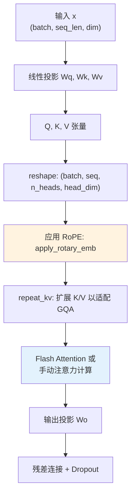

旋转位置编码（Rotary Position Embedding，简称 RoPE）是苏剑林团队于 2021 年提出的位置编码方法，现已被 LLaMA、Mistral、Qwen 等主流大语言模型广泛采用。与传统的绝对位置编码和相对位置编码不同，RoPE 通过**旋转操作**将位置信息编码到 Query 和 Key 向量中，使模型能够自然地捕获 token 之间的相对位置关系，同时保持计算效率。

本文将深入剖析 RoPE 的数学原理，并详细解读 Tiny-K 项目中 RoPE 的实现代码。

## 一、RoPE 的核心思想

### 1.1 为什么需要旋转？

在 Transformer 架构中，自注意力机制的核心计算是 Query 和 Key 的点积：

$$text{Attention}(Q, K, V) = softmax\left(\frac{QK^T}{\sqrt{d_k}}\right)V$$

传统的正弦位置编码通过**加法**将位置信息注入到词嵌入中，但这种方式在长序列上存在位置信息衰减的问题。RoPE 的创新之处在于：它不是将位置编码添加到向量中，而是**通过旋转操作来编码位置信息**。

关键洞察是：在 2 维子空间中，旋转一个向量等价于乘以一个复数。设位置 $m$ 处的旋转角度为 $\theta_m$，则旋转后的向量可以表示为：

$$R(\theta_m, \mathbf{x}) = \mathbf{x} \cdot e^{i\theta_m}$$

### 1.2 数学推导

RoPE 的核心目标是让 attention score $q_m^T k_n$ 只与相对位置 $m-n$ 相关。设 Query 向量 $\mathbf{q}_m$ 和 Key 向量 $\mathbf{k}_n$ 经过旋转后分别为：

$$\tilde{\mathbf{q}}_m = \mathbf{R}(\theta_m) \mathbf{q}_m$$
$$\tilde{\mathbf{k}}_n = \mathbf{R}(\theta_n) \mathbf{k}_n$$

则旋转后的点积为：

$$\tilde{\mathbf{q}}_m^T \tilde{\mathbf{k}}_n = \mathbf{q}_m^T \mathbf{R}(\theta_m)^T \mathbf{R}(\theta_n) \mathbf{k}_n = \mathbf{q}_m^T \mathbf{R}(\theta_m - \theta_n) \mathbf{k}_n$$

要使结果只依赖于相对位置 $m-n$，需要满足 $\theta_m = m \times \theta$（即角度与位置成正比）。此时：

$$\tilde{\mathbf{q}}_m^T \tilde{\mathbf{k}}_n = \mathbf{q}_m^T \mathbf{R}((m-n)\theta) \mathbf{k}_n$$

这正是 RoPE 的精妙之处——**绝对位置编码通过旋转操作实现了相对位置感知**。

Sources: [k_model.py](k_model.py#L68-L82)

## 二、频率计算与预计算

### 2.1 频率的数学定义

在 Tiny-K 的实现中，频率的计算遵循以下公式：

$$freq_i = \frac{1}{\theta^{2i/d}}$$

其中：
- $d$ 是 head_dim（每个注意力头的维度）
- $\theta$ 是缩放因子，默认值为 10000.0（来自 Transformer 的原始设计）
- $i$ 从 0 到 $d/2-1$

这个设计确保了：
- **高频成分**：对于较小的维度索引 $i$，频率较高，编码精细的位置变化
- **低频成分**：对于较大的 $i$，频率较低，编码粗粒度的位置信息

### 2.2 预计算实现

```python
def precompute_freqs_cis(dim: int, end: int, theta: float = 10000.0):
    # 生成频率基础值：theta^(2i/d)
    freqs = 1.0 / (theta ** (torch.arange(0, dim, 2)[: (dim // 2)].float() / dim))
    
    # 生成位置序列 [0, 1, 2, ..., end-1]
    t = torch.arange(end, device=freqs.device)
    
    # 计算外积：位置 × 频率 = 每个位置的旋转角度
    freqs = torch.outer(t, freqs).float()
    
    # 分解为实部（余弦）和虚部（正弦）
    freqs_cos = torch.cos(freqs)
    freqs_sin = torch.sin(freqs)
    
    return freqs_cos, freqs_sin
```

关键设计决策：
- **外积计算**：通过 `torch.outer(t, freqs)` 生成形状为 `(end, dim/2)` 的二维矩阵，每一行对应一个位置，每一列对应一个频率维度
- **复数分解**：预先计算 cos 和 sin 值，避免推理时重复计算
- **设备一致性**：频率张量与输入张量在同一设备上（CPU/GPU）

Sources: [k_model.py](k_model.py#L68-L82)

### 2.3 预计算策略的优势



在模型初始化时一次性计算所有位置的旋转频率，后续前向传播时只需按序列长度切片使用，大幅降低计算开销。

Sources: [k_model.py](k_model.py#L338-L341)

## 三、旋转嵌入的应用

### 3.1 广播形状适配

在应用旋转前，需要将预计算的频率张量适配到 Query/Key 张量的形状：

```python
def reshape_for_broadcast(freqs_cis: torch.Tensor, x: torch.Tensor):
    # 确保频率张量形状为 (seq_len, 1, 1, head_dim/2) 以便广播
    ndim = x.ndim
    assert 0 <= 1 < ndim
    assert freqs_cis.shape == (x.shape[1], x.shape[-1])
    
    shape = [d if i == 1 or i == ndim - 1 else 1 for i, d in enumerate(x.shape)]
    return freqs_cis.view(shape)
```

这个函数将 `(seq_len, head_dim/2)` 的频率张量转换为 `(1, seq_len, 1, head_dim/2)`，使其能够与 `(batch, seq_len, n_heads, head_dim)` 形状的 Query/Key 张量正确广播。

Sources: [k_model.py](k_model.py#L84-L95)

### 3.2 旋转操作的数学本质

旋转嵌入的核心实现采用复数乘法形式：

```python
def apply_rotary_emb(
    xq: torch.Tensor,
    xk: torch.Tensor,
    freqs_cos: torch.Tensor,
    freqs_sin: torch.Tensor
) -> Tuple[torch.Tensor, torch.Tensor]:
    
    # 将张量按实部/虚部分解：reshape to (...2) 然后 unbind
    xq_r, xq_i = xq.float().reshape(xq.shape[:-1] + (-1, 2)).unbind(-1)
    xk_r, xk_i = xk.float().reshape(xk.shape[:-1] + (-1, 2)).unbind(-1)
    
    # 适配广播形状
    freqs_cos = reshape_for_broadcast(freqs_cos, xq_r)
    freqs_sin = reshape_for_broadcast(freqs_sin, xq_r)
    
    # 复数乘法：(a + bi)(c + di) = (ac - bd) + (ad + bc)i
    xq_out_r = xq_r * freqs_cos - xq_i * freqs_sin
    xq_out_i = xq_r * freqs_sin + xq_i * freqs_cos
    xk_out_r = xk_r * freqs_cos - xk_i * freqs_sin
    xk_out_i = xk_r * freqs_sin + xk_i * freqs_cos
    
    # 合并实部虚部，还原原始形状
    xq_out = torch.stack([xq_out_r, xq_out_i], dim=-1).flatten(3)
    xk_out = torch.stack([xk_out_r, xk_out_i], dim=-1).flatten(3)
    
    return xq_out.type_as(xq), xk_out.type_as(xk)
```

**数学原理**：将 head_dim 维度两两配对视为复数的实部与虚部，通过复数乘法实现 2D 旋转。对于每一对维度 $(2i, 2i+1)$：

$$\begin{bmatrix} q_{2i}' \\ q_{2i+1}' \end{bmatrix} = \begin{bmatrix} \cos\theta_m & -\sin\theta_m \\ \sin\theta_m & \cos\theta_m \end{bmatrix} \begin{bmatrix} q_{2i} \\ q_{2i+1} \end{bmatrix}$$

Sources: [k_model.py](k_model.py#L97-L122)

## 四、在注意力机制中的集成

### 4.1 完整的前向传播流程



在 Attention 模块的 forward 方法中，RoPE 在线性投影之后、注意力计算之前应用：

```python
def forward(self, x: torch.Tensor, freqs_cos: torch.Tensor, freqs_sin: torch.Tensor, ...):
    bsz, seqlen, _ = x.shape
    
    # 线性投影得到 Q, K, V
    xq, xk, xv = self.wq(x), self.wk(x), self.wv(x)
    
    # reshape 为多头格式
    xq = xq.view(bsz, seqlen, self.n_local_heads, self.head_dim)
    xk = xk.view(bsz, seqlen, self.n_local_kv_heads, self.head_dim)
    xv = xv.view(bsz, seqlen, self.n_local_kv_heads, self.head_dim)
    
    # 【关键步骤】应用旋转位置编码
    xq, xk = apply_rotary_emb(xq, xk, freqs_cos, freqs_sin)
    
    # 扩展 K/V 以适配 GQA
    xk = repeat_kv(xk, self.n_rep)
    xv = repeat_kv(xv, self.n_rep)
    
    # ... 后续注意力计算 ...
```

Sources: [k_model.py](k_model.py#L182-L194)

### 4.2 频率的动态切片

在 Transformer 的 forward 方法中，根据实际序列长度动态获取频率：

```python
def forward(self, tokens: torch.Tensor, ...):
    _bsz, seqlen = tokens.shape
    
    h = self.tok_embeddings(tokens)
    h = self.dropout(h)
    
    # 根据序列长度切片获取对应的频率
    freqs_cos = self.freqs_cos[:seqlen]
    freqs_sin = self.freqs_sin[:seqlen]
    
    # 逐层传递频率
    for layer in self.layers:
        h = layer(h, freqs_cos, freqs_sin, attention_mask=attention_mask)
    
    h = self.norm(h)
    # ...
```

这种设计确保：
- **内存效率**：使用 `persistent=False` 的 buffer，按需加载
- **灵活性**：支持变长序列，无需重新计算频率
- **兼容性**：与 Flash Attention、mask 机制无缝配合

Sources: [k_model.py](k_model.py#L338-L341), [k_model.py](k_model.py#L424-L426)

## 五、RoPE vs 其他位置编码方案

| 特性 | 绝对位置编码 (APE) | 相对位置编码 (RPE) | **旋转位置编码 (RoPE)** |
|------|-------------------|-------------------|------------------------|
| **编码方式** | 加法注入 | 修改注意力分数 | **旋转操作** |
| **相对位置感知** | 隐式学习 | 直接建模 | **内蕴实现** |
| **计算复杂度** | O(n) | O(n²) | **O(1) 额外开销** |
| **外推能力** | 有限 | 有限 | **优秀（线性偏置）** |
| **长序列适应性** | 需插值 | 需复杂截断 | **可配合 NTK/YaRN** |
| **代表模型** | GPT-2 | Shaw et al. | **LLaMA, Mistral, Qwen** |

**RoPE 的核心优势**：
1. **无需修改注意力分数**：旋转在 Q/K 生成后直接应用，不改变注意力计算逻辑
2. **理论优雅**：通过复数旋转实现相对位置编码，数学上严格
3. **实现简洁**：预计算 + 元素级运算，无复杂索引操作

## 六、实战：自定义 RoPE 参数

### 6.1 调整 θ 参数

θ 值影响位置编码的频率范围。较大的 θ 会增加高频成分，提升短距离位置区分度：

```python
# 在 ModelConfig 中添加 theta 参数
class ModelConfig(PretrainedConfig):
    def __init__(self, ..., rope_theta: float = 10000.0, **kwargs):
        self.rope_theta = rope_theta
        super().__init__(**kwargs)

# 在预计算时使用
freqs_cos, freqs_sin = precompute_freqs_cis(
    dim=self.args.dim // self.args.n_heads,
    end=self.args.max_seq_len,
    theta=self.args.rope_theta  # 自定义 θ
)
```

### 6.2 扩展序列长度

当需要处理超出预计算范围的序列时，可以动态扩展频率缓存：

```python
def extend_freqs_cis(self, new_max_len: int):
    """扩展频率缓存以支持更长序列"""
    if new_max_len <= self.freqs_cos.shape[0]:
        return
    
    new_cos, new_sin = precompute_freqs_cis(
        dim=self.args.dim // self.args.n_heads,
        end=new_max_len,
        theta=10000.0
    )
    self.register_buffer("freqs_cos", new_cos, persistent=False)
    self.register_buffer("freqs_sin", new_sin, persistent=False)
```

## 七、总结与延伸阅读

RoPE 通过**旋转矩阵**将位置信息编码到 Query 和 Key 向量中，实现了三个关键目标：

1. **内蕴相对位置编码**：绝对位置通过旋转操作间接编码相对位置关系
2. **高效计算**：预计算 + 矩阵乘法，时间复杂度与序列长度线性相关
3. **优秀的外推性**：配合旋转插值技术可处理超出训练长度的序列

在本项目中，RoPE 的实现位于 `k_model.py` 的三个核心函数：

| 函数 | 职责 | 位置 |
|------|------|------|
| `precompute_freqs_cis` | 预计算所有位置的 cos/sin 值 | [L70-82](k_model.py#L70-L82) |
| `reshape_for_broadcast` | 适配广播形状 | [L85-95](k_model.py#L85-L95) |
| `apply_rotary_emb` | 应用旋转到 Q/K 向量 | [L97-122](k_model.py#L97-L122) |

---

**推荐阅读**：
- 原始论文：[RoFormer: Enhanced Transformer with Rotary Position Embedding](https://arxiv.org/abs/2104.09864)
- 进阶技术：[YaRN: Efficient Context Window Extension](https://arxiv.org/abs/2309.00071)
- 相关实现：[分组查询注意力机制（GQA）：高效注意力计算](6-fen-zu-cha-xun-zhu-yi-li-ji-zhi-gqa-gao-xiao-zhu-yi-li-ji-suan)