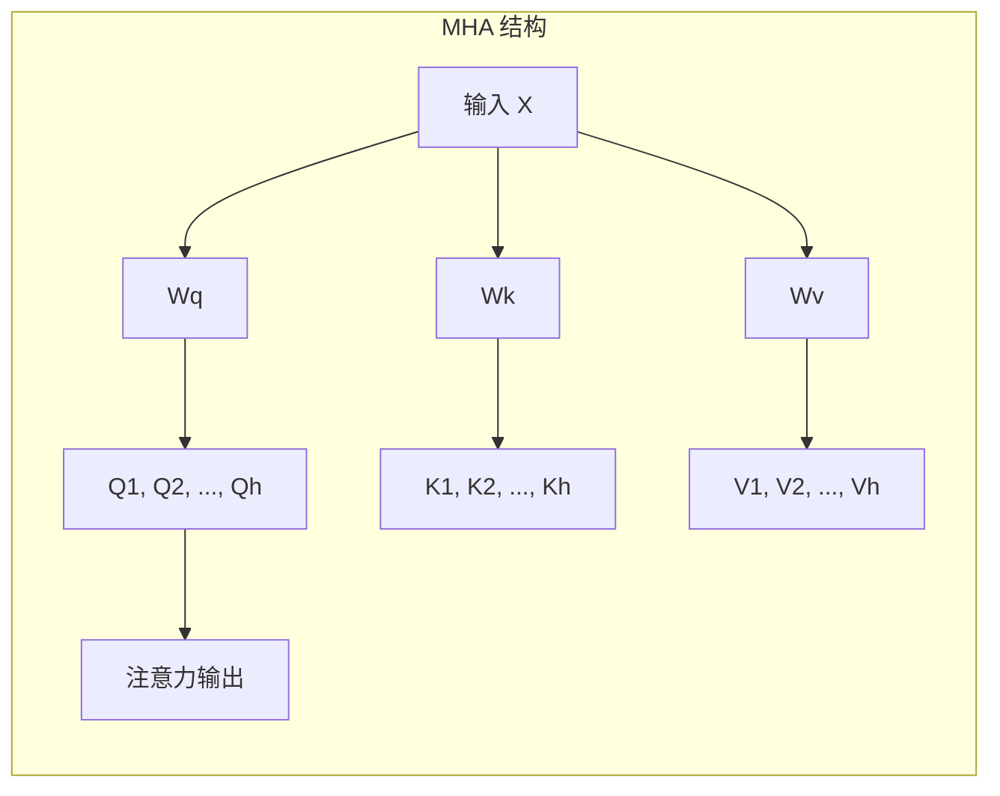
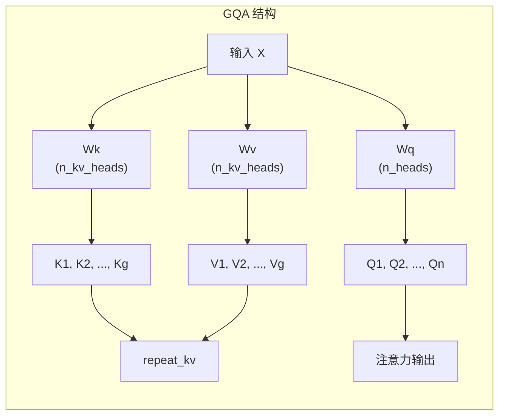

分组查询注意力（Grouped Query Attention，简称 GQA）是一种在大型语言模型中广泛应用的注意力优化技术。它通过让多个查询头共享同一组键值头，在保持模型表达能力的同时显著降低计算和内存开销。本文将深入分析 GQA 的设计原理，并结合 Tiny-K 项目中的具体实现进行讲解。

## 核心概念：从 MHA 到 GQA

### 多头注意力（MHA）回顾

在标准的多头注意力机制（Multi-Head Attention，MHA）中，每个注意力头都有独立的查询（Q）、键（K）和值（V）投影。以一个拥有 16 个注意力头的模型为例，每个头都会产生独立的 K 和 V 向量，这在序列长度较长时会带来巨大的内存压力。



### GQA 的核心思想

GQA 的创新之处在于引入「分组」机制：让多个查询头共享同一组键值头。具体来说，如果模型有 `n_heads` 个查询头和 `n_kv_heads` 个键值头（其中 `n_kv_heads < n_heads`），每个键值头将服务于 `n_heads / n_kv_heads` 个查询头。这种设计大幅减少了 K/V 的投影数量，从而降低了计算复杂度。



### 效率对比分析

| 注意力类型 | K/V 头数 | K/V 投影参数量 | 注意力计算量 | 适用场景 |
|------------|----------|----------------|--------------|----------|
| MHA | n_heads | O(n_heads × head_dim) | O(n_heads × seqlen²) | 小型模型、实验研究 |
| GQA | n_kv_heads | O(n_kv_heads × head_dim) | O(n_kv_heads × seqlen²) | 中大型模型、生产部署 |
| MQA | 1 | O(head_dim) | O(seqlen²) | 超大型模型、推理优化 |

当 `n_kv_heads = n_heads` 时，GQA 退化为标准 MHA；当 `n_kv_heads = 1` 时，GQA 等价于多查询注意力（Multi-Query Attention，MQA）。

Sources: [k_model.py](k_model.py#L14-L42)

## Tiny-K 项目中的 GQA 实现

### 模型配置

在 Tiny-K 项目中，GQA 通过 `ModelConfig` 类进行配置。关键参数包括 `n_heads`（查询头数）和 `n_kv_heads`（键值头数）。

```python
class ModelConfig(PretrainedConfig):
    model_type = "Tiny-K"
    def __init__(
            self,
            dim: int = 768,
            n_layers: int = 12,
            n_heads: int = 16,        # 查询头数
            n_kv_heads: int = 8,      # 键值头数
            vocab_size: int = 6144,
            hidden_dim: int = None,
            multiple_of: int = 64, 
            norm_eps: float = 1e-5,
            max_seq_len: int = 512,
            dropout: float = 0.0,
            flash_attn: bool = True,
            **kwargs,
    ):
        self.dim = dim
        self.n_heads = n_heads
        self.n_kv_heads = n_kv_heads
        # ... 其他参数
```

在默认配置中，查询头数为 16，键值头数为 8，意味着每 2 个查询头共享一组键值。这将 K/V 相关的计算量减少到原来的一半。

Sources: [k_model.py](k_model.py#L14-L42)

### Attention 类的实现

`Attention` 类是 GQA 的核心实现，它在初始化时根据配置确定 K/V 头数和扩展系数。

```python
class Attention(nn.Module):
    def __init__(self, args: ModelConfig):
        super().__init__()
        # 确定键值头数
        self.n_kv_heads = args.n_heads if args.n_kv_heads is None else args.n_kv_heads
        assert args.n_heads % self.n_kv_heads == 0  # 确保可整除

        model_parallel_size = 1
        self.n_local_heads = args.n_heads // model_parallel_size
        self.n_local_kv_heads = self.n_kv_heads // model_parallel_size
        self.n_rep = self.n_local_heads // self.n_local_kv_heads  # 扩展系数
        self.head_dim = args.dim // args.n_heads

        # 定义权重矩阵：K/V 的输出维度小于 Q
        self.wq = nn.Linear(args.dim, args.n_heads * self.head_dim, bias=False)
        self.wk = nn.Linear(args.dim, self.n_kv_heads * self.head_dim, bias=False)  # 较小
        self.wv = nn.Linear(args.dim, self.n_kv_heads * self.head_dim, bias=False)  # 较小
        self.wo = nn.Linear(args.n_heads * self.head_dim, args.dim, bias=False)
```

关键点在于 `wk` 和 `wv` 的输出维度是 `n_kv_heads * head_dim`，而不是 `n_heads * head_dim`。这直接减少了键值投影的参数量和计算量。

Sources: [k_model.py](k_model.py#L137-L167)

## repeat_kv：核心扩展机制

### 函数实现

由于查询头数通常大于键值头数，需要将较少的 K/V 通过「复制扩展」的方式匹配查询头数。`repeat_kv` 函数正是实现这一操作的。

```python
def repeat_kv(x: torch.Tensor, n_rep: int) -> torch.Tensor:
    """
    将键值张量扩展以匹配查询头数
    
    Args:
        x: 输入张量，形状为 (batch, seq_len, n_kv_heads, head_dim)
        n_rep: 重复次数，等于 n_heads / n_kv_heads
    
    Returns:
        扩展后的张量，形状为 (batch, seq_len, n_heads, head_dim)
    """
    bs, slen, n_kv_heads, head_dim = x.shape
    
    if n_rep == 1:
        return x  # 无需扩展
    
    # 使用 expand 和 reshape 实现高效扩展
    return (
        x[:, :, :, None, :]  # 添加新维度
        .expand(bs, slen, n_kv_heads, n_rep, head_dim)  # 扩展到 n_rep 倍
        .reshape(bs, slen, n_kv_heads * n_rep, head_dim)  # 合并维度
    )
```

### 扩展过程图解

当 `n_heads=16, n_kv_heads=8` 时，`n_rep=2`。扩展过程如下：

```
原始 K/V: (batch, seq_len, 8, head_dim)
    ↓ expand + reshape
扩展后:   (batch, seq_len, 16, head_dim)

每个键值头被复制两次，分别服务于相邻的两个查询头
```

这种扩展方式不会引入额外的可学习参数，而是通过改变张量的形状来复用已有的 K/V 信息。在注意力计算时，每个查询头会与扩展后的键值头进行匹配，从而实现跨头共享键值信息的效果。

Sources: [k_model.py](k_model.py#L122-L135)

## 前向传播中的 GQA 流程

### 完整的前向传播实现

在 `Attention` 的 `forward` 方法中，GQA 的完整流程如下：

```python
def forward(self, x: torch.Tensor, freqs_cos: torch.Tensor, 
            freqs_sin: torch.Tensor, attention_mask: Optional[torch.Tensor] = None):
    bsz, seqlen, _ = x.shape

    # 1. 线性投影生成 Q、K、V
    xq, xk, xv = self.wq(x), self.wk(x), self.wv(x)
    
    # 2. 重塑为多头格式
    xq = xq.view(bsz, seqlen, self.n_local_heads, self.head_dim)
    xk = xk.view(bsz, seqlen, self.n_local_kv_heads, self.head_dim)
    xv = xv.view(bsz, seqlen, self.n_local_kv_heads, self.head_dim)

    # 3. 应用旋转位置编码（RoPE）
    xq, xk = apply_rotary_emb(xq, xk, freqs_cos, freqs_sin)

    # 4. 扩展 K/V 以匹配 Q 的头数
    xk = repeat_kv(xk, self.n_rep)
    xv = repeat_kv(xv, self.n_rep)

    # 5. 调整维度用于注意力计算
    xq = xq.transpose(1, 2)  # (batch, n_heads, seq, head_dim)
    xk = xk.transpose(1, 2)
    xv = xv.transpose(1, 2)

    # 6. 执行注意力计算
    if self.flash:
        output = torch.nn.functional.scaled_dot_product_attention(
            xq, xk, xv,
            attn_mask=full_attn_mask if key_padding_mask else None,
            dropout_p=self.dropout if self.training else 0.0,
            is_causal=True,
        )
    else:
        # 手动实现注意力（备用路径）
        scores = torch.matmul(xq, xk.transpose(2, 3)) / math.sqrt(self.head_dim)
        # ... 遮蔽和归一化处理
        output = torch.matmul(scores, xv)

    # 7. 合并多头并输出
    output = output.transpose(1, 2).contiguous().view(bsz, seqlen, -1)
    output = self.wo(output)
    return output
```

Sources: [k_model.py](k_model.py#L180-L246)

### 数据流动示意

```
输入张量 x
    ↓
    ├── Wq 投影 → (bsz, seqlen, 16, 64)  # 16 个查询头
    ├── Wk 投影 → (bsz, seqlen, 8, 64)   # 8 个键值头
    └── Wv 投影 → (bsz, seqlen, 8, 64)   # 8 个键值头
           ↓
    repeat_kv(K): 8 → 16  (复制扩展)
    repeat_kv(V): 8 → 16
           ↓
    scaled_dot_product_attention
           ↓
    输出 → (bsz, seqlen, dim)
```

## Flash Attention 集成

Tiny-K 项目支持使用 Flash Attention 进一步加速注意力计算。当 PyTorch 版本 >= 2.0 时，自动启用 `scaled_dot_product_attention` 函数，这是 PyTorch 原生实现的 Flash Attention。

```python
self.flash = hasattr(torch.nn.functional, 'scaled_dot_product_attention')
if not self.flash:
    print("WARNING: using slow attention. Flash Attention requires PyTorch >= 2.0")
    mask = torch.full((1, 1, args.max_seq_len, args.max_seq_len), float("-inf"))
    mask = torch.triu(mask, diagonal=1)
    self.register_buffer("mask", mask)
```

Flash Attention 通过分块计算和融合核实现，在保持数值稳定性的同时，将显存占用从 O(n²) 降低到 O(n)，这对于处理长序列至关重要。

Sources: [k_model.py](k_model.py#L169-L178)

## GQA 在训练配置中的应用

在预训练脚本 `ddp_pretrain.py` 中，GQA 配置通过 `ModelConfig` 传递给模型：

```python
lm_config = ModelConfig(
    dim=1024,      # 模型维度
    n_layers=18,   # Transformer 层数
    # n_heads 默认 16，n_kv_heads 默认 8 → 2 倍扩展
)
model = Transformer(lm_config)
```

默认配置下，每个键值头服务 2 个查询头，在保持模型性能的同时减少了约 50% 的 K/V 相关计算。

Sources: [ddp_pretrain.py](ddp_pretrain.py#L272-L275)

## 扩展系数与内存分析

扩展系数 `n_rep` 决定了每个键值头需要服务多少个查询头。以不同配置为例：

| 配置 | n_heads | n_kv_heads | n_rep | K/V 内存占比 | 适用模型规模 |
|------|---------|-------------|-------|-------------|--------------|
| 高效配置 | 32 | 8 | 4 | 25% | 超大模型 (70B+) |
| 平衡配置 | 16 | 8 | 2 | 50% | 中型模型 (7B-13B) |
| 保守配置 | 16 | 16 | 1 | 100% | 小型模型 (<7B) |

扩展操作本身不增加计算量，但会按比例增加 K/V 缓存的内存占用。在推理场景中，可以通过优化 K/V 缓存来获得更大的收益。

## 总结

分组查询注意力（GQA）通过「分组共享」的创新设计，在大型语言模型的效率和性能之间取得了良好的平衡。Tiny-K 项目完整实现了 GQA 机制，包括可配置的键值头数、高效的 `repeat_kv` 扩展操作、以及 Flash Attention 的集成。理解 GQA 的实现细节对于优化模型训练和推理性能具有重要意义。