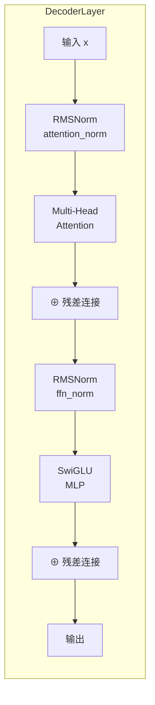

本文深入解析 Tiny-K 语言模型中两个关键组件的设计原理与实现细节：用于稳定训练过程的 **RMSNorm** 归一化技术，以及提升模型表达能力与计算效率的 **SwiGLU** 激活函数。通过源码层面的分析，揭示这两个组件如何协同工作，支撑起整个 Transformer 架构的高效运转。

## RMSNorm：均方根归一化的艺术

### 设计背景与数学原理

传统 Layer Normalization 在计算归一化时同时移除均值并除以标准差，这一步骤虽然能够有效稳定梯度流，但引入了额外的计算开销。**Root Mean Square Layer Normalization (RMSNorm)** 来自于 2023 年的研究，其核心洞察是：**均值信息对于模型性能并非不可或缺**，移除均值 centering 操作可以在几乎不损失效果的前提下显著降低计算复杂度。

RMSNorm 的数学表达式为：

```
RMSNorm(x) = x / RMS(x) * γ

其中 RMS(x) = √(E[x²] + ε)
```

这里 `γ` 是一个可学习的逐元素缩放因子，初始化为 1。值得注意的是，RMSNorm 仅使用均方根（RMS）进行归一化，完全跳过了均值计算，这与 LayerNorm 形成了本质区别。

### 源码实现剖析

在 `k_model.py` 的第 44-64 行，RMSNorm 的实现如下：

```python
class RMSNorm(nn.Module):
    def __init__(self, dim: int, eps: float):
        super().__init__()
        self.eps = eps
        self.weight = nn.Parameter(torch.ones(dim))

    def _norm(self, x):
        return x * torch.rsqrt(x.pow(2).mean(-1, keepdim=True) + self.eps)

    def forward(self, x):
        output = self._norm(x.float()).type_as(x)
        return output * self.weight
```

关键实现细节解析：

**类型转换策略**：在 `_norm` 方法中，输入 `x` 首先被转换为 `float` 类型执行计算，然后将结果转换回原始数据类型。这种做法确保了在混合精度训练时（如 bfloat16），数值计算仍能保持高精度，同时输出张量符合模型的 dtype 设置。

**数值稳定性**：`self.eps` 参数（默认为 1e-5）被加在 RMS 的计算中，有效防止了除零错误。这是深度学习模型实现中的标准安全措施。

**广播机制**：`.mean(-1, keepdim=True)` 操作在最后一个维度（即特征维度）上计算均方根，并保持该维度以便后续与输入张量进行广播操作。

Sources: [k_model.py](k_model.py#L44-L64)

## SwiGLU：门控线性单元的演进

### SwiGLU 的理论基础

**Swish-Gated Linear Unit (SwiGLU)** 源自 Google 在 2020 年的研究，并在 LLaMA、PaLM 等大型语言模型中得到了广泛应用。SwiGLU 的表达式为：

```
SwiGLU(x) = SiLU(W₁x) ⊙ W₃x · W₂
```

其中 `SiLU(x) = x · sigmoid(x)`。这个设计的精妙之处在于引入了**门控机制**：第一个分支通过 SiLU 激活进行非线性变换，第二个分支作为恒等映射，两者逐元素相乘后由第三个线性层投影回原始维度。

### MLP 模块的源码实现

`k_model.py` 第 248-271 行展示了 SwiGLU 的完整实现：

```python
class MLP(nn.Module):
    def __init__(self, dim: int, hidden_dim: int, multiple_of: int, dropout: float):
        super().__init__()
        if hidden_dim is None:
            hidden_dim = 4 * dim
            hidden_dim = int(2 * hidden_dim / 3)
            hidden_dim = multiple_of * ((hidden_dim + multiple_of - 1) // multiple_of)
        
        self.w1 = nn.Linear(dim, hidden_dim, bias=False)
        self.w2 = nn.Linear(hidden_dim, dim, bias=False)
        self.w3 = nn.Linear(dim, hidden_dim, bias=False)
        self.dropout = nn.Dropout(dropout)

    def forward(self, x):
        return self.dropout(self.w2(F.silu(self.w1(x)) * self.w3(x)))
```

**维度配置策略**：当 `hidden_dim` 未指定时，系统采用 2023 年 LLaMA 论文推荐的配置——将隐藏维度设置为输入维度的 4/3 倍，并确保该维度是 `multiple_of`（默认为 64）的倍数。这种配置在计算效率与模型容量之间取得了良好平衡。

**三权重架构**：与标准的门控线性单元（GLU）不同，SwiGLU 使用三个独立的权重矩阵：输入门 `W₁`、门信号 `W₃`（与输入共享维度）和输出投影 `W₂`。这种设计允许模型学习更复杂的非线性变换。

**SiLU 激活函数**：`F.silu` 即 Sigmoid Linear Unit，其数学形式为 `silu(x) = x · sigmoid(x)`。相比 ReLU，SiLU 在零点附近具有平滑的梯度流动；相比 GeLU，SiLU 的计算开销更低且性能相当。

Sources: [k_model.py](k_model.py#L248-L271)

## 组件协同：构建残差连接网络

### DecoderLayer 中的集成

RMSNorm 与 SwiGLU 并非孤立运作，而是通过 **残差连接（Residual Connection）** 紧密耦合。在 `DecoderLayer`（第 274-305 行）中，我们可以看到这种协同模式的完整实现：

```python
class DecoderLayer(nn.Module):
    def __init__(self, layer_id: int, args: ModelConfig):
        super().__init__()
        self.attention = Attention(args)
        self.feed_forward = MLP(
            dim=args.dim,
            hidden_dim=args.hidden_dim,
            multiple_of=args.multiple_of,
            dropout=args.dropout,
        )
        self.attention_norm = RMSNorm(args.dim, eps=args.norm_eps)
        self.ffn_norm = RMSNorm(args.dim, eps=args.norm_eps)

    def forward(self, x, freqs_cos, freqs_sin, attention_mask=None):
        h = x + self.attention.forward(self.attention_norm(x), ...)
        out = h + self.feed_forward.forward(self.ffn_norm(h))
        return out
```

### 残差连接的数据流



这种架构设计遵循了 Pre-LN（Pre-Norm）范式：将归一化层置于子层输入处，而非输出处。Pre-LN 相比 Post-LN 具有更好的训练稳定性，且在深层网络中能有效缓解梯度消失问题。

### Transformer 的最终输出层

整个 Transformer 的最终输出同样依赖 RMSNorm（`k_model.py` 第 329 行）：

```python
self.norm = RMSNorm(args.dim, eps=args.norm_eps)
```

这个归一化层位于所有 DecoderLayer 之后、解码器输出之前，确保了 logits 的数值稳定性。

Sources: [k_model.py](k_model.py#L274-L305), [k_model.py](k_model.py#L307-L351)

## 权重初始化与训练稳定性

### 特殊缩放策略

在 Transformer 初始化代码中（第 344-346 行），存在一处针对特定层权重的特殊处理：

```python
for pn, p in self.named_parameters():
    if pn.endswith('w3.weight') or pn.endswith('wo.weight'):
        torch.nn.init.normal_(p, mean=0.0, std=0.02/math.sqrt(2 * args.n_layers))
```

**设计原理**：标准差被缩放为 `0.02 / √(2n)`，其中 `n` 是层数。这种初始化策略基于理论分析：在深层网络中，保持信号方差在各层间稳定传播对于训练成功至关重要。分母中的 `√2` 补偿了残差连接带来的方差放大效应。

Sources: [k_model.py](k_model.py#L344-L346)

## 性能特性对比

| 特性 | RMSNorm | LayerNorm | SwiGLU | ReGLU |
|------|---------|-----------|--------|-------|
| 均值移除 | ✗ | ✓ | — | — |
| 计算复杂度 | O(n) | O(2n) | — | — |
| 可学习参数 | 1×dim | 2×dim | 3×(dim×hdim) | 2×(dim×hdim) |
| 激活函数 | — | — | SiLU | ReLU |
| 门控机制 | — | — | ✓ | ✓ |

表格说明：n 为特征维度，hdim 为隐藏层维度。SwiGLU 的门控机制使其相比单路径激活函数具有更强的表达能力。

## 总结

RMSNorm 与 SwiGLU 在 Tiny-K 模型中构成了前馈网络的标准化架构。通过移除均值计算，RMSNorm 降低了归一化的计算开销；通过引入门控与 SiLU 激活，SwiGLU 增强了模型的非线性建模能力。两者的协同作用结合残差连接，为深层 Transformer 的稳定训练提供了坚实基础。