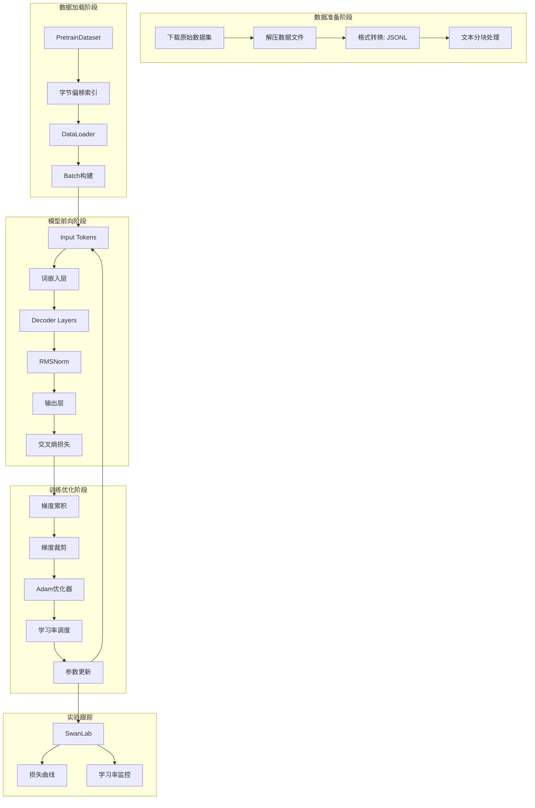

本章节深入解析 Tiny-K 语言模型训练框架的预训练核心流程，涵盖从原始数据下载、格式转换、数据集构建，到模型训练的完整链路。通过本章节，您将掌握大语言模型预训练的关键技术要点，包括高效数据加载、混合精度训练、梯度累积、学习率调度等核心组件的设计原理与实现细节。

## 数据处理流程

### 数据下载与解压

预训练的第一步是获取高质量的训练数据。框架提供了 `download_dataset.sh` 脚本，用于从 ModelScope 和 HuggingFace 下载开源数据集。该脚本支持断点续传，可以自动处理网络中断等异常情况。

```bash
#!/bin/bash
export HF_ENDPOINT=https://hf-mirror.com  # 使用镜像加速下载
dataset_dir="your local dataset dir"

# 下载预训练数据集（SeqMonkey通用语料）
modelscope download --dataset ddzhu123/seq-monkey \
    mobvoi_seq_monkey_general_open_corpus.jsonl.tar.bz2 \
    --local_dir ${dataset_dir}

# 解压预训练数据集
tar -xvf "${dataset_dir}/mobvoi_seq_monkey_general_open_corpus.jsonl.tar.bz2" \
    -C "${dataset_dir}"

# 下载SFT数据集
huggingface-cli download --repo-type dataset \
    --resume-download BelleGroup/train_3.5M_CN \
    --local-dir "${dataset_dir}/BelleGroup"
```

Sources: [download_dataset.sh](download_dataset.sh#L1-L21)

### 预训练数据格式转换

下载的原始数据需要经过格式转换才能用于模型训练。`deal_dataset.py` 中的 `split_text` 函数将长文本切分成固定长度的块，这是语言模型预训练的标准做法。

```python
def split_text(text, chunk_size=512):
    """将文本按指定长度切分成块"""
    return [text[i:i+chunk_size] for i in range(0, len(text), chunk_size)]

with open(output_pretrain_data, 'a', encoding='utf-8') as pretrain:
    with open(pretrain_data, 'r', encoding='utf-8') as f:
        data = f.readlines()
        for line in tqdm(data, desc=f"Processing lines"):
            line = json.loads(line)
            text = line['text']
            chunks = split_text(text)
            for chunk in chunks:
                pretrain.write(json.dumps({'text': chunk}, ensure_ascii=False) + '\n')
```

这种切分策略的优势在于保证每个训练样本长度一致，便于批量处理和 GPU 高效利用。512 token 的长度选择平衡了模型感受野和计算效率。

Sources: [deal_dataset.py](deal_dataset.py#L14-L26)

### SFT数据格式转换

监督微调（SFT）数据的处理更为复杂，需要将原始对话格式转换为带角色标签的标准格式。`convert_message` 函数实现了这一转换：

```python
def convert_message(data):
    """将原始数据转换为标准格式"""
    message = [
        {"role": "system", "content": "你是一个AI助手"},
    ]
    for item in data:
        if item['from'] == 'human':
            message.append({'role': 'user', 'content': item['value']})
        elif item['from'] == 'assistant':
            message.append({'role': 'assistant', 'content': item['value']})
    return message
```

该函数将 `human/assistant` 的原始对话格式转换为包含 `system`、`user`、`assistant` 角色的标准格式，便于后续使用聊天模板进行 token 化。

Sources: [deal_dataset.py](deal_dataset.py#L29-L49)

## 数据集构建

### PretrainDataset 高效加载机制

`dataset.py` 中的 `PretrainDataset` 类实现了高效的数据集加载。核心创新在于使用**字节偏移预计算**实现 O(1) 复杂度的随机访问。

```python
class PretrainDataset(Dataset):
    def __init__(self, data_path, tokenizer, max_length=512):
        super().__init__()
        self.data_path = data_path
        self.tokenizer = tokenizer
        self.max_length = max_length
        self.padding = tokenizer.pad_token_id if tokenizer.pad_token_id is not None else 0
        # 预计算每行的起始字节偏移量
        self._offsets = []
        with open(data_path, 'rb') as f:
            self._offsets.append(0)
            while f.readline():
                self._offsets.append(f.tell())
        self._total_lines = len(self._offsets) - 1
```

在初始化时，类预先扫描整个文件，记录每行的起始字节位置。在 `__getitem__` 方法中，通过 `f.seek()` 直接跳转到指定位置读取数据，避免了逐行扫描的开销。

Sources: [dataset.py](dataset.py#L10-L26)

### Loss Mask 与自回归训练

预训练采用标准的自回归语言建模目标。`__getitem__` 方法返回输入序列 X、目标序列 Y 和损失掩码 loss_mask：

```python
def __getitem__(self, index: int):
    with open(self.data_path, 'rb') as f:
        f.seek(self._offsets[index])
        line = f.readline().decode('utf-8')
    sample = json.loads(line)
    text = f"{self.tokenizer.bos_token}{sample['text']}"
    input_id = self.tokenizer(text).data['input_ids'][:self.max_length]
    text_len = len(input_id)
    # 没满最大长度的剩余部分
    padding_len = self.max_length - text_len
    input_id = input_id + [self.padding] * padding_len
    # 0表示不计算损失
    loss_mask = [1] * text_len + [0] * padding_len

    input_id = np.array(input_id)
    X = np.array(input_id[:-1]).astype(np.int64)      # 输入：不含最后一个token
    Y = np.array(input_id[1:]).astype(np.int64)        # 目标：不含第一个token
    loss_mask = np.array(loss_mask[1:]).astype(np.int64)
    return torch.from_numpy(X), torch.from_numpy(Y), torch.from_numpy(loss_mask)
```

关键设计点在于：

- **自回归偏移**：输入 X 比目标 Y 向右偏移一个位置，这是语言模型的经典设置
- **Padding 掩码**：padding 位置的 loss_mask 设为 0，确保损失计算只关注有效 token
- **BOS Token**：在文本前添加 Begin-of-Sequence token，有助于模型学习序列起始状态

Sources: [dataset.py](dataset.py#L28-L46)

## 模型架构

### Transformer 配置

`ModelConfig` 定义了模型的核心超参数：

```python
class ModelConfig(PretrainedConfig):
    model_type = "Tiny-K"
    def __init__(
            self,
            dim: int = 768,           # 模型维度
            n_layers: int = 12,       # Transformer层数
            n_heads: int = 16,       # 注意力头数
            n_kv_heads: int = 8,      # 键值头数（实现GQA）
            vocab_size: int = 6144,    # 词汇表大小
            hidden_dim: int = None,    # FFN隐藏层维度
            multiple_of: int = 64,    # 维度对齐参数
            norm_eps: float = 1e-5,   # RMSNorm epsilon
            max_seq_len: int = 512,   # 最大序列长度
            dropout: float = 0.0,     # Dropout概率
            flash_attn: bool = True,  # 是否启用Flash Attention
    ):
```

默认配置构建约 215M 参数的模型（dim=1024, n_layers=18），可通过调整这些参数实现不同规模的模型。

Sources: [k_model.py](k_model.py#L14-L42)

### 核心组件实现

Tiny-K 模型的 Transformer 架构整合了多个现代大模型的关键技术：

**RMSNorm 归一化**：相比 LayerNorm，RMSNorm 移除了均值计算，仅保留均方根归一化，计算效率更高：

```python
class RMSNorm(nn.Module):
    def __init__(self, dim: int, eps: float):
        super().__init__()
        self.eps = eps
        self.weight = nn.Parameter(torch.ones(dim))

    def _norm(self, x):
        return x * torch.rsqrt(x.pow(2).mean(-1, keepdim=True) + self.eps)

    def forward(self, x):
        output = self._norm(x.float()).type_as(x)
        return output * self.weight
```

Sources: [k_model.py](k_model.py#L44-L64)

**RoPE 旋转位置编码**：通过旋转操作将位置信息注入到 Query 和 Key 中：

```python
def apply_rotary_emb(xq, xk, freqs_cos, freqs_sin):
    xq_r, xq_i = xq.float().reshape(xq.shape[:-1] + (-1, 2)).unbind(-1)
    xk_r, xk_i = xk.float().reshape(xk.shape[:-1] + (-1, 2)).unbind(-1)
    freqs_cos = reshape_for_broadcast(freqs_cos, xq_r)
    freqs_sin = reshape_for_broadcast(freqs_sin, xq_r)
    
    xq_out_r = xq_r * freqs_cos - xq_i * freqs_sin
    xq_out_i = xq_r * freqs_sin + xq_i * freqs_cos
    xk_out_r = xk_r * freqs_cos - xk_i * freqs_sin
    xk_out_i = xk_r * freqs_sin + xk_i * freqs_cos
    
    return xq_out_r.type_as(xq), xk_out_r.type_as(xk)
```

Sources: [k_model.py](k_model.py#L95-L120)

**SwiGLU 激活函数**：MLP 层使用 SwiGLU 激活，提供更强的表达能力：

```python
class MLP(nn.Module):
    def __init__(self, dim: int, hidden_dim: int, multiple_of: int, dropout: float):
        super().__init__()
        if hidden_dim is None:
            hidden_dim = 4 * dim
            hidden_dim = int(2 * hidden_dim / 3)
            hidden_dim = multiple_of * ((hidden_dim + multiple_of - 1) // multiple_of)
        self.w1 = nn.Linear(dim, hidden_dim, bias=False)
        self.w2 = nn.Linear(hidden_dim, dim, bias=False)
        self.w3 = nn.Linear(dim, hidden_dim, bias=False)
        self.dropout = nn.Dropout(dropout)

    def forward(self, x):
        return self.dropout(self.w2(F.silu(self.w1(x)) * self.w3(x)))
```

Sources: [k_model.py](k_model.py#L248-L271)

**GQA 分组查询注意力**：通过 `repeat_kv` 函数实现键值头复用，显著减少 KV 缓存开销：

```python
def repeat_kv(x: torch.Tensor, n_rep: int) -> torch.Tensor:
    bs, slen, n_kv_heads, head_dim = x.shape
    if n_rep == 1:
        return x
    return (
        x[:, :, :, None, :]
        .expand(bs, slen, n_kv_heads, n_rep, head_dim)
        .reshape(bs, slen, n_kv_heads * n_rep, head_dim)
    )
```

Sources: [k_model.py](k_model.py#L122-L135)

### 模型前向传播

Transformer 的前向传播整合了所有组件：

```python
def forward(self, tokens: torch.Tensor, targets: Optional[torch.Tensor] = None, **kwargs):
    if 'input_ids' in kwargs:
        tokens = kwargs['input_ids']
    if 'labels' in kwargs:
        targets = kwargs['labels']
    
    _bsz, seqlen = tokens.shape
    h = self.tok_embeddings(tokens)  # 词嵌入
    h = self.dropout(h)
    
    # 获取预计算的RoPE频率
    freqs_cos = self.freqs_cos[:seqlen]
    freqs_sin = self.freqs_sin[:seqlen]

    # 通过Decoder层
    for layer in self.layers:
        h = layer(h, freqs_cos, freqs_sin, attention_mask=attention_mask)
    h = self.norm(h)  # 最终归一化

    if targets is not None:
        logits = self.output(h)
        self.last_loss = F.cross_entropy(
            logits.view(-1, logits.size(-1)),
            targets.view(-1),
            ignore_index=ignore_index,
            reduction='none'
        )
    return self.OUT
```

Sources: [k_model.py](k_model.py#L401-L457)

## 训练流程

### 分布式训练配置

`ddp_pretrain.py` 支持单卡和多卡训练，通过 `DataParallel` 实现数据并行：

```python
def init_model():
    tokenizer = AutoTokenizer.from_pretrained('./tokenizer_k/')
    if tokenizer.pad_token_id is not None:
        lm_config.pad_token_id = tokenizer.pad_token_id
    model = Transformer(lm_config)
    
    # 多卡初始化
    num_gpus = torch.cuda.device_count()
    if num_gpus > 1:
        Logger(f"Using {num_gpus} GPUs with DataParallel!")
        model = torch.nn.DataParallel(model)
    
    model = model.to(args.device)
    Logger(f'LLM总参数量：{count_parameters(model) / 1e6:.3f} 百万')
    return model, tokenizer
```

Sources: [ddp_pretrain.py](ddp_pretrain.py#L171-L217)

### 混合精度训练

框架使用 PyTorch 的自动混合精度（AMP）加速训练并减少显存占用：

```python
# 设置混合精度训练的上下文管理器
device_type = "cuda" if "cuda" in args.device else "cpu"
ctx = nullcontext() if device_type == "cpu" else torch.cuda.amp.autocast()

# 初始化梯度缩放器
scaler = torch.cuda.amp.GradScaler(enabled=(args.dtype in ['float16', 'bfloat16']))

# 在训练循环中使用
with ctx:
    out = model(X, Y)
    loss = out.last_loss / args.accumulation_steps
    loss = torch.sum(loss * loss_mask) / loss_mask.sum()

scaler.scale(loss).backward()
```

Sources: [ddp_pretrain.py](ddp_pretrain.py#L288-L317)

### 梯度累积

当 GPU 显存有限时，通过梯度累积模拟大 batch 训练：

```python
# 每accumulation_steps步执行一次优化器更新
if (step + 1) % args.accumulation_steps == 0:
    scaler.unscale_(optimizer)
    torch.nn.utils.clip_grad_norm_(model.parameters(), args.grad_clip)
    scaler.step(optimizer)
    scaler.update()
    optimizer.zero_grad(set_to_none=True)
```

有效 batch size = `batch_size × accumulation_steps × num_gpus`，通过调整累积步数可以在小显存设备上训练大模型。

Sources: [ddp_pretrain.py](ddp_pretrain.py#L109-L125)

### 学习率调度

学习率采用 Warmup + Cosine Annealing 策略：

```python
def get_lr(it, all):
    warmup_iters = args.warmup_iters
    lr_decay_iters = all
    min_lr = args.learning_rate / 10

    # Warmup阶段：线性增长
    if it < warmup_iters:
        return args.learning_rate * it / warmup_iters
    
    # 超出训练步数：保持最小学习率
    if it > lr_decay_iters:
        return min_lr
    
    # 余弦退火阶段
    decay_ratio = (it - warmup_iters) / (lr_decay_iters - warmup_iters)
    coeff = 0.5 * (1.0 + math.cos(math.pi * decay_ratio))
    return min_lr + coeff * (args.learning_rate - min_lr)
```

这种调度策略在训练初期使用较小学习率保护模型，在后期逐渐降低学习率实现平滑收敛。

Sources: [ddp_pretrain.py](ddp_pretrain.py#L34-L66)

### 训练循环

完整的训练循环整合了上述所有组件：

```python
def train_epoch(epoch):
    start_time = time.time()
    
    for step, (X, Y, loss_mask) in enumerate(train_loader):
        X = X.to(args.device)
        Y = Y.to(args.device)
        loss_mask = loss_mask.to(args.device)

        # 动态学习率
        lr = get_lr(epoch * iter_per_epoch + step, args.epochs * iter_per_epoch)
        for param_group in optimizer.param_groups:
            param_group['lr'] = lr

        # 前向传播与损失计算
        with ctx:
            out = model(X, Y)
            loss = out.last_loss / args.accumulation_steps
            loss_mask = loss_mask.view(-1)
            loss = torch.sum(loss * loss_mask) / loss_mask.sum()

        scaler.scale(loss).backward()

        # 梯度累积与更新
        if (step + 1) % args.accumulation_steps == 0:
            scaler.unscale_(optimizer)
            torch.nn.utils.clip_grad_norm_(model.parameters(), args.grad_clip)
            scaler.step(optimizer)
            scaler.update()
            optimizer.zero_grad(set_to_none=True)

        # 日志记录
        if step % args.log_interval == 0:
            Logger('Epoch:[{}/{}]({}/{}) loss:{:.3f} lr:{:.7f}...'.format(
                epoch + 1, args.epochs, step, iter_per_epoch,
                loss.item() * args.accumulation_steps,
                optimizer.param_groups[-1]['lr']))
            
            if args.use_swanlab:
                swanlab.log({
                    "loss": loss.item() * args.accumulation_steps,
                    "lr": optimizer.param_groups[-1]['lr']
                })

        # 模型保存
        if (step + 1) % args.save_interval == 0:
            model.eval()
            ckp = f'{args.save_dir}/pretrain_{lm_config.dim}_{lm_config.n_layers}_{lm_config.vocab_size}.pth'
            state_dict = model.module.state_dict() if isinstance(model, torch.nn.DataParallel) else model.state_dict()
            torch.save(state_dict, ckp)
            model.train()
```

Sources: [ddp_pretrain.py](ddp_pretrain.py#L68-L158)

### 训练启动参数

框架提供丰富的命令行参数控制训练过程：

```bash
python ddp_pretrain.py \
    --out_dir "base_model_215M" \
    --epochs 1 \
    --batch_size 64 \
    --learning_rate 2e-4 \
    --device "cuda:0" \
    --dtype "bfloat16" \
    --use_swanlab \
    --num_workers 8 \
    --data_path "./seq_monkey_datawhale.jsonl" \
    --accumulation_steps 8 \
    --grad_clip 1.0 \
    --warmup_iters 0 \
    --log_interval 100 \
    --save_interval 1000 \
    --gpus "0,1,2,3"
```

| 参数 | 说明 | 默认值 |
|------|------|--------|
| `--out_dir` | 模型输出目录 | `base_model_215M` |
| `--epochs` | 训练轮数 | 1 |
| `--batch_size` | 每 GPU batch 大小 | 64 |
| `--learning_rate` | 初始学习率 | 2e-4 |
| `--dtype` | 混合精度类型 | `bfloat16` |
| `--accumulation_steps` | 梯度累积步数 | 8 |
| `--grad_clip` | 梯度裁剪阈值 | 1.0 |
| `--warmup_iters` | 学习率预热步数 | 0 |

Sources: [ddp_pretrain.py](ddp_pretrain.py#L220-L248)

## 预训练流程总览

下图展示了完整的预训练流程架构：



整个预训练流程的数据流向清晰：从原始数据集经过格式转换和分块处理后，通过高效的数据加载器构建训练批次；模型接收 token 输入后依次经过嵌入层、Transformer 解码器、归一化层和输出层计算损失；最后通过梯度累积、裁剪和优化器更新完成参数优化，所有训练指标实时记录到 SwanLab 实验平台。

## 下一步学习

完成预训练后，模型需要进行监督微调以获得对话能力。建议继续阅读：

- [监督微调（SFT）：对话能力训练](9-jian-du-wei-diao-sft-dui-hua-neng-li-xun-lian) - 学习如何使用对话数据微调预训练模型
- [学习率调度：Warmup 与余弦退火策略](10-xue-xi-lu-diao-du-warmup-yu-yu-xian-tui-huo-ce-lue) - 深入理解学习率调度原理
- [混合精度训练与梯度累积](11-hun-he-jing-du-xun-lian-yu-ti-du-lei-ji) - 掌握显存优化技术

如需了解模型架构的详细实现，请参考：

- [Transformer 架构详解：核心组件与设计原理](4-transformer-jia-gou-xiang-jie-he-xin-zu-jian-yu-she-ji-yuan-li) - 深入理解 Transformer 设计
- [旋转位置编码（RoPE）：原理与实现](5-xuan-zhuan-wei-zhi-bian-ma-rope-yuan-li-yu-shi-xian) - RoPE 的数学原理
- [分组查询注意力机制（GQA）：高效注意力计算](6-fen-zu-cha-xun-zhu-yi-li-ji-zhi-gqa-gao-xiao-zhu-yi-li-ji-suan) - GQA 实现细节