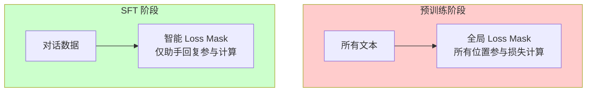

监督微调（Supervised Fine-Tuning, SFT）是让预训练语言模型获得对话能力的关键阶段。与预训练阶段学习通用语言模式不同，SFT 专注于让模型理解指令格式、遵循对话范式，并生成符合人类期望的回复。本文档将深入解析 Tiny-K 框架中 SFT 的完整实现，包括数据处理、模型加载、训练流程与关键配置参数。

## SFT 与预训练的本质区别

预训练阶段的目标是让模型学习语言的统计规律，模型在所有文本片段上计算损失，目标是预测下一个 token。而 SFT 阶段则具有完全不同的目标定位：模型需要学会理解**对话格式**与**指令遵循**，仅在人类助手的回复部分计算损失。



这种差异体现在数据格式与 loss mask 生成逻辑上。在预训练数据集 `PretrainDataset` 中，每条文本的开头添加 BOS token，然后对整个序列计算损失。而 SFT 数据集 `SFTDataset` 使用聊天模板格式化数据，并通过专门的 `generate_loss_mask` 方法仅标记助手回复部分参与损失计算。

## 对话数据处理流程

SFT 的数据来源是包含多轮对话的 JSONL 文件，每条记录包含对话双方的交互内容。`deal_dataset.py` 中的 `convert_message` 函数负责将原始数据转换为标准聊天格式：

```python
def convert_message(data):
    """将原始数据转换为标准格式"""
    message = [
        {"role": "system", "content": "你是一个AI助手"},
    ]
    for item in data:
        if item['from'] == 'human':
            message.append({'role': 'user', 'content': item['value']})
        elif item['from'] == 'assistant':
            message.append({'role': 'assistant', 'content': item['value']})
    return message
Sources: [deal_dataset.py](deal_dataset.py#L29-L41)
```

该函数首先添加系统角色（System），然后遍历原始数据的对话历史，将 `human` 映射为 `user`，将 `assistant` 映射为 `assistant`。转换后的数据写入 `BelleGroup_sft.jsonl` 文件，每行是一条完整的对话消息列表。

### 聊天模板的格式化机制

分词器的 `tokenizer_config.json` 定义了完整的聊天模板格式：

```json
"bos_token": "<|im_start|>",
"eos_token": "<|im_end|>",
"chat_template": "<|im_start|>system\n{{ message['content'] }}<|im_end|>\n<|im_start|>user\n{{ message['content'] }}<|im_end|>\n<|im_start|>assistant\n{{ message['content'] }}<|im_end|>\n"
```

格式化后，一条两轮对话会变成如下结构：

```
<|im_start|>system
你是一个AI助手<|im_end|>
<|im_start|>user
用户问题<|im_end|>
<|im_start|>assistant
助手回复<|im_end|>
```

这种格式清晰地标记了每个发言者的角色，为后续的 loss mask 生成提供了定位依据。

## SFT 数据集的核心实现

`SFTDataset` 类是处理监督微调数据的核心组件。与 `PretrainDataset` 相比，它在数据加载和 loss mask 生成上有本质区别。文件采用流式读取方式，通过预计算的字节偏移量实现高效随机访问：

```python
class SFTDataset(Dataset):
    def __init__(self, data_path, tokenizer, max_length=512):
        super().__init__()
        self.data_path = data_path
        self.tokenizer = tokenizer
        self.max_length = max_length
        self.padding = tokenizer.pad_token_id if tokenizer.pad_token_id is not None else 0
        self._offsets = []
        with open(data_path, 'rb') as f:
            self._offsets.append(0)
            while f.readline():
                self._offsets.append(f.tell())
        self._total_lines = len(self._offsets) - 1 
Sources: [dataset.py](dataset.py#L48-L60)
```

`__getitem__` 方法中，聊天模板的应用与 loss mask 的生成是关键步骤：

```python
def __getitem__(self, index: int):
    with open(self.data_path, 'rb') as f:
        f.seek(self._offsets[index])
        line = f.readline().decode('utf-8')
    sample = json.loads(line)
    text = self.tokenizer.apply_chat_template(sample, tokenize=False, add_generation_prompt=False)
    input_id = self.tokenizer(text).data['input_ids'][:self.max_length]
    text_len = len(input_id)
    padding_len = self.max_length - text_len
    input_id = input_id + [self.padding] * padding_len
    loss_mask = self.generate_loss_mask(input_id)
    # ... 返回 X, Y, loss_mask
Sources: [dataset.py](dataset.py#L101-L119)
```

### 智能 Loss Mask 生成算法

SFT 的核心在于精确控制哪些位置参与损失计算。`generate_loss_mask` 方法实现了这一逻辑：

```python
def generate_loss_mask(self, input_ids):
    mask = [0] * len(input_ids)
    a_sequence = self.tokenizer("<|im_start|>assistant\n")['input_ids']
    a_length = len(a_sequence)
    n = len(input_ids)
    i = 0
    
    while i <= n - a_length:
        match = True
        for k in range(a_length):
            if input_ids[i + k] != a_sequence[k]:
                match = False
                break
        if match:
            j = None
            for idx in range(i + a_length, n):
                if input_ids[idx] == self.tokenizer.eos_token_id:
                    j = idx
                    break
            if j is not None:
                start = i + a_length
                end = j
                if start <= end:
                    for pos in range(start, end + 1):
                        if pos < len(mask):
                            mask[pos] = 1
            i += a_length
        else:
            i += 1
    return mask
Sources: [dataset.py](dataset.py#L65-L99)
```

该算法的工作原理如下：首先定位 `<|im_start|>assistant\n` 标记的结束位置，然后从该位置向后搜索首个 EOS token（`<|im_end|>`），将两者之间的所有位置标记为参与损失计算。这种设计确保了只有助手的实际回复内容贡献梯度，而系统提示、用户问题、以及标记符号本身都不参与训练。

## 模型加载与初始化

SFT 训练脚本首先加载预训练阶段的模型权重，这是 SFT 区别于从头训练的关键。`init_model` 函数负责这一过程：

```python
def init_model():
    # 加载分词器
    tokenizer = AutoTokenizer.from_pretrained('./tokenizer_k/')
    if tokenizer.pad_token_id is not None:
        lm_config.pad_token_id = tokenizer.pad_token_id

    # 初始化模型
    model = Transformer(lm_config)

    # 加载预训练权重
    ckp = './base_model_215M/pretrain_1024_18_6144.pth'
    state_dict = torch.load(ckp, map_location=args.device)
    unwanted_prefix = '_orig_mod.'
    for k, v in list(state_dict.items()):
        if k.startswith(unwanted_prefix):
            state_dict[k[len(unwanted_prefix):]] = state_dict.pop(k)
    model.load_state_dict(state_dict, strict=False)
Sources: [ddp_sft_full.py](ddp_sft_full.py#L122-L143)
```

关键点在于使用 `strict=False` 参数加载权重。这意味着即使预训练 checkpoint 中的某些键与模型定义不完全匹配，也不会抛出错误。这种设计允许在预训练和微调阶段使用略有不同的模型配置。

多卡训练支持通过 `DataParallel` 实现，自动检测可用的 GPU 数量并进行模型复制：

```python
num_gpus = torch.cuda.device_count()
if num_gpus > 1:
    Logger(f"Using {num_gpus} GPUs with DataParallel!")
    model = torch.nn.DataParallel(model)
model = model.to(args.device)
Sources: [ddp_sft_full.py](ddp_sft_full.py#L146-L151)
```

## 训练流程详解

训练入口在 `train_epoch` 函数中，实现了完整的梯度累积、混合精度训练与学习率调度：

```python
def train_epoch(epoch):
    start_time = time.time()
    for step, (X, Y, loss_mask) in enumerate(train_loader):
        X = X.to(args.device)
        Y = Y.to(args.device)
        loss_mask = loss_mask.to(args.device)

        lr = get_lr(epoch * iter_per_epoch + step, args.epochs * iter_per_epoch)
        for param_group in optimizer.param_groups:
            param_group['lr'] = lr

        with ctx:
            out = model(X, Y)
            loss = out.last_loss / args.accumulation_steps
            loss_mask = loss_mask.view(-1)
            loss = torch.sum(loss * loss_mask) / loss_mask.sum()
Sources: [ddp_sft_full.py](ddp_sft_full.py#L51-L69)
```

### 损失计算的正确处理

SFT 的损失计算需要特别注意 loss mask 的应用方式。由于 `model(X, Y)` 返回的 `last_loss` 是每个位置损失的平均值，需要通过 mask 进行加权：

```python
loss = out.last_loss / args.accumulation_steps  # 先除以累积步数
loss_mask = loss_mask.view(-1)                  # 展平 mask
loss = torch.sum(loss * loss_mask) / loss_mask.sum()  # 加权求和后除以有效位置数
```

这种计算方式确保了只有被标记为 1 的位置贡献梯度，而填充位置和无关内容的位置不会影响模型更新。

### 梯度累积与混合精度

梯度累积通过将损失除以 `accumulation_steps`，然后在累积足够步数后执行优化器更新来实现。这允许使用更大的有效批大小，同时保持单次前向传播的内存占用可控：

```python
if (step + 1) % args.accumulation_steps == 0:
    scaler.unscale_(optimizer)
    torch.nn.utils.clip_grad_norm_(model.parameters(), args.grad_clip)
    scaler.step(optimizer)
    scaler.update()
    optimizer.zero_grad(set_to_none=True)
Sources: [ddp_sft_full.py](ddp_sft_full.py#L75-L82)
```

混合精度训练使用 `torch.cuda.amp.GradScaler` 来自动处理 FP16/BF16 的数值稳定性问题，`clip_grad_norm_` 则防止梯度爆炸。

## 学习率调度策略

SFT 采用 Warmup + 余弦衰减的学习率调度：

```python
def get_lr(it, all):
    warmup_iters = args.warmup_iters
    lr_decay_iters = all
    min_lr = args.learning_rate / 10

    if it < warmup_iters:
        return args.learning_rate * it / warmup_iters
    
    if it > lr_decay_iters:
        return min_lr
    
    decay_ratio = (it - warmup_iters) / (lr_decay_iters - warmup_iters)
    coeff = 0.5 * (1.0 + math.cos(math.pi * decay_ratio))
    return min_lr + coeff * (args.learning_rate - min_lr)
Sources: [ddp_sft_full.py](ddp_sft_full.py#L28-L49)
```

调度逻辑分为三个阶段：预热阶段线性增长、衰减阶段余弦曲线下降、以及最终保持在最小学习率。这种策略有助于训练初期的稳定性，并允许后期使用更小的学习率进行精细调整。

## 命令行参数配置

启动 SFT 训练可通过多种参数定制行为：

| 参数 | 默认值 | 说明 |
|------|--------|------|
| `--out_dir` | `sft_model_215M` | 模型保存目录 |
| `--epochs` | `1` | 训练轮数 |
| `--batch_size` | `64` | 单卡批大小 |
| `--learning_rate` | `2e-4` | 基础学习率 |
| `--accumulation_steps` | `8` | 梯度累积步数 |
| `--grad_clip` | `1.0` | 梯度裁剪阈值 |
| `--data_path` | `./BelleGroup_sft.jsonl` | 训练数据路径 |
| `--use_swanlab` | `False` | 是否启用实验跟踪 |
| `--gpus` | `'0,1,2,3,4,5,6,7'` | 可用 GPU 列表 |

典型的启动命令如下：

```bash
python ddp_sft_full.py \
    --out_dir ./sft_model_215M \
    --epochs 3 \
    --batch_size 32 \
    --learning_rate 2e-5 \
    --accumulation_steps 4 \
    --data_path ./BelleGroup_sft.jsonl \
    --use_swanlab \
    --gpus 0,1
```
Sources: [ddp_sft_full.py](ddp_sft_full.py#L156-L185)

## 模型检查点保存策略

训练过程中采用双重保存策略：定期保存与间隔保存：

```python
# 间隔保存
if (step + 1) % args.save_interval == 0:
    ckp = f'{args.save_dir}/sft_dim{lm_config.dim}_layers{lm_config.n_layers}_vocab_size{lm_config.vocab_size}.pth'

# 固定步数保存
if (step + 1) % 20000 == 0:
    ckp = f'{args.save_dir}/sft_dim{lm_config.dim}_layers{lm_config.n_layers}_vocab_size{lm_config.vocab_size}_step{step+1}.pth'
Sources: [ddp_sft_full.py](ddp_sft_full.py#L103-L119)
```

多卡训练时通过检查模型是否为 `DataParallel` 来正确获取 state dict，确保保存的权重可以正常加载恢复。

## 后续学习路径

完成 SFT 训练后，模型已具备基础对话能力。若希望进一步提升模型在特定任务上的表现或优化训练效率，建议阅读以下文档：

- [模型导出与部署：HuggingFace 格式转换](16-mo-xing-dao-chu-yu-bu-shu-huggingface-ge-shi-zhuan-huan) - 了解如何将训练好的模型导出为通用格式
- [实验跟踪：SwanLab 日志集成](18-shi-yan-gen-zong-swanlab-ri-zhi-ji-cheng) - 深入了解训练过程中的可视化监控
- [多GPU分布式训练配置](17-duo-gpufen-bu-shi-xun-lian-pei-zhi) - 掌握更高效的分布式训练方法

若对 SFT 的理论基础或与其他训练阶段的区别感兴趣，可先阅读 [预训练流程：数据加载与模型训练](8-yu-xun-lian-liu-cheng-shu-ju-jia-zai-yu-mo-xing-xun-lian) 获取预训练阶段的知识储备。