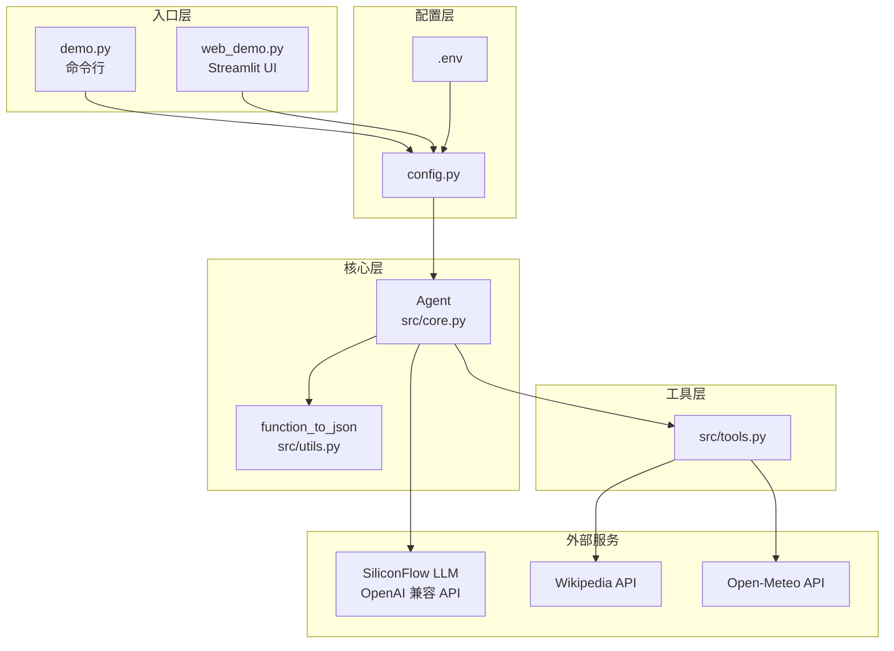
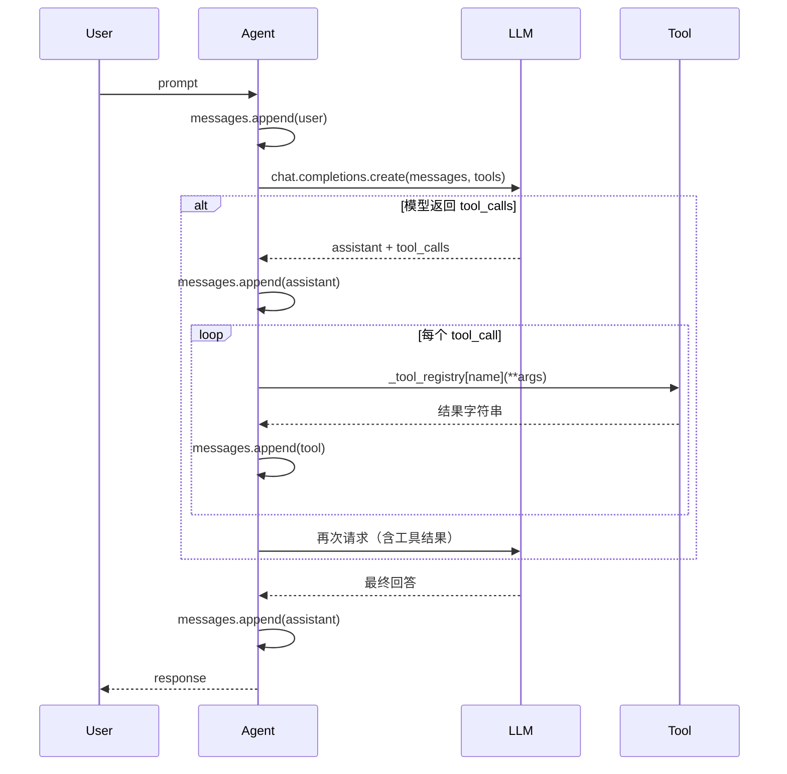

# Agent 项目代码架构

一个轻量级 **Tool-Calling Agent** 教学/demo 项目：LLM 根据用户问题决定是否调用工具，拿到结果后再生成最终回答。

---

## 目录结构

```
docs/chapter7/Agent/
├── .env / .env.example      # 环境变量（API Key、模型、Base URL）
├── config.py                # 配置加载 + Agent 工厂
├── demo.py                  # 命令行入口
├── web_demo.py              # Streamlit Web 入口
├── requirements.txt         # 依赖
└── src/
    ├── __init__.py
    ├── core.py              # Agent 核心逻辑
    ├── tools.py             # 工具函数定义
    └── utils.py             # 工具 → JSON Schema 转换
```

---

## 分层架构



| 层级 | 文件 | 职责 |
|------|------|------|
| **入口层** | `demo.py` / `web_demo.py` | 用户交互，调用 `create_agent()` |
| **配置层** | `config.py` + `.env` | 读环境变量，创建 OpenAI Client 和 Agent |
| **核心层** | `src/core.py` | Agent 循环：发消息 → 调 LLM → 执行工具 → 再调 LLM |
| **工具层** | `src/tools.py` | 具体工具实现（时间、维基、天气等） |
| **工具层** | `src/utils.py` | 把 Python 函数反射成 LLM 可用的 JSON Schema |

---

## 核心模块说明

### 1. `config.py` — 配置与工厂

- 从 `.env` 加载 `OPENAI_API_KEY`、`OPENAI_BASE_URL`、`CHAT_MODEL`
- 注册默认 3 个工具：`get_current_datetime`、`search_wikipedia`、`get_current_temperature`
- 对外提供 `create_client()`、`create_agent()`，两个入口共用

### 2. `src/core.py` — Agent 核心

`Agent` 类维护：

| 属性 | 作用 |
|------|------|
| `self.messages` | 完整对话历史（含 system / user / assistant / tool） |
| `self._tool_registry` | `{函数名: 可调用对象}`，安全分发工具调用 |
| `self._tool_schema` | 工具的 JSON Schema，初始化时缓存 |

**一次 `get_completion(prompt)` 的流程：**



关键方法：

- `get_tool_schema()` — 返回缓存的 schema
- `handle_tool_call()` — `json.loads` 解析参数 → 查注册表调用 → `str()` 返回
- `get_completion()` — 编排上述 LLM ↔ 工具循环

### 3. `src/utils.py` — Schema 生成

`function_to_json(func)` 用 `inspect.signature` 读取函数签名：

- 函数名 → `name`
- docstring → `description`
- 类型注解 → JSON Schema 的 `type`
- 无默认值的参数 → `required`

供 OpenAI Function Calling 格式使用。

### 4. `src/tools.py` — 工具集

| 函数 | 用途 | 是否默认启用 |
|------|------|-------------|
| `get_current_datetime` | 当前时间 | ✅ |
| `search_wikipedia` | 维基百科搜索 | ✅ |
| `get_current_temperature` | 经纬度查温度 | ✅ |
| `add` / `mul` / `compare` | 数学运算 | ❌（已定义，未注册） |
| `count_letter_in_string` | 统计字母 | ❌ |

新增工具：在 `tools.py` 写函数 → 在 `config.py` 的 `DEFAULT_TOOLS` 里注册即可。

---

## 两个入口的区别

| | `demo.py` | `web_demo.py` |
|---|-----------|---------------|
| 交互方式 | 终端 `input()` | Streamlit 聊天界面 |
| Agent 生命周期 | 单次运行，进程内持久 | `st.session_state.agent` |
| 对话展示 | 终端彩色打印 | `st.session_state.messages` + `st.chat_message` |
| verbose | 默认 `True`（打印工具调用） | `False` |
| 启动命令 | `python demo.py` | `streamlit run web_demo.py` |

两者都只负责 UI，核心逻辑都在 `Agent.get_completion()`。

---

## 快速开始

```bash
cd docs/chapter7/Agent
pip install -r requirements.txt
cp .env.example .env   # 填入 OPENAI_API_KEY
python demo.py           # 命令行，输入 exit 退出
streamlit run web_demo.py  # Web 界面，默认 http://localhost:8501
```

---

## 数据流总结

```
用户输入
  → 入口层（demo / web_demo）
  → config.create_agent()
  → Agent.get_completion()
      → LLM（SiliconFlow / Qwen）
      → [可选] tools.py 中的工具函数
      → LLM 再次推理
  → 返回最终文本
```

---

## 依赖关系

```
demo.py ──┐
          ├──→ config.py ──→ src/core.py ──→ src/utils.py
web_demo.py ┘                    │
                                 └──→ src/tools.py
                                          ├── wikipedia
                                          └── requests (Open-Meteo)
```

外部：`openai` SDK 对接 SiliconFlow；`python-dotenv` 读 `.env`；`streamlit` 仅 web 入口使用。

---

## 扩展点

1. **加工具** — `tools.py` 新增函数 + `config.DEFAULT_TOOLS` 注册
2. **换模型** — 改 `.env` 中 `CHAT_MODEL`
3. **换 API** — 改 `OPENAI_BASE_URL`
4. **多轮 tool call** — 在 `core.py` 的 `get_completion` 里把单次工具循环改成 `while tool_calls`（当前只处理一轮）
