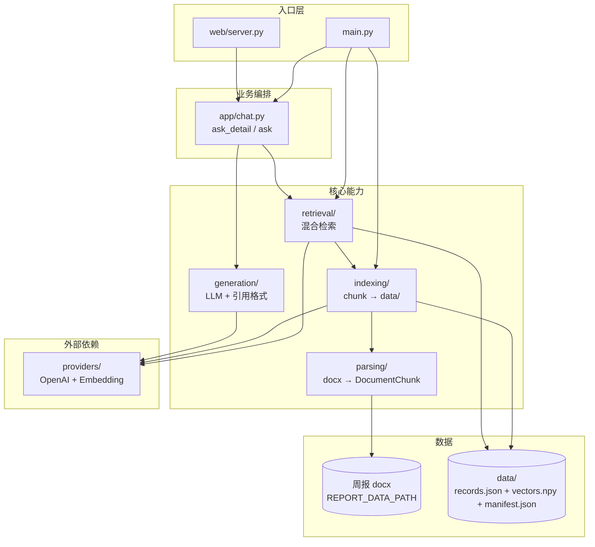

# 代码架构说明

## 目录总览

```
my_weekly_report_rag/
├── main.py                 # 唯一 CLI 入口（--build / --query / --web 等）
├── config.py               # 环境变量、常量、日志、check_env、cleanup_tmp_dirs
├── models.py               # 领域模型（Chunk、SearchResult、ChatResponse）
├── utils.py                # 日期解析、过滤条件
├── exceptions.py           # 统一异常体系
│
├── parsing/                # ① docx 解析与分块
├── indexing/               # ② 向量索引构建与持久化
├── retrieval/              # ③ 混合检索
├── providers/              # ④ OpenAI API / Embedding / 缓存
├── generation/             # ⑤ LLM 生成与输出格式化
├── app/                    # ⑥ 问答业务编排（CLI + Web 共用）
├── web/                    # ⑦ FastAPI + 静态聊天页
│
├── scripts/                # 便捷脚本（build / web / query …）
├── run.sh                  # 转发任意 main.py 参数
├── tests/                  # 单元测试（22 个）
├── docs/                   # 项目文档
├── data/                   # 索引产物（git 忽略，仅 .gitkeep 入库）
├── log/                    # 运行日志（git 忽略）
└── .env / .env_example     # 本地配置（.env 不入库）
```

**不入库的运行时文件**：`.env`、`data/*`（索引）、`.embedding_cache.sqlite`（embedding 缓存）、`log/*.log`、`.index_tmp/`（构建临时目录）。

---

## 分层架构

系统采用分层结构，数据从 docx 周报流向向量索引，再经混合检索送入 LLM 生成带引用的回答。

```
docx 周报 (REPORT_DATA_PATH)
        │
        ▼
   parsing/          解析、分块、元数据提取
        │
        ▼
   indexing/         Embedding + 持久化 → data/
        │
        ▼
   retrieval/        向量 + BM25 混合检索
        │
        ▼
   generation/       LLM 生成 + 引用格式化
        │
        ▼
   app/chat.py       ask_detail / ask / interactive_chat
        │
        ├─ main.py（CLI）
        └─ web/server.py（HTTP API）
```



入口 `main.py` 负责 CLI 参数解析、环境检查、日志初始化，不包含业务逻辑。`--web` 模式启动 `web/server.py` 中的 FastAPI 服务。

---

## 各包职责

### 根目录（基础设施）

| 文件 | 作用 |
|------|------|
| `main.py` | 解析 CLI 参数，分发到 build / search / query / chat / web |
| `config.py` | 读取 `.env`，定义 `INDEX_PATH`、`WEB_PORT` 等常量；`setup_logging()`、`check_env()`、`cleanup_tmp_dirs()` |
| `models.py` | `ChunkMetadata`、`DocumentChunk`、`SearchResult`、`Citation`、`ChatResponse` 等数据结构 |
| `utils.py` | 从路径/问题文本解析日期，`resolve_date_filter()`、`format_filter_desc()` |
| `exceptions.py` | `WeeklyReportRagError` 及子类（`IndexNotFoundError`、`ApiRequestError`、`EmbeddingError` 等） |

### parsing/ — 文档解析

| 文件 | 作用 |
|------|------|
| `parser_rules.json` | 标题识别、项目关键词（可配置，单一数据源） |
| `rules.py` | 加载规则，提供 `heading_max_len()` 等 |
| `docx.py` | 读 docx、识别项目段落、构建 chunk 文本 |
| `chunker.py` | 按 token 长度切分（含 overlap） |
| `reader.py` | `DocxReportReader`：扫描目录，输出 `DocumentChunk` 列表 |

每个 chunk 携带元数据：`source`、`report_date`、`project`、`author`、`quarter`、`section_type`、`chunk_index`。

### indexing/ — 索引构建与存储

| 文件 | 作用 |
|------|------|
| `record.py` | `IndexRecord`：文本 + 元数据 + 向量 |
| `store.py` | `IndexStore`：原子读写 `data/`（rename-swap，失败回滚） |
| `pipeline.py` | `build_index()`：全量或增量构建 |
| `manifest.py` | `build_manifest()`：文件 MD5 + 解析规则版本，驱动增量更新 |

`data/` 目录下三个文件（**同事务原子写入**）：

| 文件 | 内容 |
|------|------|
| `records.json` | chunk 文本与元数据 |
| `vectors.npy` | 向量矩阵（空索引时为 `(0, 0)`） |
| `manifest.json` | 源文件哈希与 `index_version` |

增量逻辑：对比 manifest 中各 docx 的 MD5 与 `index_version`，仅对变更文件重新解析和 embedding，删除已移除文件对应的 chunk。

### retrieval/ — 检索

| 文件 | 作用 |
|------|------|
| `engine.py` | `SearchEngine`：向量 + BM25 融合打分主流程 |
| `scoring.py` | 余弦相似度、BM25、候选池合并 |
| `search_modes.py` | `latest` / `timeline` / `compare` 去重策略 |
| `session.py` | `RAGSession`：加载索引 + 检索引擎 + LLM 客户端；`search()` 入口 |

检索流程：

1. 按 `--year` / `--month` / `--auto-date` 过滤候选
2. 向量相似度 + BM25 加权融合（默认 0.7 / 0.3）
3. 取向量 Top-K 与关键词 Top-K 的并集作为精排池
4. 按模式阈值过滤，再按模式去重

### providers/ — 外部 API

| 文件 | 作用 |
|------|------|
| `openai_client.py` | OpenAI 兼容客户端单例 |
| `embeddings.py` | `OpenAIEmbedding`，支持 BGE query/passage 前缀；实现 `EmbeddingProvider` 协议 |
| `embedding_cache.py` | SQLite 缓存，减少重复 embedding 请求 |

### generation/ — 生成与展示

| 文件 | 作用 |
|------|------|
| `llm.py` | `OpenAIChat`；三级 prompt（周报作答 / 【非周报内容】通用问答 / 片段不足提示）；`EMPTY_CONTEXT` 占位 |
| `output.py` | 引用格式化、检索结果打印、`extract_chunk_body()` |

### app/ — 业务编排（CLI 与 Web 共用）

| 文件 | 作用 |
|------|------|
| `chat.py` | **`ask_detail()`** 为核心路径：始终调用 LLM（检索无结果时传入 `EMPTY_CONTEXT`）；`ask()` 包装 CLI 输出；`interactive_chat()` 交互模式 |

### web/ — Web 服务

| 文件 | 作用 |
|------|------|
| `server.py` | FastAPI：`/api/health`、`/api/chat`；启动时加载 `RAGSession` |
| `schemas.py` | Pydantic 请求/响应模型（`ChatRequest`、`ChatResponseOut` 等） |
| `static/` | **malele周报助手** 聊天 UI：默认 `latest`；移动端抽屉侧边栏；链接自动识别可点击；可选 `WEB_ACCESS_TOKEN` |

Web 服务启动时加载一次 `RAGSession`，多用户请求通过 `threading.Lock` + `asyncio.to_thread` 串行调用检索/LLM，避免并发冲突。启用 `WEB_ACCESS_TOKEN` 时，`/api/health` 与 `/api/chat` 均需携带 `Authorization: Bearer <token>`（不配置则跳过鉴权）。

---

## 两条主流程

### 1. 构建索引（`--build`）

```
DocxReportReader.get_chunks()
  → IndexStore.from_chunks()
  → OpenAIEmbedding.get_embeddings()
  → store.persist(data/, manifest=build_manifest(reader))   # 三文件原子写入
```

- 首次运行：全量构建
- 再次运行：增量更新（对比 manifest 文件哈希）
- `--force`：全量重建，旧索引备份到 `data.backup/`

### 2. 问答（`--query` / Web `/api/chat`）

```
ask_detail(question)
  → resolve_date_filter()                        # 年月过滤（显式参数优先，其次 auto-date）
  → search() → SearchEngine.query()            # 混合检索
  → OpenAIChat.chat(context 或 EMPTY_CONTEXT)  # 始终调用 LLM
  → ChatResponse（含 citations）               # Web 直接返回；CLI 再 format_answer_with_citations()
```

LLM 按 prompt 区分三类回答：有片段的周报问题（带 [1][2] 引用）、非周报通用问题（前缀【非周报内容】）、周报问题但片段不足（提示换问法）。

仅检索（`--search`）跳过 LLM，直接输出 `SearchResult` 列表。

---

## 入口与脚本

| 方式 | 命令 |
|------|------|
| 构建索引 | `python main.py --build` 或 `./scripts/build.sh` |
| 单次问答 | `python main.py --query "..."` 或 `./scripts/query.sh` |
| 仅检索 | `python main.py --search "..."` 或 `./scripts/search.sh` |
| 交互模式 | `python main.py --chat` 或 `./scripts/chat.sh` |
| Web 服务 | `python main.py --web` 或 `./scripts/web.sh`（默认端口 1203） |
| 通用转发 | `./run.sh <任意 main.py 参数>` |

`main.py` 无子命令时直接打印帮助，不强制校验 `.env`；执行 build / query / chat 等操作时才调用 `check_env()`。

---

## 测试

```bash
python -m unittest discover -s tests -v
```

需要 Python 3.10+。当前 22 个用例，覆盖：

| 模块 | 测试文件 |
|------|----------|
| 工具函数 | `test_utils.py` |
| 数据模型 | `test_models.py` |
| 打分与候选合并 | `test_scoring.py` |
| 检索引擎 | `test_engine.py` |
| manifest 版本 | `test_manifest.py` |
| 索引持久化 | `test_store.py` |
| 问答编排 | `test_chat.py` |
| Web API（含鉴权） | `test_web.py` |
| 解析规则 | `test_rules.py` |

---

## 关键设计决策

1. **混合检索**：纯向量对专有名词（项目名、日期）召回不足，BM25 补充关键词匹配。
2. **按项目分 chunk**：周报以项目为段落单位切分，而非固定字数，提高检索语义完整性。
3. **增量索引**：manifest 记录文件哈希与解析规则版本，避免每次全量 embedding。
4. **会话复用**：`RAGSession` 在 `--chat` / Web 模式下复用已加载索引和客户端，减少 I/O。
5. **索引与源码分离**：构建产物放在 `data/`，日志放在 `log/`，与代码目录解耦。
6. **原子持久化**：`IndexStore.persist()` 使用临时目录 + rename-swap，manifest 与向量数据同事务写入。
7. **统一异常**：业务错误继承 `WeeklyReportRagError`；Web API 对客户端返回脱敏错误信息。

## 注意事项

- **构建与 Web 互斥**：索引构建（`--build`）与 Web 服务不要同时运行，避免读写冲突。
- **Web 热更新**：修改 Python 代码后需重启 `python main.py --web`；`web/static/` 静态资源刷新浏览器即可。
- **Web 安全**：默认监听 `0.0.0.0` 时局域网可访问；可选配置 `WEB_ACCESS_TOKEN`。
- **Web 与 CLI 能力差异**：Web 页面默认 `latest` 模式；`timeline` / `compare` 及精细年月过滤请使用 CLI。

## 扩展点

- **替换 Embedding**：实现 `EmbeddingProvider` 协议（见 `providers/embeddings.py`）
- **调整解析规则**：编辑 `parsing/parser_rules.json`，然后 `python main.py --build --force`
- **新增检索模式**：在 `search_modes.py` 添加去重函数，并在 `models.SEARCH_MODES` 注册
- **调整检索阈值**：通过 `.env` 设置 `THRESHOLD_LATEST` / `THRESHOLD_TIMELINE` / `THRESHOLD_COMPARE`
